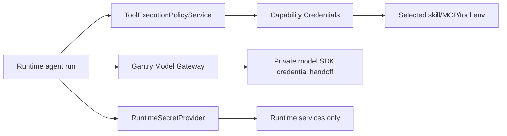

# Credential Management

Gantry separates runtime-owned secrets, model gateway credentials, and
capability environment secrets projected to installed skills, MCP servers, and
tools.

## Source Lanes

Gantry uses four source lanes:

- `settings.yaml` stores non-secret configuration, such as model gateway
  mode, channel enablement, schemas, allowlists, and model selections.
- `RuntimeSecretProvider` resolves runtime-owned secrets. The local/personal
  implementation reads runtime `.env` and process env for values such as
  database URLs, channel bot tokens, webhook/control secrets, and the stable
  credential encryption key.
- Gantry Credential Center stores capability env var values for selected skills, MCP
  servers, and reviewed tools. Values are encrypted in Postgres and projected
  only when a selected capability declares the matching env var or credential
  ref.
- `AgentCredentialBroker` resolves model-provider access and broker-safe model
  adapter injections such as loopback provider gateway URLs and run-local
  gateway tokens. Model credentials must not be reused as tool env.

There is no global `.env > database > broker` precedence. Precedence is
lane-specific: settings choose behavior, runtime secret providers resolve
runtime secrets, capability credentials resolve capability env vars, and model
credentials come from the Gantry Model Gateway. If a value appears in the wrong lane,
Gantry reports it as a configuration error instead of silently ignoring or
overriding it.

Wrong-lane checks apply to both runtime `.env` and the process environment used
to start Gantry. Process env may override local `.env` only inside
runtime-secret resolution; it is not ambient agent tool env. If a local shell
already has a capability secret, import it explicitly with
`gantry credentials capability import-env NAME`.

## Runtime-Owned Secrets

Runtime-owned secrets are needed to start and operate Gantry or its connected
services. They are read through `RuntimeSecretProvider`.

Examples:

- `GANTRY_DATABASE_URL`
- `SLACK_BOT_TOKEN`
- `SLACK_APP_TOKEN`
- `TELEGRAM_BOT_TOKEN`
- webhook secret
- control API secret
- `SECRET_ENCRYPTION_KEY`
- `SECRET_ENCRYPTION_KEYRING_JSON`

Runtime-owned secrets are never injected into an agent runner. They are checked
by runtime preflight, doctor, channel setup, storage readiness, and credential
encryption readiness.

Runtime `.env` and process env are valid for these local/personal secrets. They
must not contain non-secret settings such as model access state or gateway URLs.

## Capability Credentials

Capability credentials are the central store for simple env-var-shaped secrets
needed by approved agent capabilities. They are encrypted with
the Gantry credential secret envelope in Postgres and are never written to
`settings.yaml`. The envelope format is `gcred:v2:<key-id>:...` and uses
AES-256-GCM with metadata-bound AAD. Operator-pasted values that look like an
envelope are still encrypted as plaintext input; there is no prefix passthrough.

`SECRET_ENCRYPTION_KEY` may hold one active base64-encoded 32-byte key. For
rotation, use `SECRET_ENCRYPTION_KEYRING_JSON` with an `active` key id and a
`keys` object of key-id to base64 key values. New writes use the active key;
reads can decrypt any configured key id in the keyring.

Examples:

- `GITHUB_TOKEN` for a GitHub MCP server
- `LINKEDIN_ACCESS_TOKEN` for a LinkedIn posting skill
- `GOOGLE_APPLICATION_CREDENTIALS_JSON` for a reviewed local tool that expects
  an env var

CLI management:

```bash
gantry credentials capability list
gantry credentials capability set LINKEDIN_ACCESS_TOKEN
gantry credentials capability import-env GITHUB_TOKEN
gantry credentials capability unset GITHUB_TOKEN
```

Agents do not edit `.env`, `settings.yaml`, skill directories, or MCP config to
manage these values. When a selected skill or MCP server needs a missing secret,
the runtime fails closed with `gantry credentials capability set NAME`
guidance. If the value already exists in the host shell, an admin can run
`gantry credentials capability import-env NAME` to move it into the central
store.

Skill action manifests declare required env-var names and scoped commands; they
must not instruct agents to set shell env vars inline. Runtime injects approved
skill secrets and neutral CA trust aliases for approved tool calls, so skill
commands should stay argv-shaped, such as
`python3 skills/linkedin-posting/post.py --file ...`.

## Agent-Accessed Credentials

Agent-accessed credentials are credentials an agent may use after policy allows
the action. They include LLM provider access and tool or API credentials, but
those two categories are not scoped the same way. Model-provider credentials
come from the Gantry Model Gateway. Tool env vars come from capability
credentials when a selected
capability declares a need. Reviewed `local_cli` capabilities are valid when
the CLI already owns its own authenticated account state and Gantry pins the
executable, command templates, preflight, protected paths, and denied
environment overrides before projecting scoped command authority.

Model-provider access is account-level Model Access. Gantry always requests it
with `purpose=model_runtime` through the Gantry Model Gateway; it is not bound
to an individual agent, conversation, memory worker, subagent, or job. Agents,
subagents, jobs, and memory workers select catalog model aliases only.
Anthropic, OpenRouter, and OpenAI embedding credentials are configured once
with `gantry credentials model set anthropic`,
`gantry credentials model set openrouter`, or
`gantry credentials model set openai` and then projected through the Gantry
Model Gateway according to the selected model provider or embedding provider.
Each provider exposes explicit credential modes through the control API as
`credentialModes`; Anthropic supports `api_key` and `claude_code_oauth`, while
OpenRouter and OpenAI currently use `api_key`. `PUT
/v1/credentials/models/:providerId` replaces a credential and selects the auth
mode, `PATCH` rotates fields for the existing auth mode, and all read/mutation
responses return only redacted status, fingerprints, configured field names,
and mode metadata.

Agents do not receive every raw secret value from Gantry. Runtime code projects
only the selected capability's declared credential names. Attached skills do
not receive secrets by being attached; a selected reviewed skill action must
declare the matching `requiredEnvVars` before those values are projected.
Selected MCP servers get only their reviewed credential refs; reviewed tools get
only their declared env needs. Model credential injection remains broker-owned
and must never be reused for tool env.

For local authenticated CLIs, Gantry does not copy raw OAuth tokens or broker
proxies into generic Bash. The approved semantic capability maps to narrow
scoped command templates and protected credential/config paths. User-defined
local CLI capabilities require pinned executable identity, version/hash, auth
preflight, protected paths, and denied environment overrides before runtime
projects scoped command authority. Agents may not override
token, credential file, config directory, proxy, keychain/keyring, CA, or
authority environment keys unless a future capability explicitly models that
behavior.

Selected `local_cli` capabilities project credential paths and network host
metadata only through typed runtime access. Credential directories are mounted
into the SDK as additional readable directories and are also added to
`sandbox.filesystem.denyWrite`; they are intentionally not added to
`denyRead`. Declared network hosts are not durable `SandboxNetworkAccess`
authority. For scheduled jobs, Gantry may suppress a parentless SDK network
prompt only when it arrives immediately after the same principal's approved
Bash invocation, that command matches the reviewed local CLI command template,
and the requested host matches the capability's declared host list.

Raw provider credentials such as `ANTHROPIC_API_KEY`, `ANTHROPIC_AUTH_TOKEN`,
`OPENAI_API_KEY`, and `CLAUDE_CODE_OAUTH_TOKEN` must be configured through
Gantry model credentials, never in Gantry `.env` or process env.

## Common Key Placement

| Value                                                         | Source                                                   |
| ------------------------------------------------------------- | -------------------------------------------------------- |
| `model_access.enabled`                                        | `settings.yaml` advanced override                        |
| `model_access.gateway.bind_host`                              | `settings.yaml` advanced override                        |
| `agent.name`                                                  | `settings.yaml`                                          |
| `agent.default_model`                                         | `settings.yaml`                                          |
| `agent.one_time_job_default_model`                            | `settings.yaml`                                          |
| `agent.recurring_job_default_model`                           | `settings.yaml`                                          |
| `memory.llm.models.*`                                         | `settings.yaml`                                          |
| Conversation approvers                                        | `settings.yaml` and Postgres conversation approver rows  |
| `storage.postgres.url_env`                                    | `settings.yaml` advanced override                        |
| `GANTRY_DATABASE_URL`                                         | `RuntimeSecretProvider` / local `.env`                   |
| `TELEGRAM_BOT_TOKEN`                                          | `RuntimeSecretProvider` / local `.env`                   |
| `SLACK_BOT_TOKEN`, `SLACK_APP_TOKEN`                          | `RuntimeSecretProvider` / local `.env`                   |
| `SECRET_ENCRYPTION_KEY`                                       | `RuntimeSecretProvider` / local `.env`                   |
| Skill, MCP, and reviewed tool env vars                        | Gantry Credentials (`gantry credentials capability ...`) |
| `ANTHROPIC_API_KEY`, `ANTHROPIC_AUTH_TOKEN`, `OPENAI_API_KEY` | Gantry model credentials                                 |
| `CLAUDE_CODE_OAUTH_TOKEN`                                     | Gantry model credentials                                 |

Model env keys such as `ANTHROPIC_MODEL`, `ANTHROPIC_BASE_URL`, and
`ANTHROPIC_DEFAULT_*_MODEL` are child-process adapter projections. Gantry
runtime config does not accept them from runtime `.env`; use provider-neutral
aliases through `agent.default_model`, `agent.one_time_job_default_model`,
`agent.recurring_job_default_model`, `memory.llm.models.*`, `gantry model`, the
Control API defaults route, and group `/model` overrides for model selection.
OpenRouter is selected by provider or catalog alias. The current OpenRouter
adapter projection uses a Claude Agent SDK-compatible loopback gateway endpoint
with `gtw_*` tokens supplied by `AgentCredentialBroker`; the child process never
receives the upstream OpenRouter API key or direct OpenRouter base URL.

## Model Access Modes

`model_access.enabled` supports:

- `true`: local/personal default using encrypted Postgres model credentials and
  a loopback model gateway.
- `false`: development mode with no model gateway injection.

Future Vault, Kubernetes Secrets, AWS Secrets Manager, GCP Secret Manager,
Azure Key Vault, or custom integrations must implement typed repositories or
providers behind Gantry Credential Center. They must not add ad hoc runtime
`.env` fallbacks for agent credentials.

## Gantry Model Gateway

The Gantry Model Gateway is the only active local model credential path. It
stores provider credentials in `model_credentials` rows encrypted with
the same `gcred:v2` metadata-bound envelope, stores the selected provider
`authMode` as non-secret metadata, exposes redacted status through the Control
API and
`gantry credentials model status`, and serves per-run loopback HTTP endpoints
for Anthropic, OpenRouter, and OpenAI embedding traffic.

Provider credential shape is owned by the model provider registry. Each
provider declares one or more credential modes with:

- stable mode id, label, and help text
- user-facing field labels such as `Anthropic key`, `Azure endpoint`,
  `Deployment name`, and `AWS region`
- required field metadata
- a gateway auth strategy

OpenRouter and OpenAI each expose one `api_key` mode, so setup stays direct.
Anthropic exposes `api_key` for direct API keys and `claude_code_oauth` for
Claude Code subscription OAuth tokens. Providers that need more than one path,
such as Azure Foundry or AWS Bedrock, add additional modes in the registry
instead of adding CLI, API, storage, or gateway branches.

All user-entered credential and provider configuration values stay in the
encrypted structured payload. Read surfaces return only provider label, role,
workloads, selected `authMode`, credential modes, field metadata, configured
field names, fingerprints, health, and timestamps.

Gateway tokens are app-scoped, run-scoped, provider-scoped, and bound to the
credential fingerprint, `authMode`, and schema version present at token issue.
Credential disable or rotation invalidates previously issued tokens instead of
letting them reuse newer secrets. Gateway requests are POST-only, path-confined
under the provider route and upstream prefix, size-limited, timeout-bound, and
proxied through request/response header allowlists.

Control API semantics:

- `GET /v1/credentials/models` returns redacted admin-UI-ready status for all
  supported providers.
- `PUT /v1/credentials/models/:providerId` fully replaces one provider
  credential and may set or change `authMode`.
- `PATCH /v1/credentials/models/:providerId` rotates fields inside the
  existing active `authMode`; omitted fields are preserved, while empty, null,
  unknown, missing, disabled, or auth-mode-changing updates are rejected.
- `DELETE /v1/credentials/models/:providerId` disables active use without
  deleting the encrypted payload or metadata.

Gateway auth strategies are fail-closed. Current `header` and `bearer`
strategies inject Anthropic API-key, OpenRouter, and OpenAI credentials at the
outbound provider boundary. Anthropic `claude_code_oauth` bypasses HTTP header
injection and projects only `CLAUDE_CODE_OAUTH_TOKEN` to the trusted Claude
Code SDK process. Future strategies such as `aws_bedrock_api_key`,
`aws_sigv4`, `aws_sdk_default_chain`, `azure_api_key`, and
`azure_entra_default_credential` are distinct strategy slots; they must not
fall through to generic header injection.

AWS Bedrock API keys are bearer-token style Bedrock credentials. AWS
IAM/SigV4/default-chain modes are request-signing or SDK-identity flows, not
stored raw token fields. Azure OpenAI/Foundry API-key mode needs endpoint,
deployment, and key fields; Azure Entra mode uses bearer tokens produced from
local or hosted identity, so onboarding explains the required identity and runs
readiness checks instead of asking for a token.

For API-key modes, the Claude SDK process receives `ANTHROPIC_BASE_URL` pointed
at the loopback gateway and a short-lived `gtw_*` token. The gateway swaps that
token for the stored provider key only at the outbound provider boundary. For
Anthropic Claude Code OAuth mode, the SDK process receives
`CLAUDE_CODE_OAUTH_TOKEN` directly because Claude Code owns that auth path.
Bash tools, MCP stdio subprocesses, browser tools, and skills do not receive
model provider keys.

`NO_PROXY` and `no_proxy` are compatibility hints for cooperative tools, not an
authorization boundary. They keep common developer tools such as `gh`, `git`,
`curl`, Go, Python, and Node from routing trusted developer-platform traffic
through model credential transport when those tools honor proxy environment
variables. A malicious or vulnerable tool can ignore those variables, so
protection still comes from capability selection, permission policy, sandbox
policy, and audit.

The runtime calls the application credential service and receives a generic
`AgentCredentialInjection`; it does not read provider keys directly.

The model gateway never executes tools, approves permissions, owns scheduler
policy, evaluates protected capability changes, or enforces egress policy.
Model credential env is passed only to the Claude SDK process private model
credential handoff. Bash tools, MCP stdio subprocesses, browser tools, and
skills do not receive model provider tokens. Host-owned scheduler scripts are
not supported.

The SDK process receives sandbox policy and model credentials as separate
adapter projections. Protected filesystem paths are passed through
`GANTRY_PROTECTED_FILESYSTEM_DENY_READ_PATHS_JSON` and
`GANTRY_PROTECTED_FILESYSTEM_DENY_WRITE_PATHS_JSON` and become Claude SDK
`sandbox.filesystem.denyRead` and `sandbox.filesystem.denyWrite` entries;
reviewed local CLI credential directories are also passed through
`GANTRY_LOCAL_CLI_CREDENTIAL_DIRS_JSON` so the SDK can mount them for reads
while still denying writes. Model credentials remain only in the private SDK env
handoff. Do not use MCP stdio env, browser env, or any future scheduler script
env to carry sandbox authority or provider credentials.

## Permission Boundary

Credential injection is not permission approval. Agent actions must still pass
through `ToolExecutionPolicyService` and the permission/capability binding
checks before credentials are injected or used for a tool/API action.


