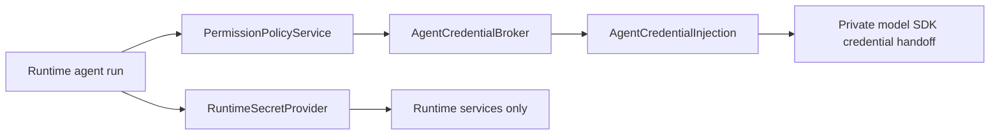

# Credential Management

MyClaw separates runtime-owned secrets from credentials that agents may access
through a broker.

## Source Lanes

MyClaw uses three source lanes:

- `settings.yaml` stores non-secret configuration, such as credential broker
  mode, broker endpoint URLs, channel enablement, schemas, allowlists, and
  model selections.
- `RuntimeSecretProvider` resolves runtime-owned secrets. The local/personal
  implementation reads runtime `.env` and process env for values such as
  database URLs, channel bot tokens, webhook/control secrets, and OneCLI
  persistence secrets.
- `AgentCredentialBroker` resolves agent-accessed credentials. It may return
  only broker-safe injection values such as provider base URLs, local
  provider-only proxy endpoints, and certificate file paths. Tool/API
  credentials must not be represented as ambient runner-wide process
  environment.

There is no global `.env > broker` precedence. Precedence is lane-specific:
settings choose behavior, runtime secret providers resolve runtime secrets, and
agent credentials come only from the selected broker. If a value appears in the
wrong lane, MyClaw reports it as a configuration error instead of silently
ignoring or overriding it.

Wrong-lane checks apply to both runtime `.env` and the process environment used
to start MyClaw. Process env may override local `.env` only inside
runtime-secret resolution; it is not a supported path for broker mode, broker
URLs, model settings, Slack approvers, or raw provider credentials.

Existing local installs must be cleaned up manually as a one-time cutover: move
settings-owned values from `.env` into `settings.yaml`, remove raw
agent-accessed credentials from the runtime env file, and recreate those
credentials in the selected broker.

## Runtime-Owned Secrets

Runtime-owned secrets are needed to start and operate MyClaw or its connected
services. They are read through `RuntimeSecretProvider`.

Examples:

- `MYCLAW_DATABASE_URL`
- `SLACK_BOT_TOKEN`
- `SLACK_APP_TOKEN`
- `TELEGRAM_BOT_TOKEN`
- webhook secret
- control API secret
- `ONECLI_DATABASE_URL`
- `SECRET_ENCRYPTION_KEY`

Runtime-owned secrets are never injected into an agent runner. They are checked
by runtime preflight, doctor, channel setup, storage readiness, and broker
persistence readiness.

Runtime `.env` and process env are valid for these local/personal secrets. They
must not contain non-secret settings such as credential mode or broker URLs.

## Agent-Accessed Credentials

Agent-accessed credentials are credentials an agent may use after policy allows
the action. They include LLM provider access and tool or API credentials, but
those two categories are not scoped the same way.

Model-provider access is account-level Model Access. MyClaw always requests it
with `purpose=model_runtime` through the reserved broker profile
`myclaw-model-access`; it is not bound to an individual agent, conversation,
memory worker, subagent, or job. Agents, subagents, and jobs select catalog
model aliases only. Claude and OpenRouter credentials are configured once in
OneCLI or the selected enterprise broker and then projected to model SDK runs
according to the selected model provider.

Agents do not receive raw secret values from MyClaw. Runtime code requests an
`AgentCredentialInjection` from `AgentCredentialBroker`; the returned injection
contains only broker-safe environment values and certificate references for the
provider credential lane. Tool/API credential lanes must use
`purpose=tool_capability` with an explicit agent/capability context; they must
never reuse the shared Model Access profile or become runner-wide ambient
process environment.

Raw provider credentials such as `ANTHROPIC_API_KEY`, `OPENAI_API_KEY`, and
`CLAUDE_CODE_OAUTH_TOKEN` must be configured through OneCLI or the selected
enterprise credential broker, never in MyClaw `.env` or process env.

## Common Key Placement

| Value                                                         | Source                                                  |
| ------------------------------------------------------------- | ------------------------------------------------------- |
| `credential_broker.mode`                                      | `settings.yaml` advanced override                       |
| `credential_broker.onecli.url`                                | `settings.yaml` advanced override                       |
| `credential_broker.external.base_url`                         | `settings.yaml` advanced override                       |
| `defaults.name`                                               | `settings.yaml`                                         |
| `defaults.model`                                              | `settings.yaml`                                         |
| `defaults.jobs.one_time_model`                                | `settings.yaml`                                         |
| `defaults.jobs.recurring_model`                               | `settings.yaml`                                         |
| Conversation approvers                                        | `settings.yaml` and Postgres conversation approver rows |
| `storage.postgres.url_env`                                    | `settings.yaml` advanced override                       |
| `MYCLAW_DATABASE_URL`                                         | `RuntimeSecretProvider` / local `.env`                  |
| `TELEGRAM_BOT_TOKEN`                                          | `RuntimeSecretProvider` / local `.env`                  |
| `SLACK_BOT_TOKEN`, `SLACK_APP_TOKEN`                          | `RuntimeSecretProvider` / local `.env`                  |
| `ONECLI_DATABASE_URL`, `SECRET_ENCRYPTION_KEY`                | `RuntimeSecretProvider` / local `.env`                  |
| `ANTHROPIC_API_KEY`, `ANTHROPIC_AUTH_TOKEN`, `OPENAI_API_KEY` | `AgentCredentialBroker`                                 |
| `CLAUDE_CODE_OAUTH_TOKEN`                                     | `AgentCredentialBroker`                                 |

Model env keys such as `ANTHROPIC_MODEL`, `ANTHROPIC_BASE_URL`, and
`ANTHROPIC_DEFAULT_*_MODEL` are child-process adapter projections. MyClaw
runtime config does not accept them from runtime `.env`; use
`agent.default_model`, `agent.one_time_job_default_model`,
`agent.recurring_job_default_model`, and group `/model` overrides for model
selection. OpenRouter's Anthropic SDK route is projected only by the runtime
adapter for cataloged OpenRouter models, with `ANTHROPIC_AUTH_TOKEN` supplied by
`AgentCredentialBroker` and `ANTHROPIC_API_KEY` intentionally blank for that
child process.

## Broker Profiles

`credential_broker.mode` supports:

- `onecli`: local/personal default using the OneCLI adapter.
- `none`: development mode with no broker injection.
- `external`: future enterprise-managed credentials.

The `external` profile is a placeholder contract. It does not include a Vault,
Kubernetes, AWS, GCP, Azure, or custom implementation yet.

Future Vault, Kubernetes Secrets, AWS Secrets Manager, GCP Secret Manager, Azure
Key Vault, or custom integrations must implement either `RuntimeSecretProvider`
for runtime-owned secrets or `AgentCredentialBroker` for agent-accessed
credentials. They must not add ad hoc runtime `.env` fallbacks for agent
credentials.

## OneCLI Adapter

OneCLI remains supported as the default personal broker. Its implementation
lives under `apps/core/src/adapters/credentials/onecli/`.

The adapter owns:

- `@onecli-sh/sdk` usage
- OneCLI URL validation
- broker-safe environment filtering
- OneCLI CA certificate materialization for host runners
- local OneCLI persistence readiness checks

OneCLI model access is resolved through the `myclaw-model-access` profile. Setup
and runtime startup create that profile directly; there is no fallback to
`main-agent` or per-agent model credential rows.

OneCLI may return local provider proxy variables such as `HTTP_PROXY`,
`HTTPS_PROXY`, and `NODE_USE_ENV_PROXY` for the model credential lane. MyClaw
accepts only OneCLI-shaped local HTTP proxy endpoints, normalizes Docker-only
loopback aliases such as `host.docker.internal` to `127.0.0.1` for host
runners, and passes the result only to the Claude SDK process through a private
model-credential handoff. General runner, scheduled-script, tool, browser, and
MCP process environments must not receive broker proxy variables or
broker-provided CA certificate variables. The Claude SDK runner sets
`CLAUDE_CODE_SUBPROCESS_ENV_SCRUB=1` so provider credentials remain with the
Claude process and are stripped from Bash, hooks, and MCP stdio subprocesses.
Git/tool-specific proxy controls remain forbidden in the broker lane.

`NO_PROXY` and `no_proxy` are compatibility hints for cooperative tools, not an
authorization boundary. They keep common developer tools such as `gh`, `git`,
`curl`, Go, Python, and Node from routing trusted developer-platform traffic
through model credential transport when those tools honor proxy environment
variables. A malicious or vulnerable tool can ignore those variables, so
protection still comes from capability selection, permission policy, sandbox
policy, and audit.

The runtime calls the application credential service and receives a generic
`AgentCredentialInjection`; it does not instantiate OneCLI.

## Permission Boundary

Credential injection is not permission approval. Agent actions must still pass
through `PermissionPolicyService` before credentials are injected or used for a
tool/API action.

