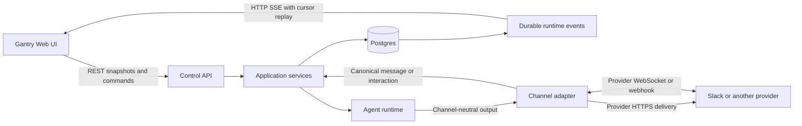
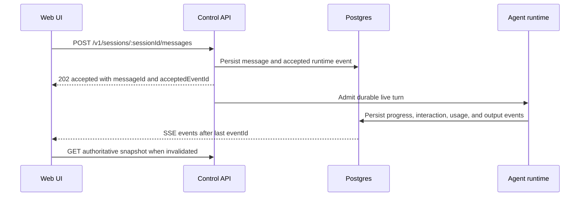

# Gantry Web UI Implementation Plan

## Branch And Change Boundary

The first implementation action is to branch from the latest `main`:

```bash
git checkout main
git pull --ff-only origin main
git checkout -b feature/gantry-web-ui-initiate
```

This document is the only deliverable in the planning change. It defines the
future UI implementation but does not add frontend code, dependencies, API
routes, settings, schemas, or generated artifacts.

## Goal

Build a local-first Gantry operator UI that can configure agents, inspect
runtime state, chat with agents, resolve interactions, and administer providers,
conversations, jobs, people, and workflows through Gantry-owned application
services.

The UI must:

- use current Control API and contract surfaces wherever they already exist;
- use REST for snapshots and commands and durable HTTP SSE for live updates;
- keep Slack and other provider WebSockets inside channel adapters;
- render the existing `InteractionDescriptor` and `render_*` protocol;
- preserve settings, credential, permission, and audit authority boundaries;
- work at desktop and mobile widths in light and dark themes.

## Non-Goals

- No server-side rendering.
- No browser-to-Gantry WebSocket protocol.
- No provider-native Slack, Teams, Telegram, or Discord payloads in React
  components.
- No browser access to Control API keys, provider credentials, model
  credentials, runtime secrets, or agent credentials.
- No user-facing subagent mission-control view; delegation remains an internal
  execution detail.
- No enterprise SSO in the first local-only slice. Non-loopback UI exposure
  remains disabled until a separate identity design is approved.
- No parallel UI backend, duplicate application services, or second event
  store.

## Current UI-Relevant Baseline

- Gantry has no browser frontend package or static UI host.
- The Control API exposes HTTP routes and session SSE; `packages/contracts`
  owns shared public shapes and `packages/sdk` remains a server-side Node
  client.
- Postgres `runtime_events` is the durable observable stream for sessions,
  conversations, runs, jobs, permissions, interactions, and usage.
- Agents expose the UI-facing concepts needed for administration: identity,
  model and harness defaults, profile files, sources, capabilities,
  permissions, conversation installs, sessions, memory, jobs, and usage.
- `settings_revisions` is durable desired-state authority. Every settings-owned
  mutation must pass through `SettingsDesiredStateService`, append a revision,
  update runtime projection, and synchronize `settings.yaml`.
- `InteractionDescriptor` is the canonical channel-neutral shape for status,
  facts, lists, tables, forms, media, progress, approvals, questions, files,
  dependencies, and results.

Only these runtime details affect the UI design. Runner internals, scheduler
lease algorithms, and provider model execution are intentionally outside this
plan.

## Communication Architecture



### Browser To Gantry

| Direction         | Transport            | Responsibility                                                                                                |
| ----------------- | -------------------- | ------------------------------------------------------------------------------------------------------------- |
| Browser to server | REST                 | Authentication, reads, chat submission, settings changes, approvals, job actions, and all other mutations     |
| Server to browser | SSE                  | Durable progress, streaming output, message changes, interaction state, job/run state, usage, and diagnostics |
| Recovery          | REST plus SSE cursor | Re-fetch authoritative snapshots and replay events after the last applied `eventId`                           |

The browser starts each page from a REST snapshot. TanStack Query owns the
snapshot cache. One SSE coordinator receives typed events, patches simple
records, and invalidates complex query aggregates for REST refetching.

SSE is observable output only. It must never approve a request, stop a run,
change settings, or otherwise act as command authority.

### Chat Turn Sequence



The current session APIs remain the chat foundation:

- `POST /v1/sessions/ensure`
- `GET /v1/sessions/{sessionId}`
- `GET|POST /v1/sessions/{sessionId}/messages`
- `GET /v1/sessions/{sessionId}/events`
- `GET /v1/sessions/{sessionId}/runs`

`POST .../messages` returning `202` means durable acceptance, not completed
model execution or successful provider delivery.

### SSE Contract

Keep the existing session event stream and add one app-scoped endpoint:

```text
GET /v1/events
Accept: application/json          # bounded event listing
Accept: text/event-stream         # live stream
```

Supported filters: `afterEventId`, `limit`, `agentId`, `conversationId`,
`threadId`, `sessionId`, `runId`, `jobId`, and repeatable `eventType`.

The endpoint projects the existing `runtime_events` table; it does not create a
new event model. Each envelope contains `eventId`, `eventType`, `createdAt`,
`correlationId`, applicable resource IDs, and a contract-validated payload.

Reconnect behavior is fixed:

1. The UI persists the highest fully applied `eventId` per app.
2. Reconnect sends `afterEventId`; the server also accepts the standard
   `Last-Event-ID` header as a fallback.
3. The server lists persisted rows after that cursor before waiting for new
   events.
4. Postgres `LISTEN/NOTIFY` only wakes subscriptions. Missed notifications are
   recovered by cursor reads.
5. The stream emits a comment heartbeat at least every 15 seconds and honors
   HTTP backpressure.
6. Unknown event types are logged and ignored, then the affected query is
   refetched. Cursor advancement happens only after successful handling.

### Provider WebSocket Boundary

Slack Socket Mode is a provider connection, not an agent socket:

1. The Slack adapter opens Bolt Socket Mode using the server-held app token.
2. Slack messages, mentions, slash commands, and interactive callbacks arrive
   over that connection and are acknowledged promptly.
3. The adapter normalizes the payload into Gantry Conversation, Thread/Topic,
   Message, sender, attachment, and provider-account identifiers.
4. Sender policy, trigger policy, conversation binding, persistence, and live
   admission run through Gantry application services.
5. The selected agent runs without knowing Slack transport details.
6. Agent output returns through channel-neutral delivery contracts; the Slack
   adapter delivers messages and rich interactions through Slack HTTPS APIs.
7. The UI reads canonical messages through REST and observes canonical change
   events through SSE. It never connects to Slack Socket Mode.

Discord Gateway and future provider WebSockets follow the same adapter
isolation. Teams or webhook-based providers may use different inbound
transports without changing browser communication.

### Shared Interactions

An approval or question has one durable `pending_interactions` record even when
rendered in both Slack and the Web UI.

- Every surface references the same interaction ID and allowed actions.
- The UI resolves it with an authenticated HTTP command, never an SSE reply.
- The server verifies app scope, Conversation membership, control-approver
  authority, allowed decision, and current interaction state.
- Resolution is idempotent. The first valid decision wins; later submissions
  receive the stored outcome rather than reopening the interaction.
- The resolution emits a runtime event so all open surfaces update.
- `Allow once` creates only run-lease-scoped transient authority. Persistent
  selections use reviewed capability or granular permission services.

### Access And Permission Authority

The UI presents three distinct operations and must not merge them:

| Operation                                      | Authority path                                                                                                             | Result                                                                             |
| ---------------------------------------------- | -------------------------------------------------------------------------------------------------------------------------- | ---------------------------------------------------------------------------------- |
| Resolve a live prompt with `Allow once`        | `POST /v1/interactions/{id}/resolve` after Conversation approver validation                                                | A transient grant scoped to the current run lease                                  |
| Select or remove a durable agent capability    | Existing capability catalog and agent access application services, followed by `SettingsDesiredStateService` revision sync | Durable reviewed capability selection reflected in settings and runtime projection |
| List or revoke an existing granular permission | New Control API adapter over the existing `PermissionManagementService` used by admin MCP tools                            | Revokes that exact durable permission without creating a second UI policy store    |

`GET /v1/permissions` is read-only projection. `DELETE
/v1/permissions/{id}` delegates to the existing revoke service and emits the
same audit evidence as other adapters. It cannot create permissions, convert a
transient grant into durable authority, or select capabilities.

## Browser Authentication And Security

The first release is same-origin and loopback-only.

### Public Flow

1. `gantry ui pair` prints a short-lived, one-use pairing code and the local UI
   URL.
2. `POST /v1/ui/auth/pair` exchanges the code for an opaque browser session.
3. Gantry stores only a hash of the session token and sets an `HttpOnly`,
   `SameSite=Strict`, path-scoped cookie. Use `Secure` whenever TLS is active.
4. `GET /v1/ui/auth/session` returns identity, app, scopes, expiry, and a CSRF
   token; it never returns the session secret.
5. Mutations require the cookie plus the CSRF header. Origin and host checks
   reject cross-site requests.
6. `DELETE /v1/ui/auth/session` revokes the current session and clears the
   cookie.

Pairing challenges expire after 10 minutes. Browser sessions default to 12
hours and are revocable. Authentication, pairing, logout, rejected CSRF, and
privileged mutations emit audit records. Existing scoped Control API keys
remain available to server-side SDK clients but never enter browser storage.

Non-secret UI configuration belongs in desired state:

```yaml
ui:
  enabled: true
  session_ttl_minutes: 720
```

Control bind address and port continue to use existing Control API runtime
configuration. Production or non-loopback exposure fails closed until an
approved external identity mode exists. OIDC and fleet SSO are deferred.

## Frontend Technical Design

### Stack

- React 19.2, TypeScript, Vite 8, and React Router Data Mode.
- TanStack Query for server state and TanStack Table for dense operational
  tables.
- Radix primitives and Lucide icons.
- React Hook Form with Zod-backed contract validation.
- `assistant-ui` only for chat composition and message presentation.
- CSS Modules with CSS custom-property tokens.
- Automated UI test tooling is deferred. Do not add Vitest, Testing Library,
  MSW, Playwright, axe-core, or a frontend test harness in this initiative.

No state library is added for server data. Local UI state stays in component or
route state until a demonstrated cross-route need exists.

### Package And Folder Structure

```text
apps/web/
  public/
  src/
    app/                  # router, providers, shell, navigation
    routes/               # route-level composition and loaders
    features/             # agents, chat, jobs, providers, workflows, etc.
    ui/
      tokens/             # CSS variables and theme definitions
      primitives/         # buttons, fields, menus, dialogs, tables
      compositions/       # headers, split panes, timelines, inspectors
      rich/               # InteractionDescriptor/render_* renderers
    lib/
      api/                # typed client, query keys, error normalization
      auth/               # session bootstrap, CSRF, logout
      events/             # app/session SSE, cursor, reconnect, dispatch
  package.json
  vite.config.ts
```

`apps/web/dist` is generated and untracked. The root build runs the web build
before packaging the Control API static assets. The full Control API process
serves the SPA under `/ui`; API and event routes stay under `/v1`. Development
uses Vite on `5173` and proxies `/v1` to the loopback Control API on `3939`.

`packages/contracts` owns browser-safe request, response, and event types.
`packages/sdk` stays Node-only; the browser does not import its HTTP transport.

## Design Tokens And Composition

Use the prototype as the visual source while normalizing controls and cards to
a maximum `8px` radius.

### Semantic Color Seeds

| Token role        | Light     | Dark      |
| ----------------- | --------- | --------- |
| Background        | `#f2f1ee` | `#131211` |
| Surface           | `#ffffff` | `#1d1c1a` |
| Surface secondary | `#f9f8f6` | `#242220` |
| Surface tertiary  | `#edebe7` | `#2b2926` |
| Text              | `#1b1a18` | `#f0eeea` |
| Text secondary    | `#555350` | `#b5b1aa` |
| Muted             | `#8b8881` | `#807c75` |
| Border            | `#e6e4df` | `#2c2a27` |
| Strong border     | `#d4d1cb` | `#3b3833` |
| Signal            | `#8a6a3c` | `#c0985f` |
| Signal soft       | `#f1e7d6` | `#2f2820` |
| Success           | `#5d7f58` | `#84a87e` |
| Success soft      | `#e2ebdf` | `#222b20` |
| Danger            | `#a85439` | `#c97f63` |
| Danger soft       | `#f2e0d8` | `#32231d` |

Define component aliases such as `--control-bg`, `--focus-ring`,
`--status-running`, and `--chart-*` from semantic tokens rather than using seed
colors directly in feature components.

### Remaining Tokens

- Typography: Spline Sans for UI, Spline Sans Mono for IDs, timestamps, logs,
  and code; roles at 10, 11.5, 13.5, 14, 18, and 26 pixels.
- Spacing: 2, 4, 6, 8, 12, 16, 20, 24, and 32 pixels.
- Radius: 4px controls, 6px repeated items, 8px cards/dialogs.
- Motion: 120ms direct feedback and 180ms overlays; disable nonessential motion
  under `prefers-reduced-motion`.
- Breakpoints: 640px, 900px, and 1200px. Typography does not scale with viewport
  width.
- Stable control sizes: 32px compact, 36px default, and 40px touch-oriented.

### Reusable Compositions

Build `AppShell`, `PageHeader`, `DataTable`, `SplitPane`, `Inspector`,
`Timeline`, `Dialog`, `EmptyState`, `ErrorState`, `ConnectionState`,
`ChatThread`, and `InteractionRenderer`. Feature routes compose these pieces;
they do not fork their own shells, tables, interaction cards, or status styles.

Desktop uses a restrained sidebar and dense work surfaces. Below 900px,
inspectors become drawers and split panes become routed or tabbed views. Below
640px, navigation becomes a drawer, table rows gain a compact detail view, and
primary actions remain reachable without horizontal scrolling.

All controls require keyboard operation, visible focus, meaningful labels,
WCAG AA contrast, reduced-motion support, and non-color status cues.

## Route And API Composition

Prototype screens that represent tabs, dialogs, drawers, empty states, or run
states are composed inside these routes instead of becoming separate pages.

| Route                 | UI responsibility                                                   | Existing APIs to reuse                                                              | Required addition                                                                        |
| --------------------- | ------------------------------------------------------------------- | ----------------------------------------------------------------------------------- | ---------------------------------------------------------------------------------------- |
| `/overview`           | Health, usage, active work, waiting interactions                    | status, health, doctor, usage, jobs, runs                                           | app event stream, session list, pending-interaction list                                 |
| `/providers`          | Provider accounts, readiness, discovery                             | providers, provider accounts, conversation discovery                                | browser-safe secret submission flow where current credential route is insufficient       |
| `/conversations/:id?` | Conversations, threads, messages, policies, installs                | conversations, approvers, threads, messages, conversation installs                  | live conversation event projection                                                       |
| `/agents/:id?`        | Identity, model, profile, sources, capabilities, access, pause      | agents, models, profile files, inventory, capabilities, skills, MCP servers, access | no parallel agent service; add only missing projections discovered during implementation |
| `/chat/:sessionId`    | Session list, messages, streaming, interactions, runs, memory       | session ensure/get/messages/events/runs, memory                                     | session list and interaction resolve APIs                                                |
| `/jobs/:id?`          | Definitions, blockers, runs, events, notifications                  | jobs, job events, runs                                                              | none unless UI acceptance exposes a documented contract gap                              |
| `/activity`           | Filterable audit and runtime history                                | runtime events and existing audit repositories                                      | paginated activity read model                                                            |
| `/diagnostics`        | Health, doctor, guided remediation, provider readiness              | status, health, doctor, guided actions                                              | no duplicate diagnostic engine                                                           |
| `/runtime/*`          | Models, memory, usage, capacity, queue, sandbox, egress, guardrails | models, credentials, usage, memory, desired settings                                | browser-safe settings projections only                                                   |
| `/people/:id?`        | Users, aliases, invitations, merge                                  | existing user and alias domain storage                                              | public people application service and API                                                |
| `/workflows/:id?`     | Definitions, versions, validation, runs, external steps             | job/run primitives only where semantics match                                       | workflow application service, storage, contracts, and API                                |
| `/profile`            | Owner profile and UI preferences                                    | current settings/profile projections where applicable                               | add only explicitly owned profile fields                                                 |

Every route defines loading, empty, partial-data, error, unauthorized, stale,
reconnecting, and offline behavior. Mutations display optimistic state only when
the operation is safely reversible; authority-changing actions wait for the
server result.

## Required Public Interfaces

Add contracts and routes only when their phase begins:

| Surface      | Minimum interface                                                                                       |
| ------------ | ------------------------------------------------------------------------------------------------------- |
| Browser auth | `POST /v1/ui/auth/pair`, `GET /v1/ui/auth/session`, `DELETE /v1/ui/auth/session`                        |
| App events   | `GET /v1/events` as JSON or SSE with cursor and resource filters                                        |
| Sessions     | `GET /v1/sessions` with pagination and agent/conversation/status filters                                |
| Interactions | `GET /v1/interactions`; `POST /v1/interactions/{id}/resolve`                                            |
| Permissions  | `GET /v1/permissions`; `DELETE /v1/permissions/{id}` over the same services used by admin MCP tools     |
| Activity     | `GET /v1/activity` with cursor pagination and actor/resource/event filters                              |
| People       | user list/detail, aliases, invitation creation/status, and atomic merge commands under `/v1/users`      |
| Workflows    | definitions, immutable versions, validation, enable/disable, runs, and run events under `/v1/workflows` |

New public shapes must be added to `packages/contracts`, represented in OpenAPI,
and covered by contract tests. Route handlers remain adapters over application
services; CLI, Control API, and Gantry MCP must not each implement business
rules independently.

## Data Ownership Rules

- Browser sessions and pairing challenges are security state in Postgres;
  store token/code hashes, app scope, expiry, revocation, and audit metadata.
- Agent identity, defaults, sources, capabilities, provider accounts,
  conversations, policies, approvers, and bindings remain revision-owned
  desired state where already defined as such.
- Runtime events, sessions, messages, runs, jobs, usage, interactions, audit,
  workflow runs, and browser sessions remain Postgres runtime state.
- Non-secret UI configuration writes `settings.yaml`, appends
  `settings_revisions`, and reconciles runtime projection in one operation.
- The browser reads runtime settings through `GET /v1/settings` and reads or
  mutates desired state through the existing `GET|PUT|POST
/v1/settings/desired-state` surface with `expectedRevision`. `PATCH
/v1/settings` remains read-only and must continue returning
  `SETTINGS_READ_ONLY`. Add the existing desired-state surface to OpenAPI and
  browser-safe contracts rather than inventing another settings route.
- Runtime secrets use `RuntimeSecretProvider`; agent credentials use
  `AgentCredentialBroker`. The UI submits secrets only to dedicated write-only
  server forms and receives redacted readiness metadata.
- Conversation approvers remain the only user-facing approval policy. The UI
  cannot invent UI-only approvers or bypass membership verification.

## Implementation Phases

Each phase is delivered independently. Its focused checks run before the next
phase; the full repository gates run at the phase boundary.

### Phase 1: Foundation, Authentication, And Hosting

Dependencies: none beyond current Control API and contracts.

Deliver:

- `apps/web` workspace, router, shell, tokens, themes, and primitives. UI test
  harness work is deferred.
- Browser pairing/session/CSRF contracts, application service, Postgres schema,
  Control API routes, CLI pairing command, and audit events.
- Typed browser API client, normalized errors, Query provider, app-scoped
  `GET /v1/events`, and SSE coordinator with cursor replay.
- Static SPA packaging at `/ui`, Vite proxying, history fallback limited to UI
  routes, and fail-closed non-loopback behavior.

Accept when pairing, refresh, logout, CSRF rejection, expired session, REST
snapshot, SSE replay, reconnect, and direct route refresh pass through manual
local verification.
Cleanup: search for browser API-key storage, duplicate auth middleware, and
tracked build output.

### Phase 2: Operational Console

Dependencies: Phase 1 app shell, API client, and events.

Deliver overview, waiting interactions, providers, conversations, approval
policy, and diagnostics using current APIs. Add session-list and
interaction-list/resolve routes through existing services.

Accept when an operator can discover a provider conversation, inspect its
messages and policy, see a pending interaction, resolve it, and observe every
view converge after the resolution event. Cleanup: search for provider-native
payloads and route-local status variants.

### Phase 3: Agent Administration

Dependencies: Phase 2 conversation and interaction components.

Deliver agent list/detail, identity/model/profile editing, sources,
capabilities, skills, MCP servers, access, conversation installs, and pause
state. Every settings-owned mutation uses revision-aware optimistic concurrency
and displays the resulting revision.

Accept when agent changes survive restart, `settings.yaml` matches the latest
revision, profile files use protected profile services, and no UI path writes
files or Postgres directly. Cleanup: search for raw model IDs, provider-specific
agent flags, and direct settings writes.

### Phase 4: Chat And Rich Interactions

Dependencies: Phase 1 session auth/events and Phase 2 interaction APIs.

Deliver session list, chat thread, composer, streaming presentation, runs,
files, questions, approvals, todo/progress, and every supported rich descriptor
kind. Throttle visual streaming updates without dropping durable events.

Accept when a full turn can be submitted, streamed, interrupted by a durable
question or permission, resolved from either UI or provider surface, resumed,
and completed after an SSE disconnect/reconnect. Cleanup: search for text-prefix
reasoning filters and duplicate rich schemas.

### Phase 5: Jobs, Runtime, Usage, And Activity

Dependencies: shared tables, timelines, and event coordinator.

Deliver jobs/runs/blockers, usage, models, memory, queue/capacity, sandbox,
egress, guardrails, diagnostics detail, and paginated activity. Reuse current
job, usage, model, memory, settings, and run contracts; add only the activity
read model.

Accept when lifecycle changes and blockers update live, settings mutations use
revision authority, and event/audit detail is inspectable without exposing
secrets. Cleanup: search for raw pg-boss concepts and UI-owned policy logic.

### Phase 6: People

Dependencies: conversations and shared form/table patterns.

Deliver user list/detail, provider aliases, invite status, and merge preview and
confirmation through new application services over existing user/alias domain
concepts.

Accept when merge is atomic, preserves audit/provenance, rejects unsafe
conflicts, and refreshes affected conversations without manual reload. Cleanup:
search for UI-only identity records and provider IDs treated as interchangeable.

### Phase 7: Workflows

Dependencies: agents, capabilities, jobs/runs, interactions, and activity.

Deliver workflow definitions, immutable versions, validation, enable/disable,
run detail, external-step status, honest-limit states, and audit history.
Workflow execution reuses Gantry permission, capability, run, interaction, and
notification services; it does not grant tools from workflow input.

Accept when a draft validates into an immutable version, an enabled version can
run, blocked capability requirements show one clear action, and every terminal
run leaves durable evidence. Cleanup: search for workflow-owned permission or
scheduler engines.

### Phase 8: Hardening And Release

Dependencies: all shipped product phases.

Deliver mobile and tablet refinements, manual keyboard audit, dark-theme visual
QA, event-load performance, security review, browser-session cleanup,
production packaging, docs, and rollout controls.

Accept when desktop and mobile manual checks pass in both themes, no page
overflows or overlaps, forced reconnect works, no secret appears in browser
storage or responses, and applicable Gantry gates pass. Cleanup:
search for prototype code, temporary mocks, stale route names, and deferred
feature flags without owners.

## Test And Verification Strategy

Automated UI testing is deferred by product decision. Do not add a frontend
test harness, testing dependencies, test scripts, fixtures, mock server,
browser runner, or accessibility runner in the current UI initiative. Use
manual acceptance checks, cleanup searches, builds, and applicable repository
structural gates. The coverage and command table below are future scope only;
they must not be implemented or run until testing is explicitly approved.

- Unit: reducers/event dispatch, query keys, form schemas, permission-aware
  actions, token/theme behavior, and rich descriptor rendering.
- Contract: OpenAPI and `packages/contracts` agreement for every browser route
  and event payload.
- Postgres integration: browser session expiry/revocation, interaction races,
  settings revision sync, event filtering, cursor ordering, and replay after
  missed notifications using disposable Postgres.
- Component: route states and mutations with MSW, including unauthorized,
  partial, stale, reconnecting, and redacted-secret responses.
- End to end: Playwright at 1440px, 1024px, and 390px in light/dark themes;
  pairing, provider discovery, agent editing, chat, cross-surface approval,
  jobs, people merge, and workflow run.
- Accessibility: axe, keyboard-only operation, focus restoration, screen-reader
  labels, reduced motion, and contrast.
- Security: CSRF, origin/host validation, cookie flags, session fixation,
  replayed pairing codes, scope enforcement, secret redaction, and non-loopback
  fail-closed behavior.
- Performance: one app SSE connection plus the active chat session stream,
  bounded query caches, virtualized large tables only after measured need, and
  throttled streaming renders.

Phase 1 adds `@gantry/web` scripts named `test:unit`, `test:e2e`, and
`test:a11y`. Later phases use these stable commands and pass their owned test
files after `--`. New Postgres suites must also be added to the root
`test:integration:postgres` script so the required database gate cannot omit
them.

### Focused Verification By Phase

| Phase                    | Focused commands                                                                                                                                                                                                                                                                                                                                                                                                                                                                                                                                                       |
| ------------------------ | ---------------------------------------------------------------------------------------------------------------------------------------------------------------------------------------------------------------------------------------------------------------------------------------------------------------------------------------------------------------------------------------------------------------------------------------------------------------------------------------------------------------------------------------------------------------------- |
| 1. Foundation            | `npm run test:unit -- apps/core/test/unit/control/ui-auth-routes.test.ts apps/core/test/unit/application/ui-session-service.test.ts apps/core/test/unit/application/runtime-events/runtime-event-exchange.test.ts`; `GANTRY_TEST_DATABASE_URL=<disposable-url> npm run test:integration:postgres`; `npm run test:unit --workspace @gantry/web -- src/lib/auth src/lib/events`; `npm run test:e2e --workspace @gantry/web -- tests/e2e/foundation.spec.ts`                                                                                                              |
| 2. Operations            | `npm run test:unit -- apps/core/test/unit/control/ui-events-routes.test.ts apps/core/test/unit/control/pending-interactions-routes.test.ts apps/core/test/unit/application/pending-interaction-durability.test.ts`; `npm run test:unit --workspace @gantry/web -- src/features/overview src/features/providers src/features/conversations`; `npm run test:e2e --workspace @gantry/web -- tests/e2e/operations.spec.ts`                                                                                                                                                 |
| 3. Agent administration  | `npm run test:unit -- apps/core/test/unit/control/settings-desired-state-routes.test.ts apps/core/test/unit/config/settings-desired-state-service.test.ts apps/core/test/unit/application/agent-capability-administration-service.test.ts apps/core/test/unit/application/permission-management-service.test.ts`; `npm run test:unit --workspace @gantry/web -- src/features/agents`; `npm run test:e2e --workspace @gantry/web -- tests/e2e/agent-admin.spec.ts`                                                                                                      |
| 4. Chat                  | `npm run test:unit -- apps/core/test/unit/channels/rich-interaction.test.ts apps/core/test/unit/runtime/pending-interaction-runtime-event.test.ts apps/core/test/unit/application/sessions/session-interaction-module.test.ts`; `npm run test:integration -- apps/core/test/integration/session-control-runs.integration.test.ts apps/core/test/integration/permission-approval-ipc.integration.test.ts`; `npm run test:unit --workspace @gantry/web -- src/features/chat src/ui/rich`; `npm run test:e2e --workspace @gantry/web -- tests/e2e/chat-reconnect.spec.ts` |
| 5. Jobs/runtime/activity | `npm run test:unit -- apps/core/test/unit/control/usage-routes.test.ts apps/core/test/unit/control/run-event-projection.test.ts apps/core/test/unit/application/job-readiness-service.test.ts`; `GANTRY_TEST_DATABASE_URL=<disposable-url> npm run test:integration:postgres`; `npm run test:unit --workspace @gantry/web -- src/features/jobs src/features/runtime src/features/activity`; `npm run test:e2e --workspace @gantry/web -- tests/e2e/jobs-runtime.spec.ts`                                                                                               |
| 6. People                | `npm run test:unit -- apps/core/test/unit/application/user-administration-service.test.ts apps/core/test/unit/control/users-routes.test.ts`; `GANTRY_TEST_DATABASE_URL=<disposable-url> npm run test:integration:postgres`; `npm run test:unit --workspace @gantry/web -- src/features/people`; `npm run test:e2e --workspace @gantry/web -- tests/e2e/people-merge.spec.ts`                                                                                                                                                                                           |
| 7. Workflows             | `npm run test:unit -- apps/core/test/unit/application/workflow-management-service.test.ts apps/core/test/unit/control/workflows-routes.test.ts`; `GANTRY_TEST_DATABASE_URL=<disposable-url> npm run test:integration:postgres`; `npm run test:unit --workspace @gantry/web -- src/features/workflows`; `npm run test:e2e --workspace @gantry/web -- tests/e2e/workflow-run.spec.ts`                                                                                                                                                                                    |
| 8. Hardening             | `npm run test:unit --workspace @gantry/web`; `npm run test:a11y --workspace @gantry/web`; `npm run test:e2e --workspace @gantry/web`; `npm run build`; `npm test`; `python3 .codex/scripts/verify.py`                                                                                                                                                                                                                                                                                                                                                                  |

Run these cleanup searches in their matching phase and review every match. They
are evidence checks, not delete-by-regex instructions.

```bash
# Phase 1
rg -n -e 'localStorage' -e 'sessionStorage' -e 'GANTRY_CONTROL_API' -e 'Bearer ' -e 'dist/ui' apps/web apps/core/src packages --glob '!**/dist/**'
# Phase 2
rg -n -e 'slack_event' -e 'slackPayload' -e 'SocketMode' -e 'xapp-' -e 'providerPayload' -e 'statusColor' apps/web/src
# Phase 3
rg -n -e 'writeFile' -e 'settings\.yaml' -e 'INSERT INTO' -e 'modelId' -e 'providerModelId' -e 'permissionStore' apps/web/src apps/core/src/control
# Phase 4
rg -n -e 'startsWith\(' -e 'includes\(.*thinking' -e 'UISpec' -e 'RichInteractionDescriptor.*interface' -e 'providerPayload' apps/web/src
# Phase 5
rg -n -e 'pg-boss' -e 'pgboss' -e 'yolo_mode' -e 'approve.*tool' -e 'policyEngine' apps/web/src
# Phase 6
rg -n -e 'slackUserId' -e 'teamsUserId' -e 'telegramUserId' -e 'discordUserId' -e 'peopleStore' apps/web/src apps/core/src/application
# Phase 7
rg -n -e 'WorkflowPermission' -e 'WorkflowScheduler' -e 'grantCapability' -e 'enableTool' -e 'pg-boss' apps/core/src apps/web/src
# Phase 8
rg -n -e 'TODO' -e 'FIXME' -e 'mock' -e 'prototype' -e 'legacy' -e 'compat' -e 'featureFlag' apps/web apps/core/src/control packages/contracts/src
```

Focused checks run after each packet. Every implementation phase closes with:

```bash
npm run build
npm test
python3 .codex/scripts/check_architecture.py
python3 .codex/scripts/check_task_completion.py
python3 .codex/scripts/validate_artifacts.py --allow-missing-run
python3 .codex/scripts/verify.py
```

Database-backed checks use a disposable Postgres instance with the required
`vector`, `pg_trgm`, and public `pgcrypto` extensions.

## Surface Impact Matrix

| Surface                      | Classification      | Implementation effect                                                                                                                                   |
| ---------------------------- | ------------------- | ------------------------------------------------------------------------------------------------------------------------------------------------------- |
| Runtime behavior             | Changed             | Serve `/ui`, authenticate browser sessions, and project app-scoped SSE without making events command authority.                                         |
| `settings.yaml`              | Changed             | Add non-secret `ui.enabled` and session TTL; all writes use desired-state revision sync.                                                                |
| Postgres/runtime projection  | Changed             | Add browser security state and later people/workflow state; reuse `runtime_events`.                                                                     |
| Control API                  | Changed             | Add browser auth, app events, session list, interactions, permissions, activity, people, and workflow routes through application services.              |
| SDK/contracts                | Changed             | Add browser-safe contracts and OpenAPI shapes. The Node SDK remains server-only.                                                                        |
| CLI                          | Changed             | Add local pairing and report UI URL/readiness without becoming a second admin implementation.                                                           |
| Gantry MCP tools/admin skill | Unchanged by design | The Web UI is an owner/admin adapter; existing MCP tools keep agent-requested reviewed flows and do not gain authority merely for UI parity.            |
| Channel/provider adapters    | Unchanged by design | Slack and other adapters retain provider transport and rendering ownership; the UI consumes canonical state and events.                                 |
| Docs/prompts                 | Changed             | Add setup, security, architecture, and operator guidance as phases ship; agent prompts do not describe UI internals.                                    |
| Audit/events                 | Changed             | Audit browser auth and mutations and add typed events where new people/workflow lifecycle changes require them.                                         |
| Tests/verification           | Deferred            | User requested no automated UI tests, harness, or testing dependencies for now; use manual checks, cleanup searches, builds, and structural gates only. |

Enterprise SSO is deferred because the first release is explicitly local and
loopback-only. It requires a separate fleet identity, session, and deployment
decision before non-loopback exposure can be enabled.

## Planning-Change Verification

For this documentation-only branch, verify only the changed artifact:

```bash
npx prettier --check docs/architecture/gantry-web-ui-implementation-plan.md
git diff --check
python3 .codex/scripts/check_architecture.py
python3 .codex/scripts/check_task_completion.py
git status --short
```

The planning change is complete when this Markdown file is the only diff, all
links and repo-relative paths are valid, existing and proposed APIs are clearly
distinguished, and no implementation code or generated output is present.
