# Gantry Architecture Overview

Top-down map for new contributors. Subsystem details live in the docs linked
from each section; this file is the index that ties them together.

If you only read one architecture doc, read this one first, then jump to the
subsystem doc that matches your task.

## 1. Context

Gantry is a single Node.js process that hosts agents around a provider-neutral
and channel-neutral capability system. Humans reach it through Slack, Telegram,
Teams, or web/API surfaces. Backend apps reach it through `@gantry/sdk`.
External systems reach it through signed `/v1/ingresses/:id/invoke` calls.
Postgres holds all durable state. OneCLI brokers credentials.

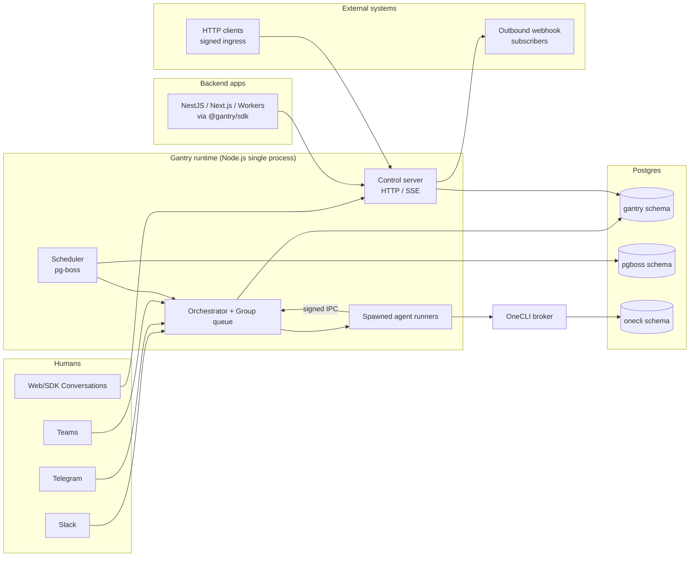

## 2. Component Map

The runtime is a single process composed of nine layers. The full file-by-file
map lives in [runtime-components.md](./runtime-components.md#runtime-map);
this overview shows the layers in execution order.

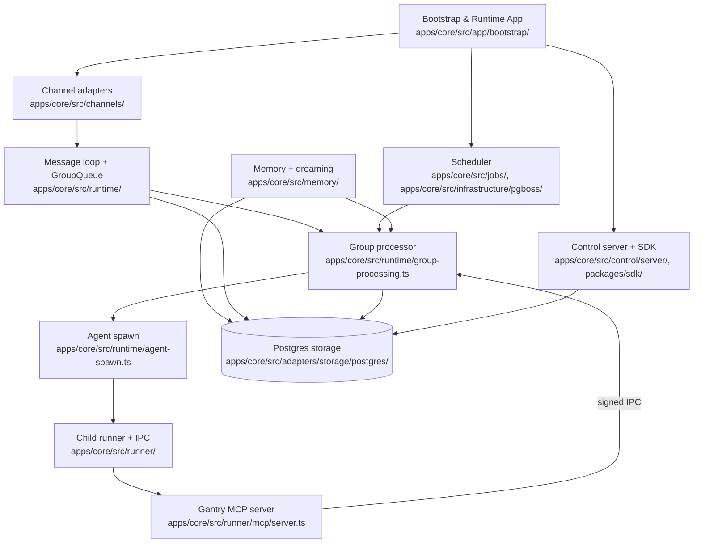

Layer-by-layer summary (one sentence each):

- **Bootstrap & Runtime App** wires Postgres, channel providers, scheduler, IPC
  watcher, and the control server into the running process.
- **Channels** translate provider-native events into normalized inbound
  messages and outbound replies through `ChannelAdapter` ports.
- **Message loop + GroupQueue** poll for new durable messages, recover pending
  threads on startup, and admit interactive and background work through
  separate lanes.
- **Group processor** loads unread messages, hydrates memory context, decides
  whether to start a new run or pipe a follow-up into a live one.
- **Agent spawn** builds the child process environment, working directory,
  model config, IPC secrets, and MCP server path.
- **Child runner** is the only process that calls the Claude Agent SDK; it
  streams follow-ups into `MessageStream` and routes tool calls through
  `canUseTool`.
- **Gantry MCP server** exposes the host-owned tools to the agent over signed
  stdio IPC.
- **Control server + SDK** speak HTTP/SSE for backend apps and external
  ingresses; the SDK is the supported public client.
- **Scheduler** owns Gantry job definitions, triggers, runs, events, and
  pg-boss dispatch.
- **Memory + dreaming** stores subject-scoped memory, records evidence, and
  runs auditable dreaming over `memory_candidates` / `memory_items`.

## 3. Agent Composition

An agent is not one record. The runtime composes the agent at spawn time from
runtime settings, the agent's stored config version, persona, skills, MCP
bindings, and the built-in capability providers.

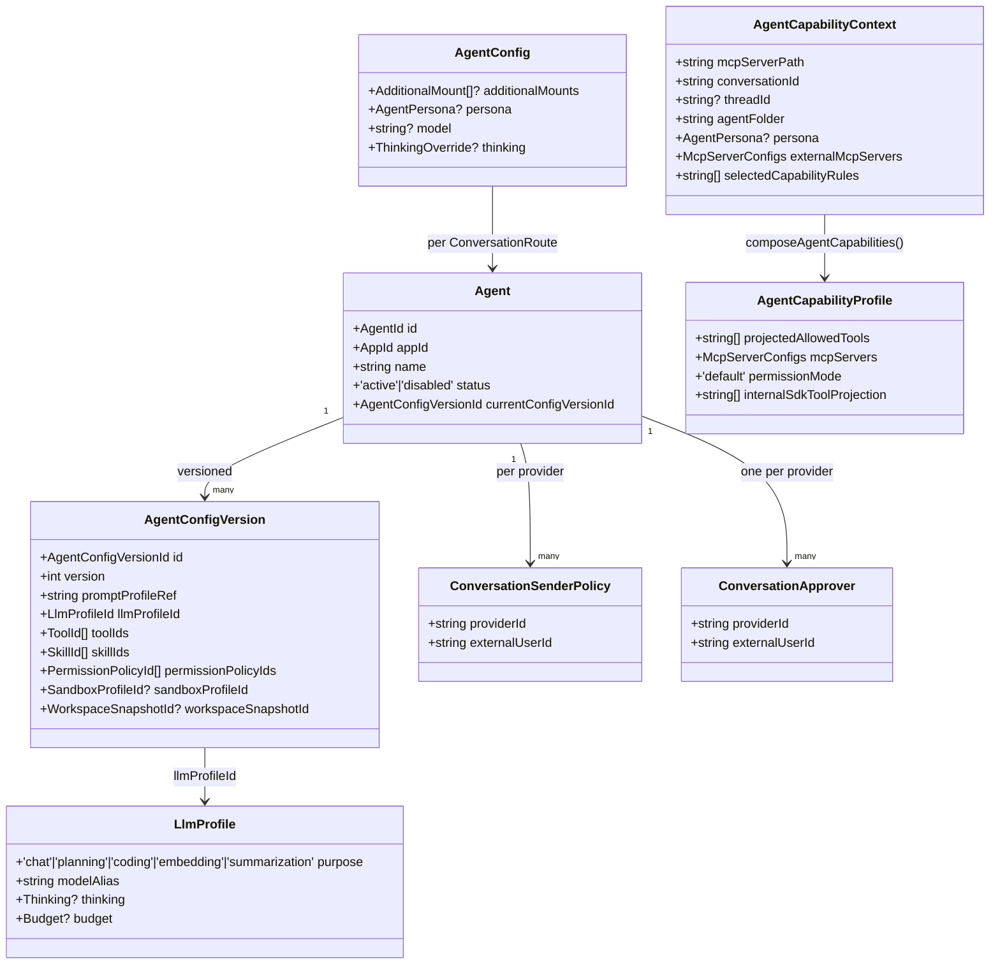

Cited at:

- `Agent`, `AgentConfigVersion`, `LlmProfile`, `ConversationSenderPolicy`,
  `ConversationApprover` — `apps/core/src/domain/agent/agent.ts`.
- `AgentConfig` (carrying `persona`, model override, and additional mounts) —
  `apps/core/src/domain/types.ts`.
- `AgentPersona` enum and resolver —
  `apps/core/src/shared/agent-persona.ts`.
- `AgentCapabilityContext` and `AgentCapabilityProfile` —
  `apps/core/src/adapters/llm/anthropic-claude-agent/agent-capabilities.ts`.
- Built-in capability providers (`sdk-tools`, `permissions`, `gantry-mcp`,
  `configured-tools`, `configured-mcp`) and `composeAgentCapabilities` —
  `apps/core/src/adapters/llm/anthropic-claude-agent/agent-capabilities.ts`.
- Persona compiled into the system prompt —
  `apps/core/src/application/agents/prompt-profile-service.ts` and
  `apps/core/src/runtime/agent-spawn.ts`.
- Skill materialisation into the run env —
  `apps/core/src/adapters/llm/anthropic-claude-agent/claude-skill-materializer.ts`,
  imported by `apps/core/src/runtime/agent-spawn.ts`.

The Gantry MCP allowlist composed by the `gantry-mcp` provider is the
agent-visible tool surface (`apps/core/src/runner/gantry-mcp-tool-surface.ts`):

```text
send_message            ask_user_question
memory_search           memory_save           continuity_summary
procedure_save          file
mcp_list_tools          mcp_call_tool
request_skill_install   request_skill_proposal
request_skill_dependency_install
request_mcp_server      request_permission
capability_status       capability_search
propose_capability      manage_capability
```

The canonical `Browser` capability is gated separately and projects to
`browser_status`, `browser_open`, `browser_inspect`, `browser_act`, and
`browser_close`. Reviewed memory tools such as `memory_patch`,
`memory_demote`, `procedure_patch`, `memory_dream`, `memory_consolidate`,
`memory_review_pending`, and `memory_review_decision` are selected only for
review/admin flows.

Selected-capability admin agents add six additional admin tools
(`apps/core/src/shared/admin-mcp-tools.ts`): `settings_desired_state`,
`request_settings_update`, `admin_permission_list`,
`admin_permission_revoke`, `service_restart`, and `register_agent`. Agents use
`capability_status` to inspect missing admin capabilities,
`propose_capability` for durable semantic capability changes, and
`request_permission` only for one-off exact fallback access or provider
capability review.

### Subagents

Native Anthropic-SDK subagents inherit the parent run by default. Gantry
uses the durable `AgentDelegation` facade to gate subagent delegation; the
Anthropic adapter projects that facade to the SDK-native `Agent` tool inside a
single run. Once `AgentDelegation` is granted, there is no second
`subagent_type` allowlist. The runner still rejects cross-provider models and
custom tool/MCP/skill input on the Agent call; see `validateAgentModelRequest`
and `validateAgentToolInput` in
`apps/core/src/adapters/llm/anthropic-claude-agent/runner/agent-model-selection.ts`.

Detail: [agent-runtime.md](./agent-runtime.md).

## 4. Inbound Message → Reply

The canonical inbound-to-reply flow is rendered in
[runtime-components.md §End-to-End Message Flow](./runtime-components.md#end-to-end-message-flow);
read it there for the full sequence and prose. The short version:

1. Channel adapter normalizes provider event → durable inbound message in
   Postgres.
2. Message loop polls / recovers, enqueues per-group/thread work.
3. Group processor checks triggers, hydrates memory, builds prompt.
4. Agent spawn launches a child runner with scoped env, IPC secrets, and the
   MCP server path.
5. Child runner streams to the Claude Agent SDK; tool calls cross signed IPC
   back into the host.
6. Final output and partial streams flow back through the channel adapter; the
   `app` channel writes durable `runtime_events` instead of network sends.

## 5. Provider Abstraction + DM vs Group Routing

Channels register through a single `Provider` shape
(`apps/core/src/channels/provider-registry.ts`):

```text
Provider {
  id, label
  jidPrefix, folderPrefix
  isGroupJid(jid) -> bool
  formatting:  'none' | 'markdown-native' | 'mrkdwn' | 'telegram-html'
  isEnabled(settings) -> bool
  create, setup
}
```

`providerForJid()` resolves a jid to its provider by longest-prefix match.
Built-in registrations from `apps/core/src/channels/register-builtins.ts`:

| Provider | jidPrefix | folderPrefix | Group jid rule              | Formatting        |
| -------- | --------- | ------------ | --------------------------- | ----------------- |
| Telegram | `tg:`     | `telegram_`  | starts with `tg:-`          | `telegram-html`   |
| Slack    | `sl:`     | `slack_`     | always group                | `mrkdwn`          |
| Teams    | `teams:`  | `teams_`     | always (`teams:` prefix)    | `markdown-native` |
| App      | `app:`    | `app_`       | always (internal SDK plane) | `none`            |

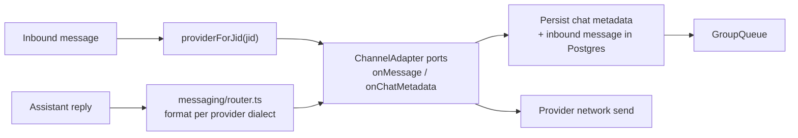

DM vs channel/group routing differs on three axes:

| Axis                 | DM                                                                        | Channel / group                                                        |
| -------------------- | ------------------------------------------------------------------------- | ---------------------------------------------------------------------- |
| Trigger requirement  | `requiresTrigger=false` by default                                        | `requiresTrigger=true` by default                                      |
| Default memory scope | `'user'` — see `apps/core/src/domain/ports/session-memory-collector.ts`   | `'group'` — same file, same toggle                                     |
| Approval authority   | Bound agent's per-provider conversation approver (`ConversationApprover`) | Conversation control approvers; see channel-interactions.md §approvers |

`conversationKind: 'dm' | 'channel'` is carried by `ConversationRoute`
while active domain and application ports use canonical conversation/session
IDs at their boundaries.

Detail: [channel-interactions.md](./channel-interactions.md).

## 6. Memory Boundary + DM/Group Isolation

Memory has two views that map onto each other:

- **Canonical domain** (`apps/core/src/domain/memory/memory.ts`):
  `MemorySubject` is one of `app | agent | user | conversation`.
- **User-facing terminology** ([MEMORY.md §Boundary Model](../MEMORY.md#boundary-model)):
  `user`, `group`, `channel`, `common`, with optional `userId`, `groupId`,
  and `channelId` ids.

`groupId` and `channelId` are facets of the canonical `conversation` subject.
`userId` is the canonical `user` subject. `common` is the canonical `app`
subject and is write-restricted to admin/service flows.
Provider thread/topic ids are routing and session metadata only; durable memory
is scoped to the DM user or the whole group/channel conversation.

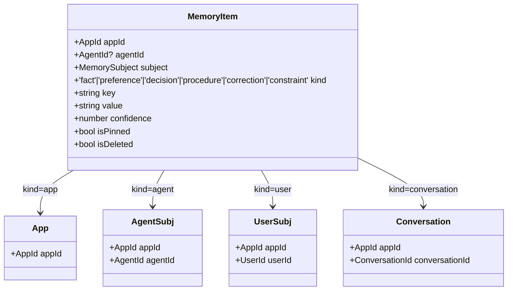

Inbound messages route to a memory subject via
the provider adapter's conversation classification and the bound agent's
conversation config:

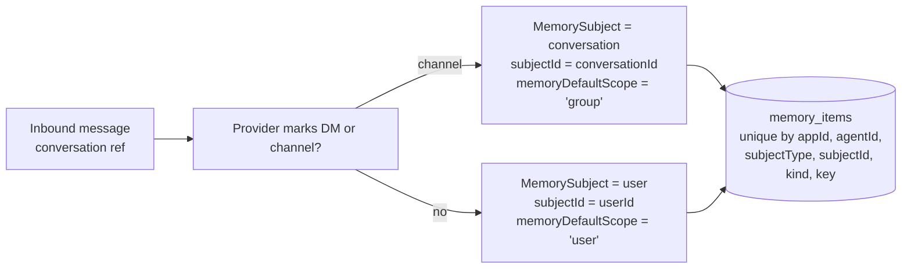

The default-scope toggle ships through the host as
`memoryDefaultScope: 'user' | 'group'` on the `SessionMemoryCollector` port
(`apps/core/src/domain/ports/session-memory-collector.ts`) and reaches the
agent through the `gantry-mcp` provider as `GANTRY_MEMORY_DEFAULT_SCOPE`
(`apps/core/src/adapters/llm/anthropic-claude-agent/agent-capabilities.ts`). The conversation memory
boundary is annotated in
`apps/core/src/adapters/storage/postgres/repositories/canonical-binding-repository.postgres.ts`.

A memory written in a DM cannot be read from a group of the same agent, and
vice versa: the rows differ in both `subjectType` and `subjectId`. `common`
remains app-level shared memory and is not promotable from agent flows.

Detail: [MEMORY.md](../MEMORY.md).

## 7. Capability Request + Approval Flow

Agents never install or mutate capabilities directly. Every change is a
reviewed request the host writes to signed IPC, renders through the channel
adapter, and gates on the Conversation approver allowlist or the bound DM
admin.

The full IPC handshake is drawn at
[runtime-components.md §Tools And IPC](./runtime-components.md#tools-and-permissions).
This section narrates the request half:

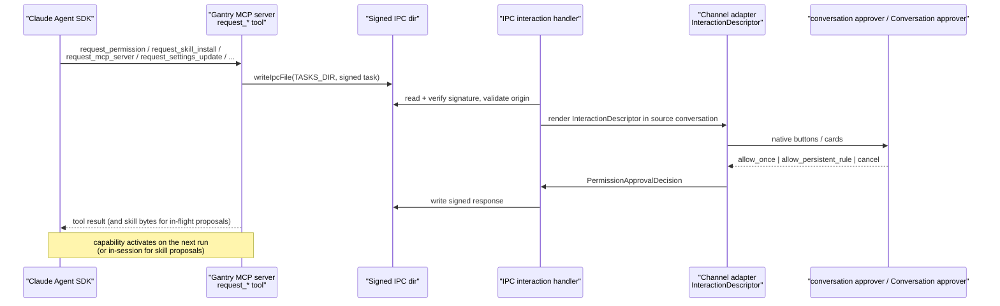

Cited at:

- `request_*` tool definitions —
  `apps/core/src/runner/mcp/tools/service.ts`.
- Settings tools (`settings_desired_state`, `request_settings_update`) —
  `apps/core/src/runner/mcp/tools/settings.ts`.
- Selected admin-capability tools (`admin_permission_list`,
  `admin_permission_revoke`, `service_restart`, `register_agent`) —
  `apps/core/src/runner/mcp/tools/admin-permissions.ts` and
  `apps/core/src/runner/mcp/tools/service.ts`.
- Decision modes (`allow_once | allow_persistent_rule | cancel`) —
  `apps/core/src/domain/types.ts`.
- IPC handlers — `apps/core/src/runtime/ipc.ts` and
  `apps/core/src/runtime/ipc-interaction-handler.ts`.
- Runner-side `canUseTool` —
  `apps/core/src/adapters/llm/anthropic-claude-agent/runner/permission-callback.ts`.
- conversation approver vs Conversation approver routing —
  [channel-interactions.md §Conversation Administration Model](./channel-interactions.md#conversation-administration-model).

## 8. Scheduler + Job Lifecycle

A Gantry job is a first-party record (`Job` in
`apps/core/src/domain/types.ts`) scoped by `group_scope` and runtime
`execution_context`/`notification_routes` in Postgres. pg-boss provides
claim/dispatch and restart-safe scheduling, not the job model.

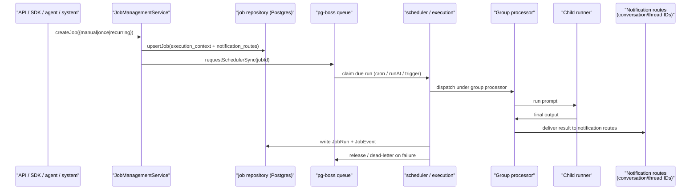

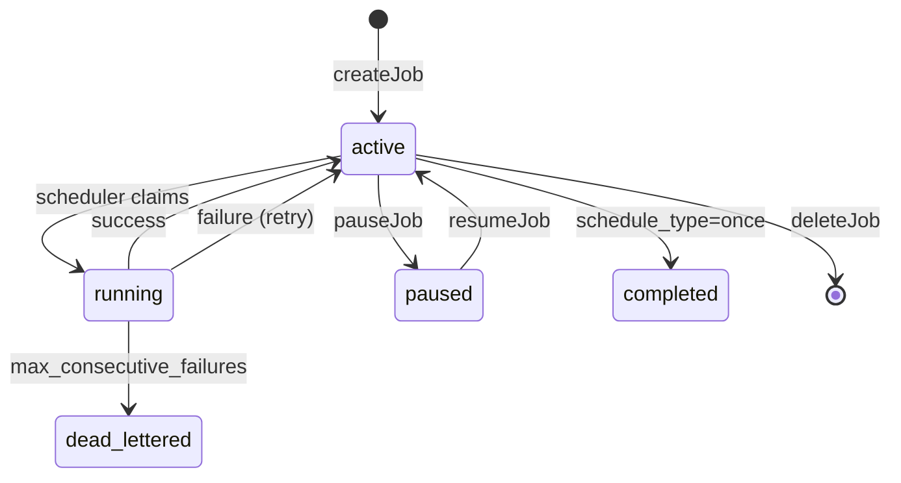

Cited at:

- Manual job creation binds `execution_context.conversationJid` and
  `notification_routes` for delivery —
  `apps/core/src/application/jobs/job-management-service.ts`.
- Agent-facing scheduler MCP tools authorize by `group_scope` plus the
  originating conversation in `execution_context.conversationJid`; thread ids
  are delivery metadata and spoof-check inputs, not visibility authority.
- System (dreaming) jobs registered per `group.folder` —
  `apps/core/src/jobs/system-jobs.ts`.
- Scheduler core — `apps/core/src/jobs/scheduler.ts`,
  `apps/core/src/jobs/execution.ts`,
  `apps/core/src/jobs/schedule-math.ts`.
- pg-boss claim/dispatch —
  `apps/core/src/infrastructure/pgboss/scheduler-engine.ts`.
- REST surface (`POST /v1/jobs/:jobId/trigger` returns `triggerId`;
  `GET /v1/triggers/:id/wait` blocks for completion) —
  `apps/core/src/control/server/routes/jobs.ts`.

## 9. External Ingress + Outbound Webhooks

Two opposite directions, drawn side by side. Policy lives in
[`docs/decisions/2026-04-30-external-ingress-vs-outbound-webhooks.md`](../decisions/2026-04-30-external-ingress-vs-outbound-webhooks.md).

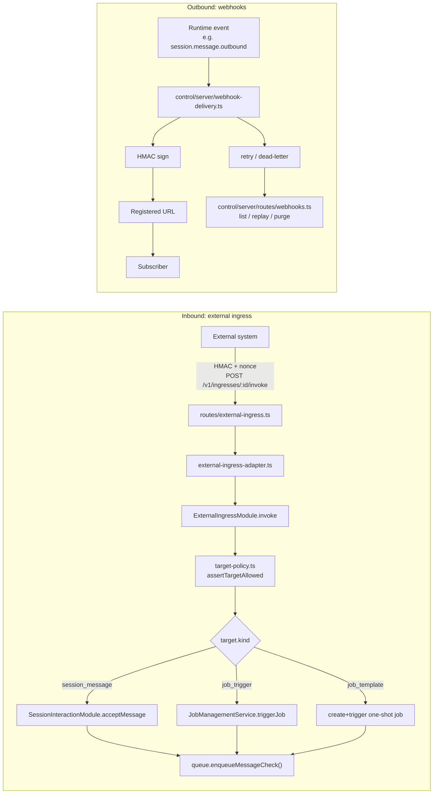

Cited at:

- Ingress route (`POST /v1/ingresses/:id/invoke` and `/wait`) —
  `apps/core/src/control/server/routes/external-ingress.ts`.
- Adapter (verifies + enqueues check after successful dispatch) —
  `apps/core/src/control/server/external-ingress-adapter.ts`.
- Module dispatch by target kind — `dispatchTarget` at
  `apps/core/src/application/external-ingress/external-ingress-module.ts`,
  with concrete branches for `session_message`, `job_trigger`, and
  `job_template`.
- Target-policy enforcement (allowlist of kinds, session ids, conversation
  ids, job ids, template ids) —
  `apps/core/src/application/external-ingress/target-policy.ts`.
- Outbound delivery + routes —
  `apps/core/src/control/server/webhook-delivery.ts` and
  `apps/core/src/control/server/routes/webhooks.ts`.

## 10. Inject a Message into a Running Session from Outside

Backend apps push messages into a live session through the same group
processor that channel inbound takes. The `app` channel adapter records
durable runtime events that the SDK observes via `wait` / `stream` or via an
outbound webhook.

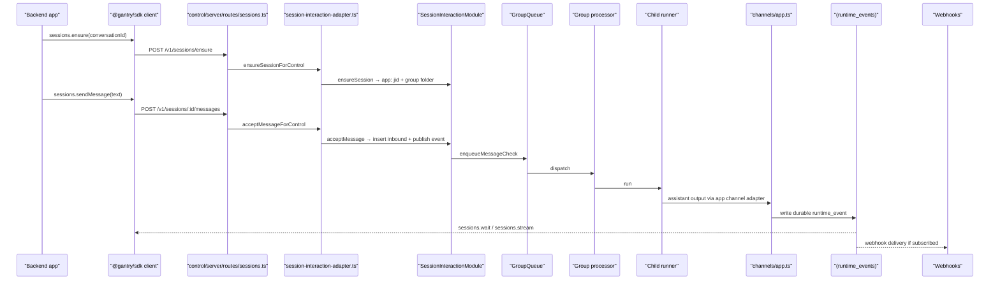

Cited at:

- SDK methods (`sessions.ensure`, `sessions.sendMessage`, `sessions.wait`,
  `sessions.stream`) — `packages/sdk/src/index.ts`.
- `POST /v1/sessions/ensure` —
  `apps/core/src/control/server/routes/sessions.ts`.
- `POST /v1/sessions/:id/messages` —
  `apps/core/src/control/server/routes/sessions.ts`.
- `ensureSessionForControl`, `acceptMessageForControl` —
  `apps/core/src/control/server/session-interaction-adapter.ts`.
- `app` channel adapter — `createAppChannel` at
  `apps/core/src/channels/app.ts`.

## 11. Dreaming End-to-End

Dreaming is a system job. The scheduler claims it per group folder, the
runtime calls `AppMemoryService.triggerDreaming({ phase: 'all' })`, and the
service writes audit rows to `memory_dream_runs` and `memory_dream_decisions`.

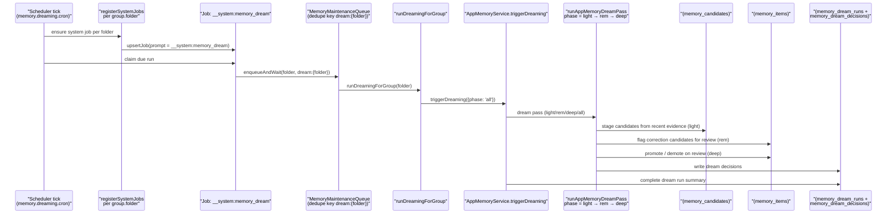

Cited at:

- System-job marker `MEMORY_DREAM_SYSTEM_PROMPT = '__system:memory_dream'` —
  `apps/core/src/jobs/system-jobs.ts`.
- Per-folder registration gated on `memory.dreaming.enabled` and
  `memory.dreaming.cron` —
  `apps/core/src/jobs/system-jobs.ts`.
- Maintenance-queue runner —
  `apps/core/src/runtime/memory-dreaming-runner.ts`.
- `triggerDreaming` —
  `apps/core/src/memory/app-memory-service.ts`.
- Phase logic (`light`, `rem`, `deep`, `all`) —
  `apps/core/src/memory/app-memory-dreaming.ts`.
- Audit tables — see [MEMORY.md §Storage](../MEMORY.md#storage).
- SDK on-demand trigger — `client.memory.dreaming.trigger` and
  `client.memory.dreaming.status` at `packages/sdk/src/index.ts`.

## 12. CLI + Control-API Operations Map

API, CLI, and MCP are adapters over the same application services
(see [capability-management.md](./capability-management.md#administration-model)). Each row
below is one operation; the columns show how each surface reaches it.

CLI surface (the `usage()` block at `apps/core/src/cli/index.ts`):

| Operation                   | CLI command                                                                                                 | Audience      |
| --------------------------- | ----------------------------------------------------------------------------------------------------------- | ------------- |
| First-run setup / doctor    | `gantry setup`, `gantry doctor`, `gantry status`                                                            | Owner / admin |
| Service control             | `gantry service install`, `gantry service start`, `gantry service stop`, `gantry service restart`           | Owner / admin |
| Local dev runtime           | `gantry local setup`, `gantry local start`, `gantry local stop`, `gantry local status`, `gantry local logs` | Owner / admin |
| Provider connect            | `gantry provider list`, `gantry provider connect`, `gantry provider doctor`                                 | Owner / admin |
| Conversation administration | `gantry conversation info`, `gantry conversation approvers`                                                 | Owner / admin |
| Agent administration        | `gantry agent list`, `gantry agent info`, `gantry agent add`, `gantry agent remove`, `gantry agent trigger` | Owner / admin |
| Browser profiles            | `gantry browser profiles`, `gantry browser status`                                                          | Owner / admin |
| Model catalog               | `gantry model status`, `gantry model list`, `gantry model set`, `gantry model reset`, `gantry model why`    | Owner / admin |
| Settings drift / export     | `gantry settings export-current`, `gantry settings drift`                                                   | Owner / admin |
| Skill upload                | `gantry skill draft upload <skill.zip>`                                                                     | Owner / admin |
| MCP administration          | `gantry mcp draft`, `gantry mcp list`, `gantry mcp approve`, `gantry mcp reject`, `gantry mcp bind`         | Owner / admin |

Control API surface (scopes from `apps/core/src/control/server/auth.ts`):

| Domain        | Scopes                                                       | Routes                                                                |
| ------------- | ------------------------------------------------------------ | --------------------------------------------------------------------- |
| Sessions      | `sessions:read`, `sessions:write`                            | `apps/core/src/control/server/routes/sessions.ts`                     |
| Jobs          | `jobs:read`, `jobs:write`                                    | `apps/core/src/control/server/routes/jobs.ts`                         |
| Providers     | `providers:read`, `providers:admin`                          | `apps/core/src/control/server/routes/provider-conversation-routes.ts` |
| Conversations | `conversations:read`, `conversations:admin`, `messages:read` | conversation routes under `routes/`                                   |
| Agents        | `agents:admin`                                               | agent routes                                                          |
| Skills        | `skills:read`, `skills:admin`                                | skill routes                                                          |
| MCP           | `mcp:read`, `mcp:admin`                                      | mcp routes                                                            |
| Webhooks      | `webhooks:read`, `webhooks:write`                            | `apps/core/src/control/server/routes/webhooks.ts`                     |
| Ingresses     | `ingresses:read`, `ingresses:write`                          | `apps/core/src/control/server/routes/external-ingress.ts`             |
| Memory        | `memory:read`, `memory:admin`                                | memory routes                                                         |

Agent-driven changes go through Gantry MCP `request_*` tools (§7) and produce
the same writes after approval. The principle —
"API, CLI, and MCP are adapters over the same application services" — is
stated at
[capability-management.md §Administration Model](./capability-management.md#administration-model).

## 13. Where to Read Next

This overview is the map. Subsystem docs are the territory:

- [runtime-components.md](./runtime-components.md) — file-by-file runtime map,
  end-to-end message flow, IPC handshake, failure/debugging table.
- [agent-runtime.md](./agent-runtime.md) — agent vs runtime boundary,
  message lifecycle, job lifecycle, app channel.
- [capability-management.md](./capability-management.md) — capability model,
  request/approval semantics, admin boundary.
- [channel-interactions.md](./channel-interactions.md) —
  `InteractionDescriptor`, conversation approver vs Conversation approver, provider
  rendering.
- [../MEMORY.md](../MEMORY.md) — boundary model, dreaming pipeline, retrieval
  injection, SDK APIs.
- [../SECURITY.md](../SECURITY.md) — full security model and trust boundaries.
- [../sdk/api-reference.md](../sdk/api-reference.md) — request shapes for the
  control API.
- [../sdk/agent-internals.md](../sdk/agent-internals.md) — agent-runtime
  contract for SDK consumers.
