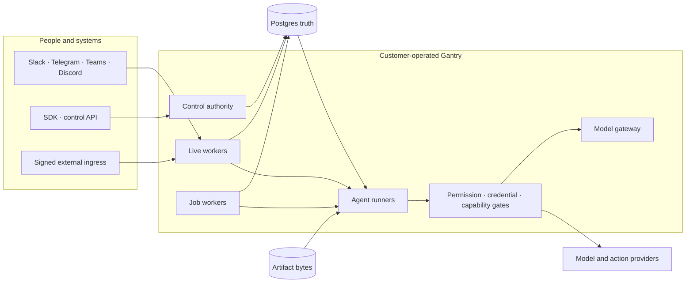

# Gantry Architecture Overview

Gantry is a provider-neutral, channel-neutral agent runtime whose host owns
routing, durability, credentials, permissions, and delivery. It ships as one
Node.js binary, but it is not limited to one process: a workstation uses the
default `all` role, while a fleet can run the same image as `control`,
`live-worker`, and `job-worker` services.

Start here, then use the three current deep guides:

- [System Atlas](./system-atlas.md) — complete feature-family status and
  authority map;
- [Runtime Flows](./runtime-flows.md) — provider ingress through delivery,
  jobs, memory, dreaming, company brain, permissions, and recovery;
- [Scaling and Deployment](./scaling-and-deployment.md) — process roles,
  Postgres coordination, capacity, provider ownership, and operational limits.

The [interactive architecture atlas](./atlas/README.md) provides five
revision-pinned views. Its [source evidence](./atlas/source-evidence.md) records
the implementation and accepted decisions behind the current narrative.
Historical plans, prompts, audits, and superseded decision sections remain
useful context, but they do not override current source and accepted decisions.

## System context

```mermaid
flowchart LR
  subgraph Callers[People and systems]
    Chat[Slack · Telegram · Teams · Discord]
    Apps[SDK · control API]
    Ingress[Signed external ingress]
  end

  subgraph Gantry[Customer-operated Gantry]
    Control[Control authority]
    Live[Live workers]
    Jobs[Job workers]
    Runner[Agent runners]
    Gate[Permission · credential · capability gates]
    Model[Model gateway]
  end

  PG[(Postgres truth)]
  Artifacts[(Artifact bytes)]
  Providers[Model and action providers]

  Chat --> Live
  Apps --> Control
  Ingress --> Live
  Control --> PG
  Live --> PG
  Jobs --> PG
  Live --> Runner
  Jobs --> Runner
  Runner --> Gate
  Gate --> Model
  Gate --> Providers
  PG --> Runner
  Artifacts --> Runner
```

Slack, Telegram, Teams, Discord, and the app channel translate native input and
delivery behind adapters. Backend apps use `@gantry/sdk` or the control API.
Signed `/v1/ingresses/:id/invoke` calls are governed inbound requests. HTTP SSE,
SDK list/wait, and outbound webhooks observe durable output; they are not
additional tool-authority paths.

## One binary, four roles

| Role | Responsibility |
| --- | --- |
| `all` | Workstation default: full control API, provider ingress, live turns, jobs, settings writes, and worker registration. |
| `control` | Full administrative/control API and desired-state writes; no provider inbound, runner, job, or bake execution. |
| `live-worker` | Provider inbound, durable live admission, and interactive execution; ops/read-only diagnostics only. |
| `job-worker` | Scheduler and durable job execution; ops/read-only diagnostics only. |

The process role is deployment-owned `GANTRY_PROCESS_ROLE`, resolved once at
boot. It is not a settings field. Fleet topology is
`runtime.deployment_mode: fleet`; security posture and runner confinement are
separate axes.

Postgres coordinates workers through durable admission, worker heartbeats,
leases, slot holds, fencing generations, command inboxes, pending interactions,
settings revisions, and job state. Notifications wake workers, but durable rows
remain authoritative.

The fleet machinery is implemented, with an important current limit: rate
limits and LLM admission are process-local. A multi-instance deployment sharing
one database must first make those authorities cluster-wide. See
[current operational ceilings](./scaling-and-deployment.md#current-operational-ceilings).

## Runtime ownership

| Concern | Owner |
| --- | --- |
| Canonical apps, agents, conversations, messages, sessions, runs, jobs, memory, settings, and events | Postgres repositories behind application ports |
| Desired state | Latest compatible Postgres `settings_revisions` row |
| Human-readable configuration | `settings.yaml` as workstation auto-import/synced copy and fleet explicit import/export |
| Provider-native identity and delivery | Provider Account plus Conversation Install |
| Agent/model selection | Versioned agent config, model aliases, and provider-neutral execution adapter |
| Real credentials | Host credential broker and configured runtime secret providers |
| Action authorization | Host permission coordinator and reviewed durable authority |
| Artifact bytes | Local workstation store or fleet-shared/object artifact adapter |
| Process topology | Deployment environment and infrastructure |

Provider JSONL, temporary runner directories, generated Claude settings, and
materialized skills are execution artifacts. They are not canonical continuity
or settings authority.

## A live turn in one paragraph

A channel adapter authenticates and normalizes a provider event, then persists
the canonical message and durable admission before waking execution. Any live
worker may atomically claim the work, but Postgres permits only one active turn
per app/agent-session/conversation/thread scope. The winner takes a fenced
lease, performs the authoritative message fetch, hydrates scoped memory once,
and composes the agent runner. Model requests use the host gateway; tool calls
cross host permission, credential, and capability gates. Completed output is
persisted, delivered through the exact installed Provider Account, and settled
by the current fenced owner. Follow-ups and approvals reach that owner through a
durable sequenced command inbox.

Read [Runtime Flows](./runtime-flows.md) for the full sequence and failure paths.

## Agent and conversation composition

An agent is assembled at run time from its versioned config, persona, model
alias, selected skills, MCP sources/actions, built-in Gantry tools, sandbox
choice, and reviewed authority. A provider message does not grant any of those
capabilities.

A Provider Account is one native provider identity owned by one agent. A
Conversation Install binds that account/agent route to a canonical conversation
with sender trigger, approver, memory, and delivery policy. The same agent can
be installed in many conversations. Several agents or several provider
accounts can share one provider-native conversation only as distinct installs;
their credentials, triggers, sessions, turns, approvals, delivery, and tool
authority remain scoped. See
[Multi-Agent Provider Configuration](./multi-agent-provider-configuration.md).

Native provider subagents are different: they run inside one parent turn and
inherit its runner, capabilities, and sandbox. They are not independently
installed Gantry agents.

## Permission and execution boundary

Authorization is always host-owned. The decision order is hard deny, locked
preset, fixed-image restriction, reviewed agent authority, deterministic rails,
optional cached classifier allow, optional risk classifier, then durable human
approval. The classifier advises risk only; it does not authorize.

Execution confinement is independent. `direct` has no inner SDK or Gantry OS
sandbox, so the host/container/VM is its confinement boundary.
`sandbox_runtime` optionally adds an outer whole-runner jail. Both still use the
same host permission and credential rails.

## Memory and company knowledge

App memory is scoped by app, agent, and a user/group/channel/common subject.
Lexical recall is always available; vector recall and embedding backfill are
optional. Memory is injected as bounded untrusted evidence and cannot grant
instructions or tools. Default-off dreaming stages host-validated lifecycle
proposals and sends destructive/contradictory changes to durable review.

Company brain is separate app-scoped knowledge: canonical pages, entities,
graph edges, embeddings, and brain dream decisions shared across agents.
Conversation harvest into it is default off and opt-in per conversation. Read
[Memory and Dreaming](../MEMORY.md) and
[Company Brain Core](./company-brain-core.md).

## Jobs and observation

One-time, recurring, maintenance, and autonomous jobs use durable definitions,
atomic claims, worker leases, fencing, job-owned sessions, host-derived memory
scope, and terminal notification routes. They use the same agent execution,
permission, credential, and capability boundaries as live work. Host-owned
scripts that bypass this lifecycle are unsupported.

Runtime events and the control outbox are durable observation/delivery facts.
They are not a command bus. Live continuation, stop, compact/new-session, and
interaction resolution use `live_turn_commands`.

## Read next

- [System Atlas](./system-atlas.md) — status of every major feature family.
- [Runtime Flows](./runtime-flows.md) — end-to-end sequences and recovery.
- [Scaling and Deployment](./scaling-and-deployment.md) — roles and limits.
- [Deployment Profiles](./deployment-profiles.md) — operator matrices and
  concrete configuration.
- [Runtime Components](./runtime-components.md) — implementation map.
- [Canonical Domain Model](./canonical-domain-model.md) — identities and
  invariants.
- [Capability Management](./capability-management.md) — capability lifecycle.
- [Autonomous Jobs](./autonomous-jobs.md) — job setup, execution, and
  visibility.
- [Browser Capability](./browser-capability.md) — profile and action boundary.
- [Session Resume](./session-resume.md) — canonical continuity.
