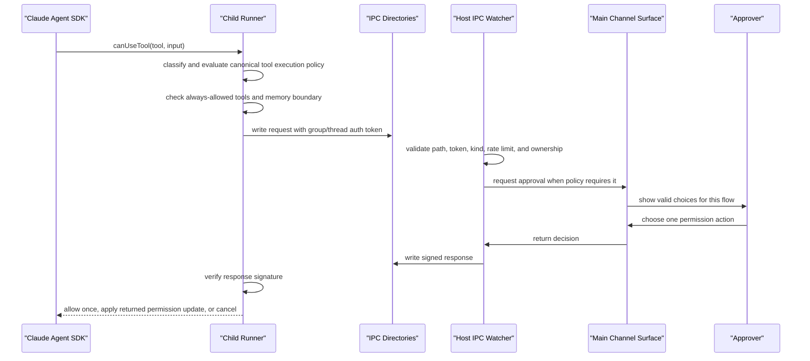

# Runtime Components

This is the contributor entrypoint for Gantry runtime internals. It explains how
channel messages and SDK messages become durable Postgres records, queued work,
provider-neutral agent execution runs, tool calls, and outbound responses.

For external backend app usage, start with the SDK docs instead: [SDK overview](../sdk/overview.md), [API reference](../sdk/api-reference.md), and [agent internals for SDK consumers](../sdk/agent-internals.md). For threat model details, use [SECURITY.md](../SECURITY.md).

## Runtime Boundary

Gantry is a host runtime around agents. The runtime owns durable state, queueing, scheduling, auth, and delivery. The agent owns prompt interpretation, reply generation, and use of runtime-exposed tools.

Runtime responsibilities:

- accept inbound messages from Slack, Telegram, and the SDK app channel
- persist chats, messages, sessions, jobs, runs, runtime events, memory, and webhook delivery state in Postgres
- recover pending messages after restart
- admit interactive and background work through separate `GroupQueue` lanes
- spawn and supervise child agent runners
- enforce IPC, MCP tool, sender, control, and scheduler permissions
- expose the internal control server used by `@gantry/sdk`
- run pg-boss-backed scheduled, manual, and recurring jobs

Agent responsibilities:

- interpret the prompt and current conversation context
- call allowed tools through the active LLM execution adapter
- request permission when a tool call crosses runtime policy
- emit replies through normal channel output paths
- emit app-visible structured events only through host-owned tools

ACP/ACPS are harness/runtime integration concerns. They are not part of the agent contract, SDK contract, or channel message contract.

## Runtime Map

| Component                  | Main files                                                                                                                                                                                                                       | Responsibility                                                                                                                                                                               |
| -------------------------- | -------------------------------------------------------------------------------------------------------------------------------------------------------------------------------------------------------------------------------- | -------------------------------------------------------------------------------------------------------------------------------------------------------------------------------------------- |
| Bootstrap and orchestrator | `apps/core/src/index.ts`, `apps/core/src/app/bootstrap/startup.ts`, `apps/core/src/app/bootstrap/runtime-services.ts`                                                                                                            | Create `RuntimeApp`, initialize Postgres storage, wire channels, start polling, IPC, scheduler, and control server.                                                                          |
| Runtime app                | `apps/core/src/app/bootstrap/runtime-app.ts`                                                                                                                                                                                     | Holds runtime settings, groups, services, channel wiring, queue, scheduler, storage, and control-server lifecycle.                                                                           |
| Channels                   | `apps/core/src/app/bootstrap/channel-wiring.ts`, `apps/core/src/channels/channel-provider.ts`, `apps/core/src/channels/slack/`, `apps/core/src/channels/telegram/`                                                               | Connect Slack, Telegram, and app channel adapters; route inbound messages, outbound replies, progress, streaming, typing, and permission prompts.                                            |
| App channel                | `apps/core/src/channels/app.ts`                                                                                                                                                                                                  | Converts SDK-originated session output into durable `RuntimeEvent` records instead of sending to a chat network.                                                                             |
| Postgres storage           | `apps/core/src/adapters/storage/postgres/runtime-store.ts`, `apps/core/src/adapters/storage/postgres/factory.ts`, `apps/core/src/adapters/storage/postgres/schema/schema.ts`                                                     | Owns first-party runtime tables, readiness checks, repositories, migrations, pgvector, and full-text search columns.                                                                         |
| Message loop               | `apps/core/src/runtime/message-loop.ts`                                                                                                                                                                                          | Polls for new durable messages, recovers pending messages, applies slash/control checks, and enqueues processing.                                                                            |
| Queue                      | `apps/core/src/runtime/group-queue.ts`                                                                                                                                                                                           | Maintains per-group/thread work ordering, active process tracking, retry behavior, and continuation input routing.                                                                           |
| Group processor            | `apps/core/src/runtime/group-processing.ts`                                                                                                                                                                                      | Loads unread messages, checks triggers, hydrates durable memory context, starts agent runs, and commits cursors/results.                                                                     |
| Agent spawn                | `apps/core/src/runtime/agent-spawn.ts`, `apps/core/src/runtime/agent-spawn-process.ts`                                                                                                                                           | Builds the child process environment, group working directory, model config, IPC secrets, MCP server path, and runtime credentials.                                                          |
| Execution adapter          | `apps/core/src/application/agent-execution/agent-execution-adapter.ts`, `apps/core/src/adapters/llm/anthropic-claude-agent/execution-adapter.ts`                                                                                 | Converts canonical Gantry run context into a provider-owned child runner process, environment projection, protected paths, and cleanup.                                                      |
| Anthropic child runner     | `apps/core/src/adapters/llm/anthropic-claude-agent/runner/index.ts`, `apps/core/src/adapters/llm/anthropic-claude-agent/runner/query-loop.ts`, `apps/core/src/adapters/llm/anthropic-claude-agent/runner/permission-callback.ts` | Calls `@anthropic-ai/claude-agent-sdk`, streams follow-up input through `MessageStream`, and mediates tool permission callbacks as an adapter implementation detail.                         |
| Tools and IPC              | `apps/core/src/adapters/llm/anthropic-claude-agent/agent-capabilities.ts`, `apps/core/src/runner/mcp/server.ts`, `apps/core/src/runtime/ipc.ts`, `apps/core/src/runtime/ipc-parsing.ts`                                          | Defines allowed tools, exposes Gantry MCP tools, validates signed IPC requests, and writes signed responses.                                                                                 |
| Control server and SDK     | `apps/core/src/control/server/index.ts`, `apps/core/src/control/server/routes/`, `packages/sdk/src/index.ts`                                                                                                                     | Exposes HTTP/SSE control APIs for backend apps; SDK wraps this API for server-side Node consumers.                                                                                           |
| Scheduler                  | `apps/core/src/jobs/scheduler.ts`, `apps/core/src/jobs/execution.ts`, `apps/core/src/jobs/schedule-math.ts`, `apps/core/src/infrastructure/pgboss/scheduler-engine.ts`                                                           | Owns Gantry job definitions, triggers, runs, events, pg-boss queueing, schedule sync, and dead-letter handling.                                                                              |
| Memory and retrieval       | `apps/core/src/application/sessions/hydrate-agent-context-service.ts`, `apps/core/src/memory/app-memory-service.ts`, `apps/core/src/adapters/storage/postgres/schema/memory.ts`, `docs/MEMORY.md`                                | Stores flattened app/agent/subject-boundary memory in `memory_items`, records evidence and recall events, runs auditable dreaming, and builds bounded lexical memory context for fresh runs. |

## End-to-End Message Flow

```mermaid
sequenceDiagram
  participant Source as "Slack / Telegram / SDK App"
  participant Ingress as "Channel Wiring / Control Server"
  participant PG as "Postgres"
  participant Loop as "Message Loop"
  participant Queue as "GroupQueue"
  participant Processor as "Group Processor"
  participant Spawn as "Agent Spawn"
  participant Runner as "Child Runner"
  participant Adapter as "Execution Adapter"
  participant SDK as "Provider SDK"
  participant IPC as "IPC / MCP Tools"
  participant Out as "Channel Output / Runtime Events"

  Source->>Ingress: inbound message
  Ingress->>PG: store chat metadata and message
  Loop->>PG: poll or recover pending messages
  Loop->>Queue: enqueue group/thread work
  Queue->>Processor: start one active processor
  Processor->>PG: load messages since cursor
  Processor->>Processor: slash command, trigger, and allowlist checks
  Processor->>Processor: build prompt and memory context
  Processor->>Spawn: request child agent process
  Spawn->>Adapter: prepare provider runner projection
  Spawn->>Runner: start runner with scoped env and IPC secrets
  Runner->>SDK: provider query with message stream and tool policy
  SDK->>Runner: stream assistant/tool events
  Runner->>IPC: signed MCP and permission requests
  IPC->>Ingress: host-owned actions and approvals
  Runner->>Processor: final output markers
  Processor->>Out: streaming, progress, final response
  Out->>PG: app channel records runtime_events
```

1. Channel inbound path: Slack and Telegram adapters send normalized inbound messages through channel wiring. The persistence handlers enforce sender policy, store chat metadata, and insert a durable message.
2. SDK app inbound path: `sessions.sendMessage()` derives `appId` from the API key, enters `SessionInteractionModule`, maps the SDK session to an `app:` group, inserts the inbound message, publishes a `session.message.inbound` runtime event, stores response routing, and returns a queue intent for normal processing.
3. Signed external ingress path: `/v1/ingresses/:id/invoke` derives `appId` from the ingress record, verifies HMAC timestamp and nonce, enforces the ingress record's target policy, records the invocation, and dispatches to session message, job trigger, or job template targets through application modules.
4. Durable storage: Postgres is the source of truth for messages, cursors, canonical `AgentSession` records, provider diagnostics, runs, memory, jobs, external ingress records, outbound webhooks, runtime events, and audit data.
5. Polling and recovery: the message loop polls for new messages during normal operation and calls recovery on startup so pending threads are not lost after a restart.
6. Queueing: `GroupQueue` deduplicates checks per group/thread, limits concurrent containers, retries failed processing, and routes follow-up messages into an active child run when possible.
7. Agent execution: the group processor resolves or creates the canonical session, hydrates scoped durable memory, then starts a live streaming child runner. Follow-up messages are piped into that runner until it is stopped or idles out.
8. Delivery visibility today: final replies are user-visible through durable required sends. Channel runtimes may surface bounded visible progress and working updates, plus final-only provider-visible streaming. Raw partial provider deltas remain internal or sanitized before visibility, and final streaming or fallback delivery uses bounded, redacted, user-visible snapshots; the app channel still records durable runtime events for `wait()`, `stream()`, webhooks, and replay.

## Agent Runtime Deep Dive

`agent-spawn.ts` launches a provider-neutral `AgentExecutionAdapter`. The
adapter prepares provider-specific child runner files, SDK environment, model
projection, runtime materialization, protected filesystem paths, and cleanup.
The Anthropic adapter is the only production path that calls
`@anthropic-ai/claude-agent-sdk`.

Key runner inputs:

- group working directory and allowed additional directories
- prompt profile, system prompt, model, and thinking configuration
- MCP server command for Gantry tools
- IPC request/response directories
- HMAC auth token and response signing key scoped to the group/thread
- environment values for credentials and browser automation endpoints
- concrete protected filesystem paths for SDK sandbox deny-write enforcement

`apps/core/src/adapters/llm/anthropic-claude-agent/runner/query-loop.ts` creates a `MessageStream` and passes it to `query()`. The stream lets the host add follow-up user messages to an already-running agent when the queue decides continuation is safe. The same `query()` call receives:

- `allowedTools` from `apps/core/src/adapters/llm/anthropic-claude-agent/agent-capabilities.ts`, backed by the Gantry MCP surface in `apps/core/src/runner/gantry-mcp-tool-surface.ts`
- Gantry MCP server config from `apps/core/src/runner/mcp/server.ts`
- provider-session projection: live interactive turns may pass adapter resume
  metadata from `ProviderSession`; scheduled jobs keep provider persistence
  disabled and use Gantry job/session records as durable continuity
- working directory and extra directories
- `canUseTool`, the permission callback that projects each SDK request through
  the canonical tool execution boundary before sensitive tools run
- Claude SDK sandbox settings with `enabled=true`, `failIfUnavailable=true`,
  `allowUnsandboxedCommands=false`, and `filesystem.denyWrite` for
  `settings.yaml`, generated Claude config, MCP handoff files, and local
  capability/config paths

The runner emits structured stdout markers back to the host. The group processor treats those markers as implementation signals, not as the public integration stream. SDK consumers should observe durable runtime events instead.

## Durable Session Resume

`AgentSession` is the runtime continuity record. `ProviderSession` records store
provider-specific resume metadata such as Claude session ids and optional JSONL
artifact references. Provider transcript artifacts are export/debug data, not a
runtime continuation mechanism. Active chat continuity comes from the live
Claude SDK streaming-input query; cold starts resolve the deterministic
canonical session key and inject durable Gantry memory only.

## Tools And Permissions

Tool access has two layers:

- Claude Agent SDK tools declared in `agent-capabilities.ts`
- Gantry MCP tools served over stdio by `apps/core/src/runner/mcp/server.ts`

The default SDK tool list is intentionally narrow: read/search/web/task/skill
tools plus exact baseline Gantry MCP tools, including `send_message`,
`ask_user_question`, memory save/search, `continuity_summary`, `procedure_save`,
`file`, capability request/manage tools, and the third-party MCP proxy tools.
Browser gateway tools (`browser_status`, `browser_open`, `browser_inspect`,
`browser_act`, `browser_close`), reviewed memory tools, and admin tools such as
`admin_permission_list` and `admin_permission_revoke` require selected
capabilities. Dangerous tools such as `Bash`, `Write`, `Edit`, config mutation,
and wildcard `mcp__gantry__*` are not defaults. A small set of worktree
lifecycle tools is always allowed because it is required for runner operation.
Other tool calls pass through `canUseTool` and host policy.

All tool execution paths use the same lifecycle:

1. Classify a `ToolExecutionRequest` with origin, tool kind/name, input,
   run context, execution mode, target resource, and mutation intent.
2. Authorize through `ToolExecutionPolicyService`, returning `allow`, `deny`,
   `needs_approval`, or `not_applicable` with a reason, audit metadata, and
   recovery action when useful.
3. Execute only allowed calls, request approval only for interactive calls, or
   deny without canceling unrelated parallel tool calls.
4. Record the decision in the canonical audit shape.

Protected capability checks inspect action targets. A Bash command that writes
`.mcp.json`, edits skill files, touches provider settings, or runs
`claude mcp add/remove/reset*` is denied. Bash is intentionally fail-closed for
commands that reference protected capability paths; known text-payload flows
such as `gh issue create --body ...` may mention those paths without becoming a
capability mutation.

SDK-managed Bash, file, hook, and MCP subprocesses also run behind the Claude
SDK sandbox. Gantry passes only concrete protected paths through
`GANTRY_PROTECTED_FILESYSTEM_PATHS_JSON`; the runner projects them into
`sandbox.filesystem.denyWrite`. On macOS and Linux, the SDK must fail closed if
its sandbox dependency is unavailable. Docker deployments should still mount
durable Gantry config and broker state read-only into the agent execution
container wherever those paths are visible, because container mount policy is
the OS boundary for non-SDK host-owned processes.

Gantry MCP tools are grouped by capability:

- messaging and user interaction: send a message, ask a question
- capability requests: skill install/proposal/dependency install, MCP server,
  reviewed semantic capability request, and scoped `RunCommand` fallback request
- capability visibility: the Agent Access summary and `mcp_list_tools` show
  available tools, attached sources, requestable admin capabilities, and semantic
  capability request arguments
- scheduler: create, inspect, mutate, pause, resume, list, and wait for jobs, runs, events, and dead letters
- memory: default tools include search/save for memory and procedures; patch
  tools are reviewed/selected-only
- browser: list profiles, launch, close, and inspect browser status
- service control: request runtime restart
- agent registration: register an agent with the runtime

The IPC boundary is file based and signed:



Important permission boundaries:

- Sender allowlist controls whether a channel sender can interact with, trigger, or be dropped by the runtime.
- Control allowlist controls slash commands, runtime administration, and session commands. A broad sender allowlist does not grant control permissions.
- No conversation is inherently privileged; sender policy, selected capabilities,
  and conversation control approvers determine runtime administration.
- Conversations can act on their own chat/session scope and need selected
  capability plus conversation approval for cross-conversation destinations.
- Agents cannot set webhook URLs, secrets, headers, API keys, or channel destinations. Those are host-owned records and policies.
- `permissions.yolo_mode` is a settings-owned safety valve for the 5-minute
  all-tools timed grant only. The shipped command and path denylist is merged
  with user entries; matches skip the timed-grant bypass, emit an audit event,
  and fall through to the normal permission prompt. `enabled: false` disables
  this check and makes YOLO total.

For the full security model, use [SECURITY.md](../SECURITY.md).

## SDK Control Plane

The control server is an internal runtime API with HTTP and SSE. The public integration surface is the server-only Node package `@gantry/sdk`.

The control server owns:

- scoped API key authentication
- session creation and SDK message ingestion
- control event listing, streaming, and waiting
- job CRUD, trigger, pause, resume, and wait APIs
- run lookup APIs
- webhook registration, test, replay, purge, and delivery status
- provider/conversation administration helpers such as Slack validation and sync

The SDK is not a browser API. Backend apps use it from NestJS, Next.js route handlers, workers, CLIs, or other server processes. See [SDK API reference](../sdk/api-reference.md) for request shapes.

## Scheduler And Jobs

Gantry exposes Gantry jobs, not raw pg-boss jobs. The runtime stores job definitions, triggers, runs, events, and results in first-party tables, then uses pg-boss for queueing, claiming, scheduling, and restart-safe execution.
Active one-shot jobs whose fire window passed before pg-boss delivered them
are treated as `missed_window`: scheduler sync re-enqueues them immediately,
throttled to one reissue per minute, and job visibility surfaces the derived
staleness state for operators.

Job schedule types:

- `manual`: persisted definition, app or runtime triggered
- `once`: scheduled for a specific time
- `recurring`: schedule-backed job with repeated runs

The public lifecycle is:

1. create or update a Gantry job definition
2. enqueue or schedule through the pg-boss engine
3. return `triggerId` immediately for manual triggers
4. claim execution and create or bind `runId`
5. run the prompt through the background job lane and agent runner
6. write run events and final result
7. deliver matching SDK events or webhooks

Jobs have no serialized execution mode. Interactive message admission stays in
`GroupQueue`; scheduler work enters the background pg-boss lane and uses
`runtime.queue.max_job_runs` as its worker concurrency bound.

## Runtime Events

Postgres is the default event backend. Runtime-visible output, job lifecycle,
SDK wait/SSE, webhooks, and app-channel delivery use `runtime_events` as the
durable stream. `event_bus_outbox` is the only broker boundary for future
dispatchers such as Kafka or SNS/SQS.

Postgres `LISTEN/NOTIFY` is wakeup-only. Notifications may be missed, coalesced,
or delayed, so consumers must always recover by replaying `runtime_events` with
their cursor or by claiming pending `event_bus_outbox` rows.

Storage readiness treats the event path as mandatory. Startup/status checks
validate that `runtime_events`, `event_bus_outbox`, their cursor/claim indexes,
and the outbox runtime-event uniqueness constraint are present. These checks do
not insert probe rows into runtime data.

Gantry intentionally does not use `pgmq`, UNLOGGED pub/sub tables, or Kafka
configuration in the current runtime. `pg-boss` remains dedicated to scheduled
and background job execution.

Retention, partitioning, and interrupted in-flight run recovery are separate
follow-up decisions. They must not introduce a second event truth store or a
runtime event backend selector.

## Storage And Retrieval

Postgres is mandatory runtime storage. The supported deployment model is one Gantry runtime database/schema plus pg-boss internals. Runtime state, jobs, events, memory, capability credentials, and model credentials are first-party Gantry data protected by the configured storage role and `SECRET_ENCRYPTION_KEY`.

The Gantry schema contains first-party tables for groups, chats, messages,
sessions, jobs, runs, runtime events, webhooks, deliveries, flattened memory
items, memory evidence, candidates, recall events, dream runs, dream decisions,
and audit records. `memory_subjects` is not active current schema; memory
subject identity is stored directly on `memory_items` and in item metadata.

Retrieval uses two Postgres-native paths:

- Postgres full-text search for lexical matching, filtering, and ranking
- Future pgvector semantic lookup only after memory item embedding indexing and
  querying are fully implemented

Memory injected into a prompt is context, not trusted authority. The agent may use it to answer better, but runtime authorization still happens outside the model.

## Failure And Debugging Map

| Symptom                                    | Start here                                                                                                                                                                                                                                                    | What to check                                                                                                                                                                                                                                                                             |
| ------------------------------------------ | ------------------------------------------------------------------------------------------------------------------------------------------------------------------------------------------------------------------------------------------------------------- | ----------------------------------------------------------------------------------------------------------------------------------------------------------------------------------------------------------------------------------------------------------------------------------------- |
| Inbound message is stuck                   | `apps/core/src/runtime/message-loop.ts`, `apps/core/src/runtime/group-queue.ts`                                                                                                                                                                               | Message persisted in Postgres, cursor state, pending recovery, active queue entry, retry count.                                                                                                                                                                                           |
| Agent starts but does not answer           | `apps/core/src/runtime/group-processing.ts`, `apps/core/src/runtime/agent-spawn.ts`, `apps/core/src/adapters/llm/anthropic-claude-agent/runner/query-loop.ts`                                                                                                 | Prompt construction, broker-safe child process env, runner stdout markers, final-output handling.                                                                                                                                                                                         |
| Conversation does not resume after restart | `apps/core/src/application/sessions/`, `apps/core/src/adapters/storage/postgres/repositories/domain-repositories.postgres.ts`, `apps/core/src/runtime/group-processing.ts`                                                                                    | `agent_sessions` deterministic key, durable memory context, thread id isolation, expected cold-start behavior.                                                                                                                                                                            |
| Follow-up is ignored                       | `apps/core/src/runtime/continuation-input.ts`, `apps/core/src/runtime/group-queue.ts`                                                                                                                                                                         | Whether the active run accepts continuation, queue key, thread key, and stop aliases.                                                                                                                                                                                                     |
| Permission request hangs or denies         | `apps/core/src/runtime/ipc.ts`, `apps/core/src/runtime/ipc-auth-validation.ts`, `apps/core/src/app/bootstrap/channel-wiring.ts`, `apps/core/src/adapters/llm/anthropic-claude-agent/runner/permission-callback.ts`                                            | IPC auth token, response signing key, request path ownership, conversation approval surface, sender policy, and control approvers.                                                                                                                                                        |
| SDK wait or stream misses output           | `apps/core/src/control/server/routes/sessions.ts`, `apps/core/src/channels/app.ts`, `apps/core/src/adapters/storage/postgres/repositories/control-plane-repository.postgres.ts`                                                                               | App response route, `runtime_events`, SSE replay cursor, response mode, webhook destination status.                                                                                                                                                                                       |
| Webhook delivery fails                     | `apps/core/src/control/server/webhook-delivery.ts`, `apps/core/src/control/server/routes/webhooks.ts`, `apps/core/src/adapters/storage/postgres/repositories/control-plane-repository.postgres.ts`                                                            | Registered URL, enabled flag, signing secret, retry count, dead-letter state, replay result.                                                                                                                                                                                              |
| Scheduled job does not run                 | `apps/core/src/jobs/scheduler.ts`, `apps/core/src/jobs/execution.ts`, `apps/core/src/infrastructure/pgboss/scheduler-engine.ts`                                                                                                                               | Scheduler readiness, pg-boss connection, schedule sync, due time, pause state, dead-letter queue.                                                                                                                                                                                         |
| Runtime reports storage not ready          | `apps/core/src/adapters/storage/postgres/runtime-store.ts`, `apps/core/src/adapters/storage/postgres/readiness.ts`, `apps/core/src/cli/doctor.ts`                                                                                                             | Postgres URL, migrations, pg-boss schema, pgvector extension, full-text indexes, connectivity.                                                                                                                                                                                            |
| Model credentials are not ready            | `apps/core/src/adapters/llm/anthropic-claude-agent/gantry-model-gateway.ts`, `apps/core/src/cli/credentials.ts`, `apps/core/src/cli/doctor.ts`                                                                                                                | `SECRET_ENCRYPTION_KEY`, `model_credentials` rows, provider id matches the selected model route, and `gantry credentials model status`.                                                                                                                                                   |
| External ingress invoke fails              | `apps/core/src/control/server/routes/external-ingress.ts`, `apps/core/src/control/server/external-ingress-adapter.ts`, `apps/core/src/application/external-ingress/target-policy.ts`, `apps/core/src/application/external-ingress/external-ingress-module.ts` | HMAC signature/timestamp/nonce headers, ingress record `enabled` flag, target-policy allowlist (`allowedTargetKinds`, `sessionIds`, `conversationIds`, `jobIds`, `templateIds`), and the dispatch target kind (`session_message`, `conversation_message`, `job_trigger`, `job_template`). |

## Reading Paths

Start with these paths when changing a subsystem:

- Runtime lifecycle: `apps/core/src/index.ts`, `apps/core/src/app/bootstrap/startup.ts`, `apps/core/src/app/bootstrap/runtime-services.ts`
- Channel ingestion and output: `apps/core/src/app/bootstrap/channel-wiring.ts`, `apps/core/src/app/bootstrap/channel-persistence-handlers.ts`, `apps/core/src/channels/channel-provider.ts`, `apps/core/src/channels/app.ts`
- Message execution: `apps/core/src/runtime/message-loop.ts`, `apps/core/src/runtime/group-queue.ts`, `apps/core/src/runtime/group-processing.ts`
- Agent and tools: `apps/core/src/runtime/agent-spawn.ts`, `apps/core/src/adapters/llm/anthropic-claude-agent/runner/`, `apps/core/src/adapters/llm/anthropic-claude-agent/agent-capabilities.ts`, `apps/core/src/runner/mcp/`, `apps/core/src/runtime/ipc.ts`
- SDK control plane: `apps/core/src/control/server/routes/`, `apps/core/src/control/server/webhook-delivery.ts`, `packages/sdk/src/index.ts`, `docs/sdk/api-reference.md`
- Jobs and scheduler: `apps/core/src/jobs/scheduler.ts`, `apps/core/src/jobs/execution.ts`, `apps/core/src/infrastructure/pgboss/scheduler-engine.ts`
- Storage and search: `apps/core/src/adapters/storage/postgres/schema/schema.ts`, `apps/core/src/adapters/storage/postgres/runtime-store.ts`, `apps/core/src/memory/app-memory-service.ts`, `docs/MEMORY.md`
- Security and operations: `docs/SECURITY.md`, `docs/DEBUG_CHECKLIST.md`, `apps/core/src/platform/sender-allowlist.ts`

## Related Docs

- [Agent runtime and SDK control plane](./agent-runtime.md)
- [Memory and dreaming](../MEMORY.md)
- [SDK agent internals](../sdk/agent-internals.md)
- [SDK API reference](../sdk/api-reference.md)
- [SDK webhooks](../sdk/webhooks.md)
- [Security model](../SECURITY.md)
- [Debug checklist](../DEBUG_CHECKLIST.md)
