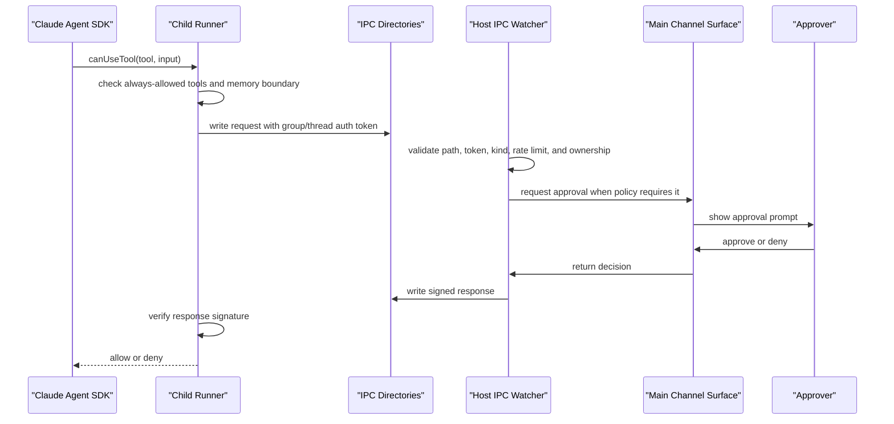

# Runtime Components

This is the contributor entrypoint for MyClaw runtime internals. It explains how channel messages and SDK messages become durable Postgres records, queued work, Claude Agent SDK runs, tool calls, and outbound responses.

For external backend app usage, start with the SDK docs instead: [SDK overview](../sdk/overview.md), [API reference](../sdk/api-reference.md), and [agent internals for SDK consumers](../sdk/agent-internals.md). For threat model details, use [SECURITY.md](../SECURITY.md).

## Runtime Boundary

MyClaw is a host runtime around agents. The runtime owns durable state, queueing, scheduling, auth, and delivery. The agent owns prompt interpretation, reply generation, and use of runtime-exposed tools.

Runtime responsibilities:

- accept inbound messages from Slack, Telegram, and the SDK app channel
- persist chats, messages, sessions, jobs, runs, control events, memory, and webhook delivery state in Postgres
- recover pending messages after restart
- serialize work per group or thread through `GroupQueue`
- spawn and supervise child agent runners
- enforce IPC, MCP tool, sender, control, and scheduler permissions
- expose the internal control server used by `@myclaw/sdk`
- run pg-boss-backed scheduled, manual, and recurring jobs

Agent responsibilities:

- interpret the prompt and current conversation context
- call allowed tools through the Claude Agent SDK
- request permission when a tool call crosses runtime policy
- emit replies through normal channel output paths
- emit app-visible structured events only through host-owned tools

ACP/ACPS are harness/runtime integration concerns. They are not part of the agent contract, SDK contract, or channel message contract.

## Runtime Map

| Component                  | Main files                                                                                                                                                             | Responsibility                                                                                                                                    |
| -------------------------- | ---------------------------------------------------------------------------------------------------------------------------------------------------------------------- | ------------------------------------------------------------------------------------------------------------------------------------------------- |
| Bootstrap and orchestrator | `apps/core/src/index.ts`, `apps/core/src/app/bootstrap/startup.ts`, `apps/core/src/app/bootstrap/runtime-services.ts`                                                  | Create `RuntimeApp`, initialize Postgres storage, wire channels, start polling, IPC, scheduler, and control server.                               |
| Runtime app                | `apps/core/src/app/bootstrap/runtime-app.ts`                                                                                                                           | Holds runtime settings, groups, services, channel wiring, queue, scheduler, storage, and control-server lifecycle.                                |
| Channels                   | `apps/core/src/app/bootstrap/channel-wiring.ts`, `apps/core/src/channels/channel-provider.ts`, `apps/core/src/channels/slack/`, `apps/core/src/channels/telegram/`     | Connect Slack, Telegram, and app channel adapters; route inbound messages, outbound replies, progress, streaming, typing, and permission prompts. |
| App channel                | `apps/core/src/channels/app.ts`                                                                                                                                        | Converts SDK-originated session output into durable `control_events` instead of sending to a chat network.                                        |
| Postgres storage           | `apps/core/src/adapters/storage/postgres/runtime-store.ts`, `apps/core/src/adapters/storage/postgres/factory.ts`, `apps/core/src/adapters/storage/postgres/schema/schema.ts` | Owns first-party runtime tables, readiness checks, repositories, migrations, pgvector, and full-text search columns.                              |
| Message loop               | `apps/core/src/runtime/message-loop.ts`                                                                                                                                | Polls for new durable messages, recovers pending messages, applies slash/control checks, and enqueues processing.                                 |
| Queue                      | `apps/core/src/runtime/group-queue.ts`                                                                                                                                 | Maintains per-group/thread work ordering, active process tracking, retry behavior, and continuation input routing.                                |
| Group processor            | `apps/core/src/runtime/group-processing.ts`                                                                                                                            | Loads unread messages, checks triggers, builds prompts, injects memory context, starts agent runs, and commits cursors/results.                   |
| Agent spawn                | `apps/core/src/runtime/agent-spawn.ts`, `apps/core/src/runtime/agent-spawn-process.ts`                                                                                 | Builds the child process environment, group working directory, model config, IPC secrets, MCP server path, and runtime credentials.               |
| Child runner               | `apps/core/src/runner/claude/index.ts`, `apps/core/src/runner/claude/query-loop.ts`, `apps/core/src/runner/claude/permission-callback.ts`                              | Calls `@anthropic-ai/claude-agent-sdk`, streams follow-up input through `MessageStream`, and mediates tool permission callbacks.                  |
| Tools and IPC              | `apps/core/src/runner/agent-capabilities.ts`, `apps/core/src/runner/mcp/server.ts`, `apps/core/src/runtime/ipc.ts`, `apps/core/src/runtime/ipc-parsing.ts`             | Defines allowed tools, exposes MyClaw MCP tools, validates signed IPC requests, and writes signed responses.                                      |
| Control server and SDK     | `apps/core/src/control/server/index.ts`, `apps/core/src/control/server/routes/`, `packages/sdk/src/index.ts`                                                           | Exposes HTTP/SSE control APIs for backend apps; SDK wraps this API for server-side Node consumers.                                                |
| Scheduler                  | `apps/core/src/jobs/scheduler.ts`, `apps/core/src/jobs/execution.ts`, `apps/core/src/jobs/schedule-math.ts`, `apps/core/src/infrastructure/pgboss/scheduler-engine.ts` | Owns MyClaw job definitions, triggers, runs, events, pg-boss queueing, schedule sync, and dead-letter handling.                                   |
| Memory and retrieval       | `apps/core/src/runtime/memory-context.ts`, `apps/core/src/memory/app-memory-service.ts`, `apps/core/src/adapters/storage/postgres/schema/schema.ts`, `docs/MEMORY.md`    | Stores app/agent/subject-boundary memory, records evidence and recall events, runs auditable dreaming, and injects bounded context into prompts.  |

## End-to-End Message Flow

```mermaid
sequenceDiagram
  participant Source as "Slack / Telegram / SDK App"
  participant Ingress as "Channel Wiring / Control Server"
  participant PG as "Postgres"
  participant Loop as "Message Loop"
  participant Queue as "GroupQueue"
  participant Processor as "Group Processor"
  participant Spawn as "Agent Spawn"
  participant Runner as "Child Runner"
  participant SDK as "Claude Agent SDK"
  participant IPC as "IPC / MCP Tools"
  participant Out as "Channel Output / Control Events"

  Source->>Ingress: inbound message
  Ingress->>PG: store chat metadata and message
  Loop->>PG: poll or recover pending messages
  Loop->>Queue: enqueue group/thread work
  Queue->>Processor: start one active processor
  Processor->>PG: load messages since cursor
  Processor->>Processor: slash command, trigger, and allowlist checks
  Processor->>Processor: build prompt and memory context
  Processor->>Spawn: request child agent process
  Spawn->>Runner: start runner with scoped env and IPC secrets
  Runner->>SDK: query() with MessageStream and tool policy
  SDK->>Runner: stream assistant/tool events
  Runner->>IPC: signed MCP and permission requests
  IPC->>Ingress: host-owned actions and approvals
  Runner->>Processor: final output markers
  Processor->>Out: streaming, progress, final response
  Out->>PG: app channel records control_events
```

1. Channel inbound path: Slack and Telegram adapters send normalized inbound messages through channel wiring. The persistence handlers enforce sender policy, store chat metadata, and insert a durable message.
2. SDK app inbound path: `sessions.sendMessage()` in the control server maps the SDK session to an `app:` group, inserts the inbound message, appends a `session.message.inbound` control event, stores response routing, and enqueues normal processing.
3. Durable storage: Postgres is the source of truth for messages and cursors. Runtime memory, jobs, runs, webhooks, control events, and audit data live there too.
4. Polling and recovery: the message loop polls for new messages during normal operation and calls recovery on startup so pending threads are not lost after a restart.
5. Queueing: `GroupQueue` deduplicates checks per group/thread, limits concurrent containers, retries failed processing, and routes follow-up messages into an active child run when possible.
6. Agent execution: the group processor builds a prompt from unread messages, session state, job context, and memory context, then starts the child runner.
7. Streaming and final response: the processor forwards partial output, progress, typing, and final replies through channel wiring. Slack and Telegram send network responses; the app channel records durable control events for `wait()`, `stream()`, webhooks, and replay.

## Agent Runtime Deep Dive

The child runner is the only process that calls `@anthropic-ai/claude-agent-sdk`. The host prepares all policy and context before launch.

Key runner inputs:

- group working directory and allowed additional directories
- Claude session id for resume
- prompt profile, system prompt, model, and thinking configuration
- MCP server command for MyClaw tools
- IPC request/response directories
- HMAC auth token and response signing key scoped to the group/thread
- environment values for credentials and browser automation endpoints

`apps/core/src/runner/claude/query-loop.ts` creates a `MessageStream` and passes it to `query()`. The stream lets the host add follow-up user messages to an already-running agent when the queue decides continuation is safe. The same `query()` call receives:

- `allowedTools` from `apps/core/src/runner/agent-capabilities.ts`
- MyClaw MCP server config from `apps/core/src/runner/mcp/server.ts`
- session resume settings
- working directory and extra directories
- `canUseTool`, the permission callback that checks runtime policy before sensitive tools run

The runner emits structured stdout markers back to the host. The group processor treats those markers as implementation signals, not as the public integration stream. SDK consumers should observe durable control events instead.

## Tools And Permissions

Tool access has two layers:

- Claude Agent SDK tools declared in `agent-capabilities.ts`
- MyClaw MCP tools served over stdio by `apps/core/src/runner/mcp/server.ts`

The allowed SDK tool list includes file/search/edit/shell/web/task/team/config tools plus `mcp__myclaw__*`. A small set of tools is always allowed because it is required for runner operation. Other tool calls pass through `canUseTool`.

MyClaw MCP tools are grouped by capability:

- messaging and user interaction: send a message, ask a question
- scheduler: create, inspect, mutate, pause, resume, list, and wait for jobs, runs, events, and dead letters
- memory: search, save, and patch memory or procedures
- browser: list profiles, launch, close, and inspect browser status
- service control: request runtime restart
- agent registration: register an agent with the runtime

The IPC boundary is file based and signed:



Important permission boundaries:

- Sender allowlist controls whether a channel sender can interact with, trigger, or be dropped by the runtime.
- Control allowlist controls slash commands, runtime administration, and session commands. A broad sender allowlist does not grant control permissions.
- Main group permissions are intentionally broader because the main group is the trusted operator surface.
- Non-main groups can act on their own chat/session scope but cannot administer other groups or choose arbitrary destinations.
- Agents cannot set webhook URLs, secrets, headers, API keys, or channel destinations. Those are host-owned records and policies.

For the full security model, use [SECURITY.md](../SECURITY.md).

## SDK Control Plane

The control server is an internal runtime API with HTTP and SSE. The public integration surface is the server-only Node package `@myclaw/sdk`.

The control server owns:

- scoped API key authentication
- session creation and SDK message ingestion
- control event listing, streaming, and waiting
- job CRUD, trigger, pause, resume, and wait APIs
- run lookup APIs
- webhook registration, test, replay, purge, and delivery status
- channel administration helpers such as Slack validation and sync

The SDK is not a browser API. Backend apps use it from NestJS, Next.js route handlers, workers, CLIs, or other server processes. See [SDK API reference](../sdk/api-reference.md) for request shapes.

## Scheduler And Jobs

MyClaw exposes MyClaw jobs, not raw pg-boss jobs. The runtime stores job definitions, triggers, runs, events, and results in first-party tables, then uses pg-boss for queueing, claiming, scheduling, and restart-safe execution.

Job execution modes:

- `manual`: persisted definition, app or runtime triggered
- `once`: scheduled for a specific time
- `recurring`: schedule-backed job with repeated runs

The public lifecycle is:

1. create or update a MyClaw job definition
2. enqueue or schedule through the pg-boss engine
3. return `triggerId` immediately for manual triggers
4. claim execution and create or bind `runId`
5. run the prompt through the normal group processor and agent runner
6. write run events and final result
7. deliver matching SDK events or webhooks

Serialized execution is a queue policy tied to session or group affinity. It is not a second queue system.

## Storage And Retrieval

Postgres is mandatory runtime storage. The supported deployment model is one database with separate schemas and roles: `myclaw` for first-party runtime tables, `onecli` for OneCLI broker state, and `pgboss` for pg-boss internals. MyClaw provisions and verifies the schema boundary, but it does not query OneCLI-owned tables or run OneCLI migrations. `MYCLAW_DATABASE_URL` and `ONECLI_DATABASE_URL` must use different Postgres users; the OneCLI `schema=onecli` URL parameter is not treated as a permission boundary by itself.

The MyClaw schema contains first-party tables for groups, chats, messages, sessions, jobs, runs, control events, webhooks, deliveries, memory subjects, evidence, candidates, items, recall events, dream runs, dream decisions, and audit records.

Retrieval uses two Postgres-native paths:

- Postgres full-text search for lexical matching, filtering, and ranking
- pgvector for semantic memory lookup and dedupe when brokered embeddings are enabled

Memory injected into a prompt is context, not trusted authority. The agent may use it to answer better, but runtime authorization still happens outside the model.

## Failure And Debugging Map

| Symptom                                | Start here                                                                                                                                                                            | What to check                                                                                                                                    |
| -------------------------------------- | ------------------------------------------------------------------------------------------------------------------------------------------------------------------------------------- | ------------------------------------------------------------------------------------------------------------------------------------------------ |
| Inbound message is stuck               | `apps/core/src/runtime/message-loop.ts`, `apps/core/src/runtime/group-queue.ts`                                                                                                       | Message persisted in Postgres, cursor state, pending recovery, active queue entry, retry count.                                                  |
| Agent starts but does not answer       | `apps/core/src/runtime/group-processing.ts`, `apps/core/src/runtime/agent-spawn.ts`, `apps/core/src/runner/claude/query-loop.ts`                                                      | Prompt construction, broker-safe child process env, Claude session id, runner stdout markers, final-output handling.                             |
| Follow-up is ignored                   | `apps/core/src/runtime/continuation-input.ts`, `apps/core/src/runtime/group-queue.ts`                                                                                                 | Whether the active run accepts continuation, queue key, thread key, and stop aliases.                                                            |
| Permission request hangs or denies     | `apps/core/src/runtime/ipc.ts`, `apps/core/src/runtime/ipc-auth-validation.ts`, `apps/core/src/app/bootstrap/channel-wiring.ts`, `apps/core/src/runner/claude/permission-callback.ts` | IPC auth token, response signing key, request path ownership, main-channel approval surface, allowlists.                                         |
| SDK wait or stream misses output       | `apps/core/src/control/server/routes/sessions.ts`, `apps/core/src/channels/app.ts`, `apps/core/src/adapters/storage/postgres/schema/control-plane-repo.postgres.ts`                     | App response route, `control_events`, SSE replay cursor, response mode, webhook destination status.                                              |
| Webhook delivery fails                 | `apps/core/src/control/server/webhook-delivery.ts`, `apps/core/src/control/server/routes/webhooks.ts`, `apps/core/src/adapters/storage/postgres/schema/control-plane-repo.postgres.ts`  | Registered URL, enabled flag, signing secret, retry count, dead-letter state, replay result.                                                     |
| Scheduled job does not run             | `apps/core/src/jobs/scheduler.ts`, `apps/core/src/jobs/execution.ts`, `apps/core/src/infrastructure/pgboss/scheduler-engine.ts`                                                       | Scheduler readiness, pg-boss connection, schedule sync, due time, pause state, dead-letter queue.                                                |
| Runtime reports storage not ready      | `apps/core/src/adapters/storage/postgres/runtime-store.ts`, `apps/core/src/adapters/storage/postgres/readiness.ts`, `apps/core/src/cli/doctor.ts`                                         | Postgres URL, migrations, pg-boss schema, pgvector extension, full-text indexes, connectivity.                                                   |
| OneCLI broker persistence is not ready | `apps/core/src/adapters/credentials/onecli/local/persistence.ts`, `apps/core/src/cli/doctor.ts`, `apps/core/src/adapters/storage/postgres/storage-readiness.ts`                         | `ONECLI_DATABASE_URL`, `schema=onecli`, generated base64-encoded 32-byte `SECRET_ENCRYPTION_KEY`, schema existence, OneCLI gateway reachability. |

## Reading Paths

Start with these paths when changing a subsystem:

- Runtime lifecycle: `apps/core/src/index.ts`, `apps/core/src/app/bootstrap/startup.ts`, `apps/core/src/app/bootstrap/runtime-services.ts`
- Channel ingestion and output: `apps/core/src/app/bootstrap/channel-wiring.ts`, `apps/core/src/app/bootstrap/channel-persistence-handlers.ts`, `apps/core/src/channels/channel-provider.ts`, `apps/core/src/channels/app.ts`
- Message execution: `apps/core/src/runtime/message-loop.ts`, `apps/core/src/runtime/group-queue.ts`, `apps/core/src/runtime/group-processing.ts`
- Agent and tools: `apps/core/src/runtime/agent-spawn.ts`, `apps/core/src/runner/claude/`, `apps/core/src/runner/agent-capabilities.ts`, `apps/core/src/runner/mcp/`, `apps/core/src/runtime/ipc.ts`
- SDK control plane: `apps/core/src/control/server/routes/`, `apps/core/src/control/server/webhook-delivery.ts`, `packages/sdk/src/index.ts`, `docs/sdk/api-reference.md`
- Jobs and scheduler: `apps/core/src/jobs/scheduler.ts`, `apps/core/src/jobs/execution.ts`, `apps/core/src/infrastructure/pgboss/scheduler-engine.ts`
- Storage and search: `apps/core/src/adapters/storage/postgres/schema/schema.ts`, `apps/core/src/adapters/storage/postgres/runtime-store.ts`, `apps/core/src/memory/app-memory-service.ts`, `docs/MEMORY.md`
- Security and operations: `docs/SECURITY.md`, `docs/DEBUG_CHECKLIST.md`, `apps/core/src/platform/sender-allowlist.ts`

## Related Docs

- [Agent runtime and SDK control plane](./agent-runtime.md)
- [Memory and dreaming](../MEMORY.md)
- [SDK agent internals](../sdk/agent-internals.md)
- [SDK API reference](../sdk/api-reference.md)
- [SDK webhooks](../sdk/webhooks.md)
- [Security model](../SECURITY.md)
- [Debug checklist](../DEBUG_CHECKLIST.md)
