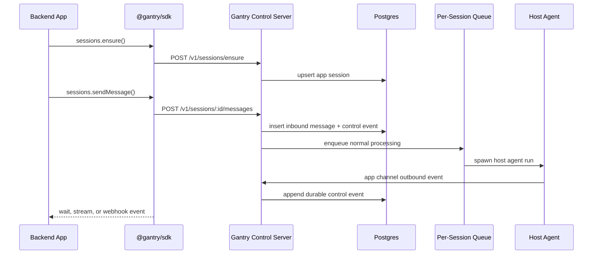
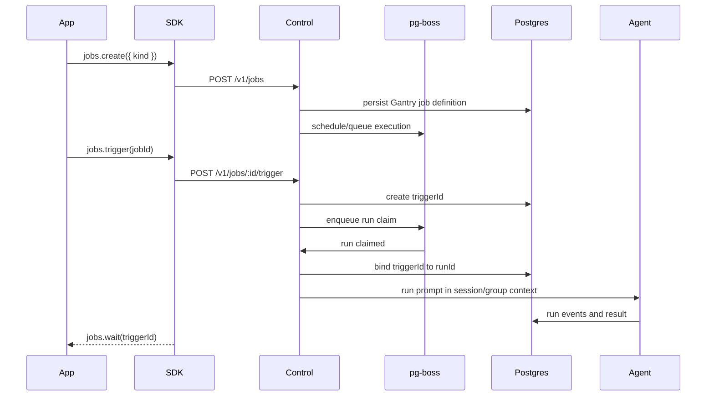
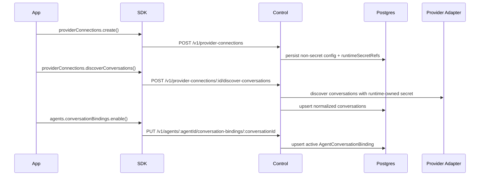
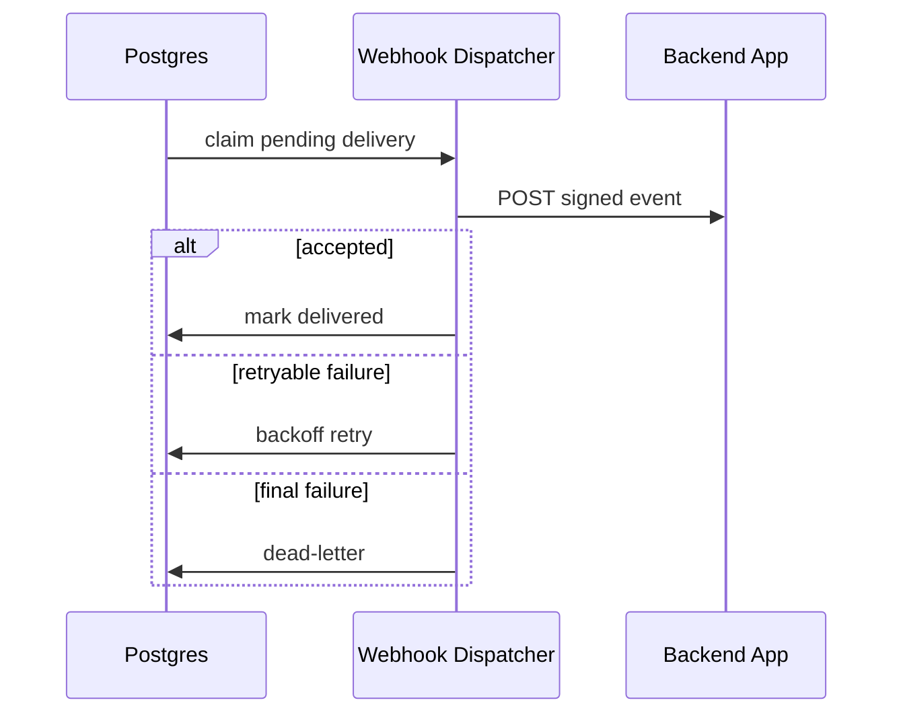

# Agent Internals For SDK Consumers

This document explains what a backend developer is using when they call `@gantry/sdk`.

## Boundary

The SDK talks to the Gantry control server. The control server is a host runtime surface, not an agent feature. ACP/ACPS remain harness/runtime concerns and are not part of the public SDK contract.

Agents cannot choose callback URLs, API keys, webhook headers, or channel destinations. They can only react to durable inbound messages and emit structured events through host-owned tools.

For contributor-level runtime internals and source-reading paths, see [runtime components](../architecture/runtime-components.md).

## Message Flow

`sendMessage()` is intentionally not an RPC call into the model. It writes an inbound message, then the normal runtime processor claims work. This makes retries, ordering, status events, and webhook delivery durable.

## Job Flow

The SDK exposes Gantry jobs, triggers, runs, events, and results. It does not expose raw `pg-boss` concepts. `trigger()` returns `triggerId` immediately; execution later binds a `runId`.

## Channel Onboarding Flow

The control API never accepts raw Slack, Telegram, Teams, or WhatsApp tokens in
providerConnection payloads. Backend apps pass runtime secret references, and the host
runtime resolves those references through `RuntimeSecretProvider`. Teams and
WhatsApp are catalog placeholders until provider adapters exist.

## Webhook Flow

Webhook URLs are registered by the app, signed with per-destination secrets, retried durably, and dead-lettered after bounded failures. Apps should deduplicate on event id.

## Storage

Postgres is the runtime store:

- `pg-boss` schedules and claims jobs.
- `pgvector` and embedding cache tables support optional semantic memory recall when embeddings are enabled and backfilled.
- Postgres full-text search remains the always-available retrieval path and the lexical fallback when query embedding is unavailable.
- Control events, messages, jobs, runs, triggers, sessions, webhooks, deliveries, and memory records are first-party Gantry tables.

## Event Contract

Every control event has:

- monotonic `eventId`
- typed `eventType`
- JSON payload
- optional `sessionId`, `jobId`, `runId`, `triggerId`
- optional correlation id
- timestamp

Backend apps should treat events as the durable integration stream. The current agent transcript and stdout are implementation details.
