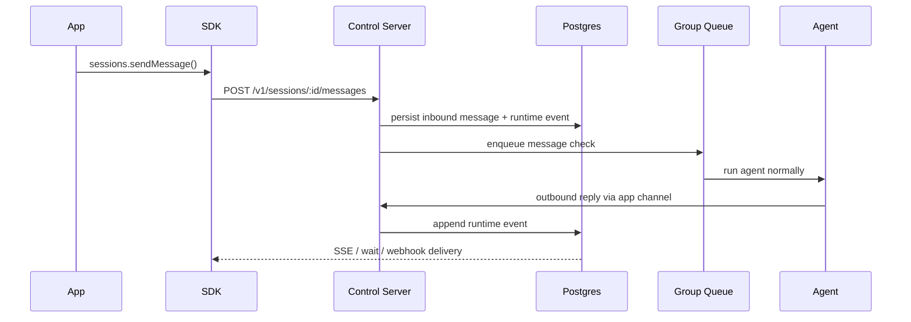

# Gantry SDK Overview

`@gantry/sdk` is the server-side integration surface for backend applications that want to treat Gantry as a sidecar agent runtime.

Use it from:

- NestJS services/providers
- Next.js route handlers and server actions
- background workers
- local CLIs

Do not use it from browser bundles.

## Deployment shapes

The SDK talks to one control API regardless of how Gantry is deployed. There are
two shapes, and **the SDK code is identical in both** — only the base URL and how
you provision the API key change.

- **Same-machine (workstation sidecar).** Gantry runs as a sidecar next to your
  app, typically via the workstation install or `docker compose`. The parent
  runtime and the per-turn child runners are co-located on one machine. This is
  `runtime.deployment_mode: workstation` — vertical scale, one box, live
  skill/dependency installs, `settings.yaml` watched on disk. The SDK reaches the
  control API over a **Unix domain socket** (set `socketPath`); loopback TCP is
  available when a control port is configured.
- **Separated-to-scale (fleet).** Gantry runs as immutable worker
  processes/machines behind an ALB, against RDS Postgres + S3, with desired state
  distributed through the control API. This is `runtime.deployment_mode: fleet` —
  horizontal scale, availability via distributed live execution, no package
  manager on workers. The SDK reaches the control API over **HTTPS through the
  ALB** (set `baseUrl`); there is no Unix socket to share across machines.

In the fleet shape the one image runs as differentiated **process roles**
(deployment-owned env `GANTRY_PROCESS_ROLE`):

- **`control`** serves the full admin/settings API plus SDK session messages and
  external ingress (the `/v1/*` surface). **Point `baseUrl` at the control plane**
  — that is where the SDK's authenticated calls go. The ALB forwards `/v1/*` to
  control automatically; you target the ALB host.
- **`live-worker` and `job-worker`** serve **ops-only** routes (`/healthz`,
  `/readyz`, `/metrics`, and read-only `/v1/status`, `/v1/health`, `/v1/doctor`);
  every admin/mutation route 404s on them. They are not an SDK base URL. Live
  workers run distributed live execution; job workers run the scheduler + bakes.
- **`all`** (workstation default) is every role in one process — the SDK targets
  that one process.

So a fleet SDK client always points at the ALB (which routes `/v1/*` to control);
you never point it directly at a worker role. Switching shapes is a config +
base-URL change, not a code change. Which axis to scale on, and when to move from
workstation to fleet, is the
[Scaling Decision Guide](../architecture/deployment-profiles.md#scaling-decision-guide-vertical-vs-horizontal).
To stand up a fleet or locked support stack on AWS, follow the
[AWS Terraform runbook](../deployment/aws-terraform.md).

Deployment topology (`runtime.deployment_mode`) is a **different axis** from
security posture (`GANTRY_SECURITY_POSTURE`, values `production|remote`). Fleet
requires production posture; workstation defaults to the relaxed local posture
and may opt into production. See
[Deployment Modes](../decisions/2026-06-11-deployment-modes.md).

## Transport

The runtime exposes a small internal control API. The SDK selects transport from
the options you pass:

- **Unix domain socket** when `socketPath` is set — the same-machine workstation
  default.
- **Loopback or remote TCP/HTTPS** when `baseUrl` is set — required for the
  fleet shape, where the SDK reaches the control API through the ALB. (There is
  no shared Unix socket across machines in fleet.)

`@gantry/contracts` is the shared DTO and schema boundary for the control API,
the server-side SDK, future Web UI integrations, and framework integrations
such as NestJS providers or Next.js route handlers. Application code should
depend on those contracts instead of importing Gantry runtime internals.

Authentication is bearer-token based and scoped. The runtime reads keys from:

- `GANTRY_CONTROL_API_KEYS_JSON`, where every key includes `kid`, `token`,
  `appId`, and explicit `scopes`

Production apps should use the narrowest key needed. A typical chat backend
uses `sessions:read` and `sessions:write`; job dashboards add `jobs:read` and
`jobs:write`; external ingress administration uses `ingresses:read` and
`ingresses:write`; outbound webhook administration uses `webhooks:read` and
`webhooks:write`.

## Core flow

1. The app calls `sessions.ensure()`.
2. The app calls `sessions.sendMessage()`.
3. Gantry persists the inbound message to the runtime store.
4. The message enters the normal group queue.
5. The agent runs through the normal host runtime.
6. Outbound replies/progress/streaming are emitted as durable `RuntimeEvent` records in `runtime_events`.
7. The app consumes those events through `sessions.wait()`, `sessions.stream()`, or signed outbound webhooks.

`appId` is derived from the API key for normal sidecar calls. SDK examples omit
it. Advanced multi-app callers may pass `appId` as an assertion, but Gantry
rejects it when it does not match the resolved app scope.



## Public resources

- `sessions`
- `jobs`
- `runs`
- `models`
- `agents`
- `skills`
- `mcpServers`
- `providers`
- `providerConnections`
- `conversations`
- `ingresses`
- `webhooks`
- `memory`
- `settings`
- `health`
- `doctor`

For the runtime boundary, message lifecycle, job lifecycle, and outbound webhook delivery internals, see [Agent Internals For SDK Consumers](./agent-internals.md).

## Desired state (settings)

In the fleet shape, desired configuration is distributed as a versioned, typed
JSON settings document through the control API, not a file workers each watch.
The SDK exposes this as `client.settings`:

- `client.settings.getDesiredState()` returns the current revision and document.
- `client.settings.updateDesiredState({ settings, expectedRevision?, note? })`
  appends a new revision; pass `expectedRevision` for optimistic concurrency.
- `client.settings.listRevisions()` lists recent revision summaries.

The wire shape is the full snake_case settings document — the same shape stored
in `settings_revisions` — validated server-side with document-path-level errors.
YAML never appears on the API wire; it is only the workstation `settings.yaml`
file and the CLI `--file` edge. In the workstation shape, the same file is
auto-imported through the identical validation path. See the
[API reference](./api-reference.md#desired-state) for the contract, scopes,
409/400 semantics, and an optimistic-concurrency example, and
[Settings Authority](../decisions/2026-06-11-settings-authority.md) for the
one-service/two-surfaces decision.

## External Ingress

External ingress is for signed systems that cannot hold a control API key, such
as a scraper worker or task resolver. Ingress callers sign `method`, `path`,
`timestamp`, `nonce`, body hash, and raw body with the ingress secret.

Supported target kinds:

- `session_message`: accept a normal user message into a configured or derived session.
- `conversation_message`: accept a normal inbound message into a configured Gantry conversation and optional thread/topic. This is async-only and uses `conversationId`/`threadId` from the Conversations API, not provider transport ids.
- `job_trigger`: trigger an existing manual, once, or recurring job.
- `job_template`: invoke a Gantry-owned one-time job template with variables and metadata only.

Each ingress record is a scoped capability. Management callers configure
`metadata.targetPolicy.allowedTargetKinds` and the allowed `sessionIds`,
`conversationIds`, `jobIds`, or `templateIds`; omitted policy fields deny
access by default.

External ingress is inbound authority. `/v1/webhooks` is outbound callback
delivery and is not used for inbound requests.

## Event model

The SDK does not read agent stdout directly. It reads durable runtime events.

Important event types in this cut:

- `session.message.inbound`
- `session.message.outbound`
- `session.message.streaming`
- `session.progress`
- `session.typing`
- `job.triggered`
- `job.run.started`
- `job.run.completed`
- `job.run.failed`
- `webhook.test`

## Minimal client setup

Same-machine (workstation) over the Unix socket:

```ts
import { createClient } from '@gantry/sdk';

const client = createClient({
  socketPath: process.env.GANTRY_CONTROL_SOCKET_PATH,
  apiKey: process.env.GANTRY_SESSIONS_API_KEY!,
});
```

Separated-to-scale (fleet) over the ALB — same code, different option:

```ts
const client = createClient({
  baseUrl: process.env.GANTRY_CONTROL_BASE_URL, // https://<alb-host>
  apiKey: process.env.GANTRY_SESSIONS_API_KEY!,
});
```
