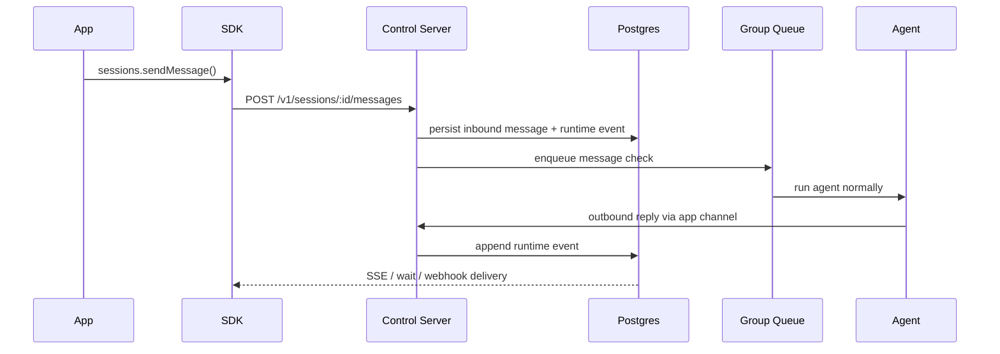

# Gantry SDK Overview

`@gantry/sdk` is the server-side integration surface for backend applications that want to treat Gantry as a sidecar agent runtime.

Use it from:

- NestJS services/providers
- Next.js route handlers and server actions
- background workers
- local CLIs

Do not use it from browser bundles.

## Transport

The runtime exposes a small internal control API over:

- Unix domain socket by default
- loopback TCP only when explicitly enabled

`@gantry/contracts` is the shared DTO and schema boundary for the control API,
the server-side SDK, future Web UI integrations, and framework integrations
such as NestJS providers or Next.js route handlers. Application code should
depend on those contracts instead of importing Gantry runtime internals.

Authentication is bearer-token based and scoped. The runtime reads keys from:

- `GANTRY_CONTROL_API_KEYS_JSON`, where every key includes `kid`, `token`,
  `appId`, and explicit `scopes`

Production apps should use the narrowest key needed. A typical chat backend
uses `sessions:read` and `sessions:write`; job dashboards add `jobs:read` and
`jobs:write`; external ingress administration uses `ingresses:read` and
`ingresses:write`; outbound webhook administration uses `webhooks:read` and
`webhooks:write`.

## Core flow

1. The app calls `sessions.ensure()`.
2. The app calls `sessions.sendMessage()`.
3. Gantry persists the inbound message to the runtime store.
4. The message enters the normal group queue.
5. The agent runs through the normal host runtime.
6. Outbound replies/progress/streaming are emitted as durable `RuntimeEvent` records in `runtime_events`.
7. The app consumes those events through `sessions.wait()`, `sessions.stream()`, or signed outbound webhooks.

`appId` is derived from the API key for normal sidecar calls. SDK examples omit
it. Advanced multi-app callers may pass `appId` as an assertion, but Gantry
rejects it when it does not match the resolved app scope.



## Public resources

- `sessions`
- `jobs`
- `runs`
- `models`
- `agents`
- `ingresses`
- `webhooks`
- `memory`
- `health`
- `doctor`

For the runtime boundary, message lifecycle, job lifecycle, and outbound webhook delivery internals, see [Agent Internals For SDK Consumers](./agent-internals.md).

## External Ingress

External ingress is for signed systems that cannot hold a control API key, such
as a scraper worker or task resolver. Ingress callers sign `method`, `path`,
`timestamp`, `nonce`, body hash, and raw body with the ingress secret.

Supported target kinds:

- `session_message`: accept a normal user message into a configured or derived session.
- `job_trigger`: trigger an existing manual, once, or recurring job.
- `job_template`: invoke a Gantry-owned one-time job template with variables and metadata only.

Each ingress record is a scoped capability. Management callers configure
`metadata.targetPolicy.allowedTargetKinds` and the allowed `sessionIds`,
`conversationIds`, `jobIds`, or `templateIds`; omitted policy fields deny
access by default.

External ingress is inbound authority. `/v1/webhooks` is outbound callback
delivery and is not used for inbound requests.

## Event model

The SDK does not read agent stdout directly. It reads durable runtime events.

Important event types in this cut:

- `session.message.inbound`
- `session.message.outbound`
- `session.message.streaming`
- `session.progress`
- `session.typing`
- `job.triggered`
- `job.run.started`
- `job.run.completed`
- `job.run.failed`
- `webhook.test`

## Minimal client setup

```ts
import { createClient } from '@gantry/sdk';

const client = createClient({
  socketPath: process.env.GANTRY_CONTROL_SOCKET_PATH,
  apiKey: process.env.GANTRY_SESSIONS_API_KEY!,
});
```
