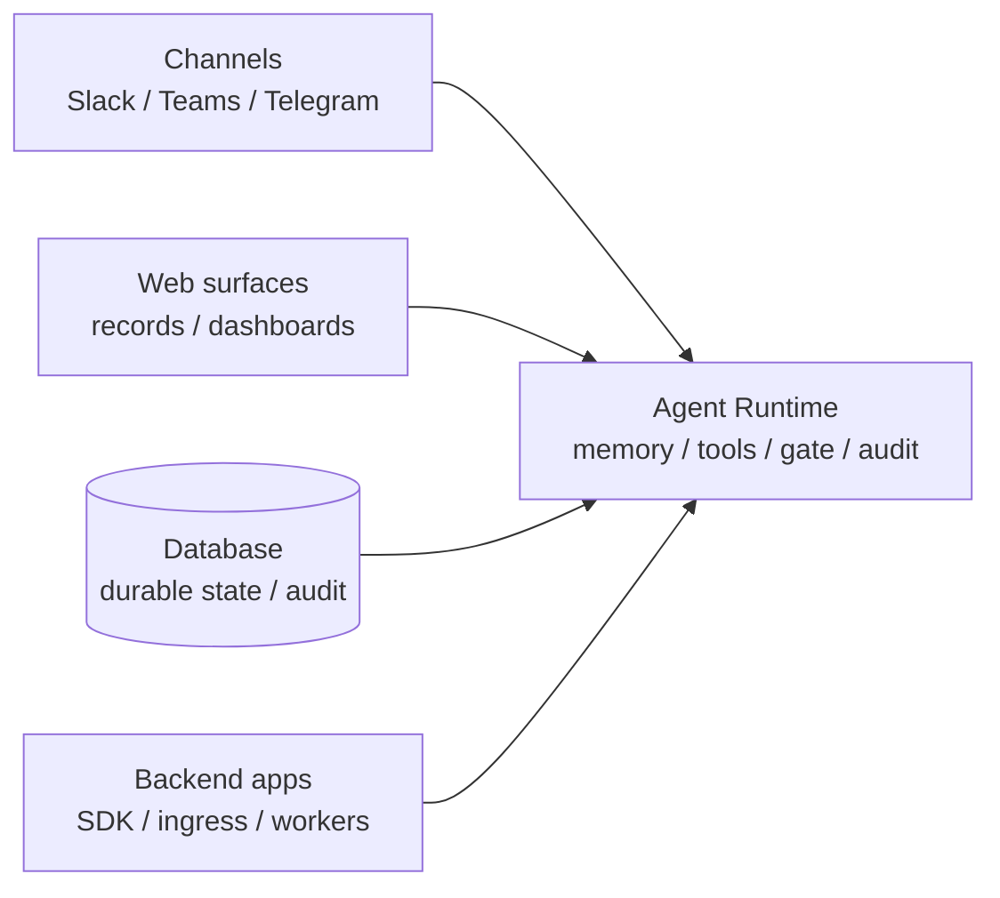
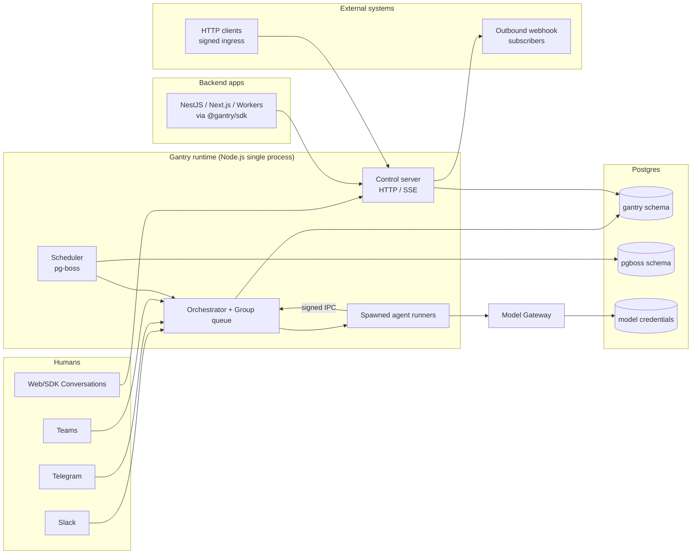
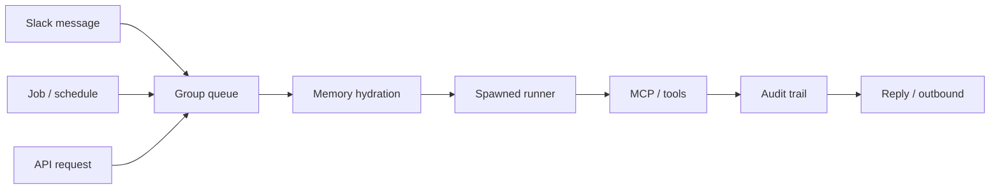
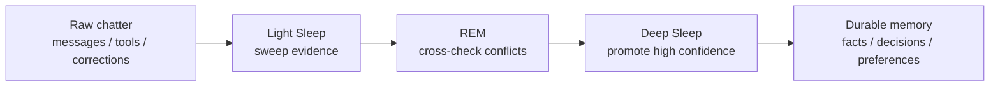
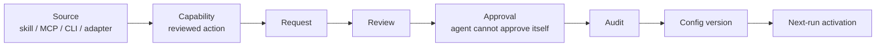
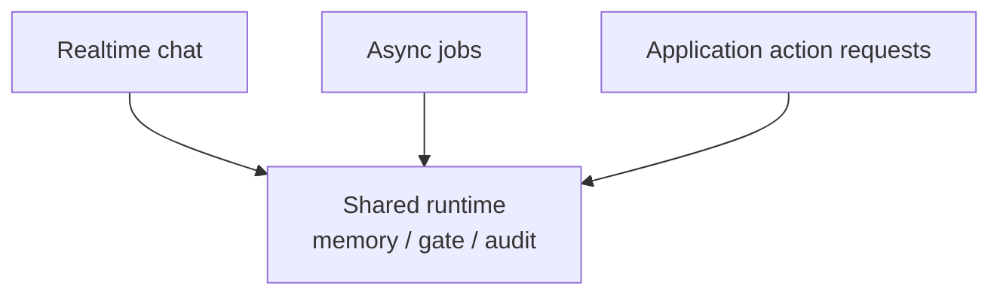

# Gantry Talk — HTML Deck Build Brief

Everything needed to generate the full slide deck as **one self-contained HTML file** in
Claude (artifacts). **No binary assets** — the agent renders everything from markup:
architecture diagrams as live **mermaid.js**, concept visuals as **inline SVG / CSS**, and
the logo as a **text wordmark**. The only external loads are CDN libraries and Google Fonts.

> **How to use:** paste the "Master prompt" section into Claude, then paste the rest of this
> file beneath it. Claude returns a single `index.html` you can open in any browser, present
> from, and refine visually. Nothing else to download.

---

## Master prompt (paste this first)

> Build a single self-contained `index.html` presentation deck from the spec below. Use
> **reveal.js** and **mermaid.js** from CDN (jsDelivr) and **Google Fonts**. 16:9, 1920×1080
> logical size. Apply the KnackLabs dark design system exactly (tokens given). **Use no image
> files of any kind** — render every architecture diagram as **live mermaid** from the embedded
> definitions (do not invent labels), draw concept visuals as **inline SVG/CSS**, and render the
> logo as a styled **text wordmark**. Put the speaker prose into reveal's speaker notes
> (`<aside class="notes">`) so pressing **S** opens the notes window. Keep on-screen text sparse
> and exactly as written. Output only the HTML file. No commentary, no placeholder lorem.

---

## Output requirements

- One file: `index.html`. No build step, no local assets. Opens by double-click.
- External loads only: `reveal.js` 5.x (+ `notes` plugin), `mermaid` 11.x (jsDelivr), Google Fonts.
- 12 slides, in order. 16:9. Keyboard nav (← →), **S** = speaker notes, **F** = fullscreen,
  progress bar on, slide numbers `c/t`.
- **Logo = text wordmark** (no image): `Knack` in off-white + `Labs` in mint, Space Grotesk 600.
  Small wordmark bottom-left on every slide except the title; slide number bottom-right. Both subtle.
- Diagrams must scale to fit their slide with comfortable margins — never clipped, never scrolled.
- Respect `prefers-reduced-motion`; keep transitions to a quiet fade.

---

## Design system (KnackLabs dark)

Pulled from the live knacklabs.ai Webflow CSS variables — use these exact values.

```css
:root {
  --bg:        #0b0b0b;   /* --black-900 — slide background */
  --bg-deep:   #000000;   /* pure black — subgraph fills / depth */
  --panel:     #0c3529;   /* --green-800 deep evergreen — cards, node fills */
  --edge:      #18884f;   /* --green-600 — borders, secondary lines */
  --edge-2:    #1c6b49;   /* --green-700 — dividers */
  --accent:    #6af1b0;   /* --green-300 mint — THE brand color: key terms, connectors, glow */
  --ink:       #f8f8f8;   /* off-white — primary text + linework (#fff for max contrast) */
  --ink-dim:   #758696;   /* slate — secondary text / captions */
}
```

- **Type (matches knacklabs.ai exactly):** headings `Space Grotesk` (500/600/700); body
  `Lato` (400/700, italics available). Load both from Google Fonts:
  `Space Grotesk:300,400,500,600,700` and `Lato:300,400,400i,700,900`. The site brands no
  monospace — for flow arrows / code-ish lines use a generic system `monospace`. Line-height ~1.4 body.
- **Scale (logical px on 1920×1080):** slide title 96–112; section headline 64–72; body 34–40;
  bullets 34; captions/footnotes 22. Never below 22 on screen.
- **Layout:** ~140px outer padding. Left-align most slides; center the title and thesis slides.
  One idea per slide — lots of negative space. Accent is a seasoning, not a fill: use it for the
  key noun, a thin rule under the headline, and diagram edges. Avoid neon.
- **Bullets:** custom marker (a small mint `—` or `›`), not default discs. No more than 6.

---

## Mermaid theme config (use verbatim)

```js
mermaid.initialize({
  startOnLoad: false,                 // render manually after reveal is ready (see init note)
  theme: 'base',
  securityLevel: 'loose',
  themeVariables: {
    background:        '#0b0b0b',
    primaryColor:      '#0c3529',   // node fill — deep evergreen
    secondaryColor:    '#000000',
    tertiaryColor:     '#000000',
    primaryBorderColor:'#6af1b0',   // mint node outline
    primaryTextColor:  '#f8f8f8',
    secondaryTextColor:'#f8f8f8',
    tertiaryTextColor: '#f8f8f8',
    lineColor:         '#6af1b0',   // mint connectors
    clusterBkg:        '#000000',   // subgraph panels — pure black
    clusterBorder:     '#18884f',   // green-600 subgraph outline
    edgeLabelBackground:'#0b0b0b',
    fontFamily:        'Lato, Arial, sans-serif',
    fontSize:          '22px'
  },
  flowchart: { curve: 'basis', htmlLabels: true, nodeSpacing: 50, rankSpacing: 64, padding: 16 }
});
```

> **Init note (avoids the classic blank-diagram bug):** reveal keeps off-screen slides in the
> DOM but hidden, which can make mermaid render at 0 width. So: leave `startOnLoad:false`, then
> after `Reveal.initialize().then(() => mermaid.run())`. Put each diagram in
> `<pre class="mermaid">…</pre>`. If a diagram still looks unscaled, also call `mermaid.run()`
> once on the first `slidechanged` event. Style the generated `svg` to `max-width:100%; height:auto`.

---

## Concept visuals without images (inline SVG / CSS)

The four slides that previously used hero images become pure CSS/SVG treatments — tasteful,
on-brand, zero downloads. Keep them subtle backgrounds behind the type, not the focus.

- **Slide 1 (hub):** a large radial-gradient "glow" centered behind the title (mint `--accent`
  fading to transparent over `--bg`), with a few thin mint lines radiating outward to small
  off-white dots near the edges — an inline `<svg>` "hub and spokes." Quiet, ~15% opacity.
- **Slide 2 (stress):** plain type on `--bg`. Optional: one faint diagonal hairline "crack"
  in `--edge` across a corner. No imagery.
- **Slide 9 (containment):** right-side inline `<svg>` of 3–4 concentric circles in mint/green
  strokes around a small solid mint core; a single dot outside the outer ring. Communicates
  "layered perimeter." ~40% opacity so bullets stay primary.
- **Slide 12 (foundation):** behind the centered closer, a CSS stack of thin horizontal rules
  that get denser/brighter toward the bottom — "small tip, deep foundation." `--edge` → `--accent`.

---

## Per-slide spec

For each slide: **layout**, the exact **on-screen** content, the **visual** (markup-only), and
the **speaker notes** (`<aside class="notes">`). Notes are abridged — full prose lives in
`script.md`; paste those verbatim if you prefer.

---

### Slide 1 — Title / The new application core — *centered*

- Text wordmark **KnackLabs** top-center (larger here).
- Headline: **The agent is the new application core.**
- Sub: *Users shouldn't have to travel to your software. It should meet them where they already work.*
- Visual: the "hub" SVG/CSS glow (see Concept visuals).
- Notes: opener, show of hands; the one argument — the agent is the easy part, the runtime around it is the work.

### Slide 2 — The demo works. Production doesn't. — *headline + bullets*

- Headline: **Every agent demo works. Then you try to ship it.**
- Bullets (mint marker):
  - It remembers the wrong person's data
  - It has root on your tools
  - Give it a shell, and your secrets are one injection away
  - Nobody approved that action
  - No audit trail when it goes wrong
  - It doesn't know who it's talking to
- Visual: plain type (optional faint corner hairline).
- Notes: the secrets line is **scoped, not universal** — a text-only/LangGraph agent doesn't
  expose keys; the danger is the price of real tools. (Full nuance in `script.md`.)

### Slide 3 — The new full stack — *headline + diagram*

- Headline: **Frontend. Backend. Database — and now a runtime for the agent.**
- Diagram (live mermaid); make `RT` larger / accent-bordered — it's the center of gravity:

- Notes: the runtime is the new center; web becomes system of record; channels are the front door.

### Slide 4 — What Gantry is — *centered quote*

- Big pull-quote, off-white, with the two "is not" lines emphasized:
  > *"Gantry is an enterprise-grade agent runtime: the host process that gives AI agents a
  > controlled place to run, people or applications to respond to, tools to use, durable
  > memory, and an immutable audit trail.*
  > *It is not a chatbot. It is not an LLM wrapper. It is not a workflow engine."*
- Caption: — README, verbatim
- Notes: the three "is nots" matter as much as the "is." It's the host process the agent runs inside.

### Slide 5 — The runtime map — *headline + large diagram*

- Headline: **One Node.js process. Everything flows through it.**
- Diagram (live mermaid — verbatim from `docs/architecture/overview.md:17-60`):

- Densest slide — give it the most room; shrink padding to ~80px if needed.
- Notes: the real repo diagram; the model gateway brokering creds is the whole game (callback on slide 9).

### Slide 6 — One message, end to end — *headline + pipeline diagram*

- Headline: **Message → queue → memory → runner → tools → audit → reply**
- Sub: *Same path for a Slack message, a cron job, and an API call.*
- Diagram (live mermaid):

- Notes: trace one message; group queue keyed per conversation; runner is a real child process; three triggers, one path.

### Slide 7 — Memory isn't a bigger context window — *headline + bullets + diagram*

- Headline: **Memory is scoped, not stuffed.**
- Bullets:
  - Scoped by app, agent, and subject — leakage is structurally impossible
  - Digest-first: the runner starts with a summary, not a transcript
  - It "dreams": Light Sleep → REM → Deep Sleep turns chatter into durable memory
- Diagram (live mermaid):

- Notes: "bigger context window" is hoarding; scope is enforced at the data layer; dreaming distills.

### Slide 8 — Tools need a product contract — *headline + diagram*

- Headline: **A tool isn't "installed." It's requested, reviewed, approved, and versioned.**
- Diagram (live mermaid); give `APP` (Approval) a mint/accent border:

- Notes: source → capability → grant; an agent can *ask* for a tool, never *grant* itself one.

### Slide 9 — Trust boundaries — *headline + bullets (+ concentric-rings SVG)*

- Headline: **The conversation is the security perimeter.**
- Bullets:
  - Every tool call passes a two-axis gate: *who's asking* and *what they're asking for*
  - Provider keys never reach the agent — only loopback gateway tokens
  - Secrets are scoped per capability, not dumped in one .env
  - Agents cannot grant themselves approval
- Visual: the concentric-rings inline SVG on the right (see Concept visuals).
- Notes: heart of the talk; pay off the gateway from slide 5; honest sandbox caveat (enforcing only in sandbox runtime mode).

### Slide 10 — Three shapes, one runtime — *headline + diagram*

- Headline: **Realtime chat. Async jobs. Application action requests.**
- Sub: *Not three products — three patterns most real apps use at once.*
- Diagram (live mermaid):

- Notes: all three hit the same runtime, memory, gate, audit — secure the runtime once.

### Slide 11 — The market, honestly — *headline + 4 cards (hard 4-min slide)*

- Headline: **Everyone runs agents. The difference is the runtime around them.**
- Render as **four styled HTML cards** (cleaner than mermaid here) — give the Gantry card the
  mint/accent border:
  - **OpenClaw** — open-source, self-hosted personal agent. Capable; safety is yours to set up.
  - **NemoClaw** — NVIDIA blueprints for a local, "more secure" always-on agent (OpenShell sandbox).
  - **Microsoft Scout** — built on OpenClaw, wrapped in Microsoft 365 identity and governance.
  - **Gantry** — safe by default, walled per user, embeddable through an API. Runs anywhere.
- **Do NOT** reproduce any Bad/Good matrix — it's our own positioning, not a benchmark.
- Notes: fair, fast, capped at 4 minutes; one-liner — the difference isn't the AI, it's the runtime around it.

### Slide 12 — The thesis — *centered closer*

- Headline: **The agent is the easy part. The runtime you can trust with a business is the hard part.**
- Visual: the CSS "foundation" rules behind the type (see Concept visuals).
- Text wordmark **KnackLabs** + a small "thanks / questions" line.
- Notes: the model gets better for free; the hard part is the runtime — build the boring part well.

---

## Acceptance checklist (tell Claude to self-verify)

- [ ] Opens as one file, no console errors, **no `` or local file references** of any kind.
- [ ] All 7 mermaid diagrams render themed (evergreen nodes, mint outlines/edges, off-white
      text, black subgraphs) and fit their slides without clipping or scrolling.
- [ ] Concept visuals (hub, rings, foundation) are inline SVG/CSS and stay subtle behind text.
- [ ] **S** opens speaker notes with the per-slide prose; **F** fullscreen; arrows navigate.
- [ ] On-screen text matches `slides.md` exactly — no added marketing copy, no lorem.
- [ ] Slide 11 shows 4 neutral cards, not a Bad/Good matrix.
- [ ] Fonts are Space Grotesk (headings) + Lato (body); palette tokens used everywhere; accent
      restrained; nothing below 22px on screen; logo is a text wordmark.
