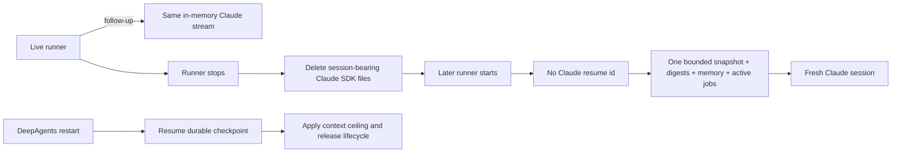

# cache-bug — Capability-aware provider-session continuity

This plan replaces the earlier universal-resume plan body. The confirmed
requirements are `docs/specs/cache-bug.md` plus the Claude amendment in
`docs/specs/process-local-claude-continuity.md`. Decision 0163 controls every
Claude-specific conflict with decisions 0158/0159; 0158/0159 remain in force
for adapters that declare durable resume.

## Problem

The old runtime resumes a stored Claude provider session and also sends a new
bounded Slack briefing after a runner restart. The provider therefore sees the
old briefing already in its transcript plus the new overlapping briefing. Each
restart compounds overlap, cached tokens, latency, and SDK transcript files.
If messages arrive between runners, relying only on the old provider session
can also miss them; relying on a full new snapshot while resuming duplicates
them.

The desired outcome is:

Claude continuity ends with the runner process. While one runner is alive,
follow-up messages continue through its existing in-memory SDK query stream.
After that runner ends, a later worker or inline run starts Claude without a
resume id and without persistent SDK transcript state. Gantry sends the
current bounded channel/thread snapshot, recent scoped session digests,
durable memory, and active jobs exactly once.

DeepAgents remains a durable-resume adapter. Its checkpoint, 150k context
ceiling, compaction delta, and provider-session release lifecycle remain
intact. T1 and T2 are already shipped containment for this durable path and
are not reverted.

## Scope / Non-goals

- `AgentExecutionAdapter` declares `providerSessionContinuity` as
  `process_local` or `durable_resume`; core policy branches on this capability,
  never on a Claude/Anthropic provider id.
- A `process_local` attempt receives no provider resume input and cannot
  persist a provider handle, link one to an `agent_run`, promote/replay/retire
  a provider row, or expose one through `/status`, `hasProviderResume`, or the
  public session projection.
- Claude worker and inline SDK calls use `persistSession: false` and omit
  `resume`. Same-process MessageStream continuation remains unchanged.
- Fresh reconstruction remains bounded by the existing Slack/channel limits.
  Late and intervening messages inside that window appear once; older useful
  state comes from existing durable digests and memory, not a provider
  transcript.
- Claude `/compact` resolves to `fresh_checkpoint` before provider locking.
  The durable compaction task remains the single admission/deduplication
  owner and returns the existing already-running, ready, or degraded receipt.
  It creates no Claude maintenance provider session or delta replay.
- Failover state is attempt-local. A DeepAgents attempt may read/write its
  checkpoint; a Claude attempt cannot inherit or publish that handle.
- Normal Claude cleanup deletes only per-run/session-bearing SDK artifacts.
  Stable config, skills, credentials, and unrelated runtime files remain.
- A drained rollout operation clears stale Claude provider rows plus both
  `agent_sessions.latest_provider_session_id` and
  `agent_runs.provider_session_id`. It preserves DeepAgents provider rows and
  all DeepAgents checkpoint tables. Database cleanup is transactional and
  idempotent; filesystem cleanup is explicit and path-scoped.
- Scheduled jobs do not change.

Non-goals: delta-watermark resume, automatic digest creation on every idle
close, a lazy startup sweeper, changing Slack snapshot limits, changing
DeepAgents billing aggregation, or deleting canonical messages/run evidence.

## Acceptance Criteria

- P1: the worker lane continues through its live in-process MessageStream. A
  later worker and every inline attempt start fresh with no provider handle,
  run linkage, promotion, delta replay, retirement, or public resume signal.
- P2: a fresh worker and inline run each receive the bounded current snapshot,
  recent scoped digests, active durable memory, and active jobs exactly once;
  late/intervening in-window messages are present and old provider transcript
  content is absent. Canonical runs and runtime events remain stored as
  evidence but are not replayed into the prompt.
- P3: every failover attempt applies only its active adapter's continuity
  capability to resume input and result persistence.
- P4: Claude compaction selects before locking, deduplicates through the
  durable task, and preserves already-running/ready/degraded receipts without
  creating provider maintenance state.
- P5: stale Claude rows are ignored by lifecycle and projections even before
  rollout cleanup.
- P6: Claude session-bearing SDK files are removed at runner teardown while
  stable materialized assets remain.
- P7: DeepAgents durable resume, ceiling, provider compaction, checkpoints,
  and idempotent `releaseSession` behavior remain green.
- P8: retired references carry `agentSessionId`; active and idle `/new` reply
  first, then release after the complete primary-plus-fallback delivery attempt
  settles in `finally`; failures are sanitized and observable.
- P9: the drained cleanup removes only stale Claude associations and legacy
  Claude session directories, is safe to rerun, and proves DeepAgents and
  canonical evidence survive.
- P10: GET, PUT, and POST `/v1/settings/desired-state` have shared runtime-
  validated contracts and OpenAPI schemas, including the cap under `limits`.
- P11: focused unit/Postgres tests, the hermetic agent-e2e restart scenario,
  scheduled-job regression tests, and `factory/scripts/verify.py` pass.

## Technical Approach

### Capability and lifecycle policy

Add the capability to
`apps/core/src/application/agent-execution/agent-execution-adapter.ts`.
DeepAgents declares `durable_resume`; Claude declares `process_local`.
`live-execution.ts`, the turn-context port/service/repository,
`group-agent-runner.ts`, `group-agent-runner-context-ceiling.ts`,
`group-agent-runner-compaction-delta.ts`, and failover attempt state consult
the capability before any resume selection, provider-row transition, run
attachment, or result persistence. Selection excludes process-local rows
before `live-execution.ts` creates the run, so there is never a Claude
`providerSessionId` to attach. Capability is resolved once per attempt.
The default for any existing/test adapter is explicit `durable_resume`; no
implicit provider-name fallback is introduced.

`application/sessions/session-interaction-module.ts` and its repository input
accept the continuity filter so stale process-local rows never become public
resume state. Lifecycle filtering happens before projection, not by deleting
fields after the fact.

### Claude execution and reconstruction

In the worker lane
`adapters/llm/anthropic-claude-agent/execution-adapter.ts` and
`runner/query-loop-phases-setup.ts`, and in
`adapters/llm/anthropic-claude-agent/inline-lane/index.ts`, set
`persistSession: false` and omit `resume`. The live runner still writes
follow-ups to its current MessageStream.

The existing group-processing/runner context builder remains Gantry's source
of truth for a fresh start. Tests pin the composition: bounded channel/thread
snapshot, latest scoped session digests, durable memory, and active jobs. No
new digest is generated merely because a runner idles out.

`claude-config-materializer.ts` uses two cleanup boundaries inside the
decision-0010 temporary run directory. Inner attempt/session teardown removes
only session-bearing SDK artifacts while config, skills, and credentials stay
available for the remainder of that run. Final run teardown removes the whole
temporary run directory, including those stable-for-run assets, exactly as
decision 0010 requires. Tests use sentinel config/skill/credential/unrelated
files to prove the inner boundary preserves them and the final boundary
removes the run directory.

### Compaction

`session/session-compaction-command.ts` resolves the adapter capability before
obtaining a provider-session lock. `process_local` selects
`fresh_checkpoint`; `durable_resume` keeps provider compaction and delta
replay. `session/session-commands.ts` and
`runtime/group-session-command-state.ts` preserve the current durable task
admission key and its concurrent/already-running, ready, and degraded
receipts. No Claude provider row is created by maintenance.

### Durable release and `/new`

Widen `RetiredProviderSessionReference` in
`domain/sessions/provider-session-measurement.ts` and both SQL return paths in
`canonical-session-repository-context-mark.postgres.ts` to include
`agentSessionId`. Propagate it through the ops port/facades without a second
lookup.

Add optional `releaseSession` to the execution adapter. DeepAgents implements
it through `PostgresSaver.deleteThread`; Claude has no durable release work.
`runtime/provider-session-release.ts` owns idempotent adapter dispatch,
sanitization, cleanup-failed event publication, and structured fallback
logging.

Change the idle `clearCurrentSession` contract and supplier/handler plumbing
to return retired references. The active and idle `/new` paths enqueue those
references, deliver the complete primary/fallback response, and drain exactly
once from `group-processing.ts` in `finally` after delivery settles. Nothing
drains at the end of `runAgent`.

### Rollout and documentation

`docs/memory/provider-session-ceiling-operations.md` owns executable,
provider-scoped SQL for a drained deployment: stop workers, identify only
Claude execution-provider rows, clear both pointers, delete those provider
rows, verify none remain, and verify DeepAgents/checkpoint counts are
unchanged. The Postgres test executes SQL extracted from the document/shared
artifact. Legacy filesystem paths are enumerated and validated before removal;
rollback restarts Claude fresh and never reconstructs deleted provider state.

Reconcile `docs/architecture/session-resume.md`,
`docs/architecture/runtime-components.md`,
`docs/architecture/canonical-domain-model.md`, `docs/SPEC.md`, and
`apps/core/src/runner/AGENTS.md` to the same capability-aware contract.

### Desired-state HTTP contract

Add shared Zod envelope DTOs in `packages/contracts/src/settings/index.ts`.
`SettingsDocumentSchema` remains `record<string, unknown>` by design: the core
runtime settings parser is the single full-document authority, and duplicating
that large schema in the transport package would create a second validator.
The boundary is no longer `unknown`; it is a parsed envelope containing a
record-shaped document that is then passed to the authoritative parser:

- write request for both PUT and POST: required `settings` document, optional
  integer-or-null `expectedRevision`, optional string-or-null `note`;
- write success: `{revision: integer}`;
- GET empty state: `{revision: 0, settings: null, updatedAt: null}`;
- GET configured state: revision, minReaderVersion, typed settings document,
  createdBy, nullable note, and updatedAt;
- existing standard 400/409 error envelopes remain unchanged.

The route parses the shared request schema before the runtime settings parser;
the latter remains authoritative for document-path validation. Register GET,
PUT, and POST with matching OpenAPI schemas. No method is removed.

## Decisions

- 0158 remains the measurement/ceiling authority for `durable_resume` only.
- 0159 remains the release authority and is amended by the four-field retired
  reference already recorded in that decision.
- 0160 keeps the shipped snake_case physical column.
- 0161 is unaffected: this work adds no granted capability; the adapter
  continuity declaration is internal execution metadata, not a discoverable
  permission/tool.
- 0162 is unaffected: this work adds no host/port/environment exception.
- 0163 is the governing Claude continuity decision.
- Decision 0005 already selects Node/TypeScript, Vitest, and the current
  Postgres stack. The rollout helper uses those installed tools; no new
  framework, dependency, or parallel validation authority is introduced.
- D-0087 is fulfilled here rather than in a separate CACHE-2 story: the user
  explicitly folded fresh Claude restart behavior into active `cache-bug`.
- D-0089 is resolved by P10 and T4.
- D-0090 is resolved by the post-delivery `finally` boundary in T3D.
- D-0091 is resolved by the four-field reference in T3D.
- D-0086 (per-request/model-relative ceiling) and D-0088 (DeepAgents billing
  aggregation) remain open and out of scope.

Recurring `contract-partial` tripwire: every changed contract in this plan
must enumerate and test all producers and consumers (continuity capability,
retired reference, compaction receipt, desired-state envelope). If review
again finds one side updated without the other, stop the task and escalate
under WORKFLOW.md Recurring Findings instead of applying another local patch.

## Surface Impact

| Surface | Class | Owner |
| --- | --- | --- |
| Runtime behavior | Changed | T3A/T3B/T3C/T3D: capability-aware admission, fresh Claude attempts, compaction, and post-delivery release |
| API | Changed | T3A removes stale Claude resume signals; T4 types/documents desired-state GET/PUT/POST |
| Data/schema | Changed | T3D widens the retired reference in code/queries; T3E removes stale Claude associations without a new schema migration |
| CLI/ops | Changed | T3E adds dry-run/apply legacy-session cleanup and drained SQL procedure |
| UI | N-A | No screen, component, styling, or motion change |
| Docs | Changed | Each runtime task updates its governing canon in the same PR; T3E owns rollout operations |
| Tests | Changed | Each task carries focused unit/integration proof; every runtime-behavior PR carries its own agent-e2e delta or a concrete non-agent justification |

## Task Decomposition

T1 and T2 are already merged and remain recorded as done. One new backend
task cannot fit a bounded implement/verify/review/fix session: the first plan
grill demonstrated that combining admission, two SDK lanes, reconstruction,
compaction concurrency, Postgres checkpoint deletion, delivery ordering,
rollout cleanup, and a public HTTP contract was not reviewable. The split
below is forced by those independently falsifiable contracts and their large,
non-overlapping test harnesses—not by file count. Dependencies name only
consumed behavior; independent tasks wait for normal one-PR-at-a-time human
merging without false DAG edges.

### cache-bug-T3A — Capability-aware continuity and Claude execution

Dependencies: T2. `user_facing: false`.

Owns P1, P3, P5 and the execution half of P7. Add the adapter capability;
make Claude worker/inline calls process-local; make selection, persistence,
run attachment, failover, ceiling/delta lifecycle, status, and public resume
projection capability-aware. Preserve live MessageStream continuation and
durable DeepAgents behavior.

Write scope:

- `apps/core/src/application/agent-execution/agent-execution-adapter.ts`
- `apps/core/src/adapters/llm/anthropic-claude-agent/execution-adapter.ts`
- `apps/core/src/adapters/llm/anthropic-claude-agent/inline-lane/index.ts`
- `apps/core/src/adapters/llm/anthropic-claude-agent/runner/query-loop-phases-setup.ts`
- `apps/core/src/adapters/llm/deepagents-langchain/execution-adapter.ts`
- `apps/core/src/runtime/group-agent-runner*.ts`
- failover attempt-state modules under `apps/core/src/runtime/`
- `apps/core/src/app/bootstrap/live-execution.ts`
- the canonical turn-context application port/service and selecting Postgres
  repository under `apps/core/src/application/sessions/` and
  `apps/core/src/adapters/storage/postgres/repositories/`
- `apps/core/src/application/sessions/session-interaction-module.ts`
- `docs/architecture/session-resume.md`
- `docs/architecture/runtime-components.md`
- `docs/architecture/canonical-domain-model.md`
- the capability/failover sections of `docs/SPEC.md` and
  `apps/core/src/runner/AGENTS.md`
- one hermetic agent-e2e restart scenario under `apps/core/test/agent-e2e/`
- corresponding unit/integration tests

Completion checks: Claude restart supplies no resume id and records no handle;
same-process continuation passes; process-local rows never enter lifecycle or
projection; failover is attempt-local; DeepAgents resume/ceiling tests remain
green; `npm run test:e2e:agent:hermetic` proves the restart has no duplicate
briefing; the governing docs match the shipped behavior.

### cache-bug-T3B — Fresh reconstruction and scoped SDK cleanup

Dependencies: T3A. `user_facing: false`; this is backend runtime behavior, so
functional evidence is required by the acceptance contract without invoking
UI-design skills.

Owns P2 and P6. Pin the fresh worker and inline reconstruction package,
including late/intervening messages exactly once, and make Claude SDK
session-bearing storage per-run and removable without touching stable assets.
Split force: context-composition fixtures plus two-stage filesystem lifetime
proof would push T3A beyond one reviewable session after its admission,
failover, projection, and agent-e2e obligations.

Write scope:

- group-processing context assembly and runner IPC modules under
  `apps/core/src/runtime/` and `apps/core/src/runner/`
- `apps/core/src/adapters/llm/anthropic-claude-agent/claude-config-materializer.ts`
- Claude runner teardown modules
- `docs/architecture/anthropic-claude-adapter-materialization.md`
- reconstruction/materialization sections of `docs/SPEC.md` and
  `apps/core/src/runner/AGENTS.md`
- `apps/core/test/unit/runtime/group-processing.test.ts`
- `apps/core/test/unit/runner/agent-runner-ipc.test.ts`
- `apps/core/test/unit/adapters/claude-config-materializer.test.ts`
- focused inline-lane integration tests
- a hermetic agent-e2e late/intervening-message reconstruction scenario

Completion checks: both lanes prove bounded snapshot + digest + memory + jobs;
raw provider transcript, canonical runs, and runtime events are absent from the
prompt; inner/final cleanup sentinel tests pass; the agent-e2e reconstruction
scenario and governing docs pass.

### cache-bug-T3C — Capability-aware compaction

Dependencies: T3A. `user_facing: false`; this is a backend command path.

Owns P4 and the compaction half of P7. Resolve strategy before provider lock,
route Claude to fresh checkpoint, retain durable task admission/dedupe and all
receipt states, and leave DeepAgents locking/delta replay unchanged.
Split force: lock ordering and concurrent receipt semantics need an isolated
concurrency review; mixing them into admission or reconstruction would make a
failure impossible to localize and exceed one bounded fix/review cycle.

Write scope:

- `apps/core/src/session/session-compaction-command.ts`
- `apps/core/src/session/session-commands.ts`
- `apps/core/src/runtime/group-session-command-state.ts`
- compaction sections of `docs/architecture/session-resume.md` and
  `docs/SPEC.md`
- compaction command/state tests
- a hermetic agent-e2e `/compact` receipt scenario

Completion checks: concurrent Claude requests return already-running; ready
and degraded receipts are stable; no Claude maintenance row exists; the
DeepAgents compaction suite remains green; agent-e2e and docs ship in this PR.

### cache-bug-T3D — Durable release and post-delivery `/new` cleanup

Dependencies: T2. `user_facing: false`; this is backend session cleanup.

Owns P7 and P8. Widen retired references, implement DeepAgents release, return
references from the idle command surface, and drain active/idle `/new`
cleanup only after full primary-plus-fallback delivery settles. Publish one
successful `session.provider.retired` event per committed retired row before
release, in addition to sanitized `cleanup_failed` evidence.
Split force: this task uses the Postgres checkpoint harness and delivery
ordering/failure matrix, independent of Claude admission; it already spans the
maximum coherent release contract a reviewer can verify in one session.

Write scope:

- `apps/core/src/domain/sessions/provider-session-measurement.ts`
- `apps/core/src/adapters/storage/postgres/repositories/canonical-session-repository-context-mark.postgres.ts`
- canonical ops port/service/facade modules
- `apps/core/src/runtime/provider-session-release.ts`
- `apps/core/src/runtime/group-processing.ts`
- `apps/core/src/runtime/group-processing-session-command-handlers.ts`
- `apps/core/src/runtime/group-processing-types.ts`
- `apps/core/src/session/session-commands.ts`
- `apps/core/src/app/bootstrap/runtime-services-active-new.ts`
- DeepAgents checkpoint setup/execution adapter modules
- `/new` and release sections of `docs/architecture/session-resume.md`,
  `docs/SPEC.md`, and `docs/memory/provider-session-ceiling-operations.md`
- a hermetic agent-e2e `/new` delivery-ordering scenario
- focused unit and Postgres integration tests

Completion checks: all four retirement reasons delete only the target
DeepAgents thread after reply; second release is a no-op; failure is sanitized,
logged/evented, and never suppresses delivery; a lost transition does nothing.
The success event carries `agentSessionId`; agent-e2e and docs ship in this PR.

### cache-bug-T3E — Drained rollout cleanup

Dependencies: T3A and T3B. `user_facing: false`; this is an operator/data
cleanup surface.

Owns P9 and the rollout portion of P11. Provide executable Claude-only cleanup
and verification after the runtime has already learned to ignore stale rows.
Split force: destructive operator tooling requires path-containment/security
review and disposable-Postgres proof separate from live runtime behavior.

Write scope:

- `docs/memory/provider-session-ceiling-operations.md`
- shared cleanup SQL artifact
- `scripts/cleanup-legacy-claude-sessions.mjs`
- fixture-driven tests for the cleanup script
- provider-session operations Postgres integration test

Completion checks: execute the documented SQL against Postgres; prove Claude
rows/pointers disappear and DeepAgents/checkpoints/messages/runs survive;
rerun safely. The filesystem helper supports `--dry-run` and explicit
`--apply`, accepts only enumerated legacy subdirectories below a resolved
runtime home, rejects root/symlink/path-escape targets, is idempotent, and
preserves config/skills/credentials/unrelated sentinels. No agent-e2e delta is
required because this task changes only a stopped, drained operator procedure;
Postgres and fixture integration tests are its end-to-end proof. Run
scheduled-job regressions and `python3 factory/scripts/verify.py`.

### cache-bug-T4 — Typed desired-state API contract

Dependencies: T2. `user_facing: false`.

Owns P10. Define shared request/response schemas, runtime-parse GET/PUT/POST
boundaries, register all three operations in OpenAPI, and prove empty state,
configured state, malformed request, conflict, and cap round trip.
Split force: this is a public control-API/OpenAPI contract with a distinct
consumer and integration harness; combining it with runtime lifecycle or
operator deletion would exceed review scope and couple unrelated rollback.

Write scope:

- `packages/contracts/src/settings/index.ts`
- `apps/core/src/control/server/routes/settings.ts`
- `apps/core/src/control/server/openapi-routes-core.ts`
- `apps/core/src/control/server/openapi-operation-schemas.ts`
- OpenAPI component-schema registration modules under
  `apps/core/src/control/server/`
- desired-state route/OpenAPI integration tests

Completion checks: contract schemas and handlers agree; invalid bodies fail at
the boundary with standard errors; PUT and POST share semantics; GET empty and
configured unions are exact; the cap round-trips; `verify.py` passes.
No agent-e2e delta is required because this is a control HTTP schema surface;
route and generated-OpenAPI integration tests are the end-to-end proof.

## Risks

- **Fence applied too late:** a Claude row could be linked to a run before the
  runner sees the capability. Mitigation: filter at turn-context selection and
  assert `live-execution.ts` receives no process-local provider id.
- **Context loss on restart:** provider transcript removal could omit useful
  state. Mitigation: positive snapshot/digest/memory/job assertions plus late
  message agent-e2e; do not invent automatic idle digests.
- **Evidence replay:** retained runs/events could accidentally enter prompts.
  Mitigation: explicit negative reconstruction assertions.
- **DeepAgents regression:** generic filtering could suppress durable state.
  Mitigation: capability table tests and unchanged resume/ceiling/compaction/
  checkpoint suites in every owning task.
- **Cleanup escapes its target:** legacy deletion could remove stable assets or
  another runtime home. Mitigation: dry-run default, explicit apply, resolved
  allowed roots, symlink/path-escape refusal, sentinels, and idempotence tests.
- **Partial contract update recurs:** any missing producer/consumer triggers
  the recurring-finding escalation described in Decisions.

## Verify Plan

T3A:

- `npx vitest run -c vitest.unit.config.ts apps/core/test/unit/runtime/group-agent-runner-context-ceiling.test.ts apps/core/test/unit/application/sessions/session-interaction-module.test.ts`
- `npx vitest run -c vitest.integration.config.ts apps/core/test/integration/claude-agent-sdk-boundary.integration.test.ts`
- `npm run test:e2e:agent:hermetic`
- Fail if any Claude restart selects, links, or persists a provider id; any
  process-local row enters lifecycle/projection; same-process worker
  continuation fails; or DeepAgents durable tests change behavior.

T3B:

- `npx vitest run -c vitest.unit.config.ts apps/core/test/unit/runtime/group-processing.test.ts apps/core/test/unit/runner/agent-runner-ipc.test.ts apps/core/test/unit/adapters/claude-config-materializer.test.ts`
- `npm run test:e2e:agent:hermetic`
- Fail if an in-window message is absent/duplicated, a run/event/transcript is
  replayed, a required digest/memory/job is absent, inner cleanup removes
  stable-for-run assets, or final cleanup leaves the run directory.

T3C:

- `npx vitest run -c vitest.unit.config.ts apps/core/test/unit/session/session-commands.test.ts apps/core/test/unit/runtime/group-session-command-state.test.ts`
- `npm run test:e2e:agent:hermetic`
- Fail if Claude obtains a provider lock/maintenance row, concurrent admission
  creates duplicate tasks, receipt states drift, or DeepAgents delta replay
  changes.

T3D:

- `npx vitest run -c vitest.unit.config.ts apps/core/test/unit/runtime/group-processing.test.ts`
- `npx vitest run -c vitest.integration.postgres.config.ts apps/core/test/integration/deepagents-checkpoint.postgres.integration.test.ts`
- `npm run test:e2e:agent:hermetic`
- Fail if cleanup precedes full delivery settlement, a committed retired row
  lacks its success event, a failure leaks an external id/thread/connection
  string or suppresses the reply, another thread/migration row is deleted, or
  a second release is not a no-op.

T3E:

- run the document-extracted SQL through the provider-session operations
  Postgres integration suite;
- run fixture tests for `scripts/cleanup-legacy-claude-sessions.mjs` in dry-run,
  apply, repeat, symlink, path-escape, and sentinel-preservation cases;
- fail if any DeepAgents row/checkpoint or canonical message/run changes, either
  pointer remains on a Claude association, or a filesystem target escapes the
  enumerated runtime-home subdirectories.

T4:

- run desired-state route tests and generated-OpenAPI consistency tests;
- fail if GET empty/configured shapes drift, PUT and POST differ, malformed
  envelopes reach the runtime parser, standard 400/409 errors change, or the
  cap does not round-trip.

Every task then runs `python3 factory/scripts/verify.py`, one autoreview pass
covering quality/performance/security, and the task-specific functional check
when its acceptance contract changes an interactive command. Scheduled-job
regression tests remain green. One task PR/worktree is merged before the next
human-selected ready task starts; the DAG itself contains only real edges.
