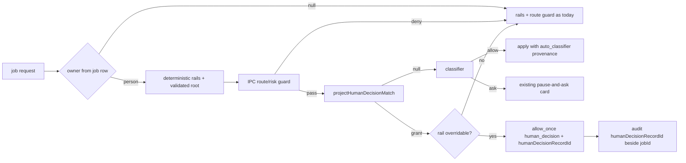

# ASKFLOOR-1-T4 — Jobs walk the chat ladder: projected memories, then the classifier (0153, 0156)

## Context
T3a stores remembered decisions (#484), T3b consults them on interactive auto turns (#486), T3c writes them from a card tap (#488). Jobs still know nothing about them: a scheduled job's IPC request is decided by host policy plus deterministic rails (`runtime/ipc-permission-classifier-decision.ts:75-188`, `reviewedRuleDecision` at `:145` passing `autonomousAllowedToolRules`), and the inline scheduled tail (`app/bootstrap/inline-agent-loop-tools.ts:399-450`) calls the classifier while the worker (IPC) job lane never does (0121). Decision 0156 (2026-09-08, supersedes 0121) rules that a job walks the SAME ladder as a chat auto turn: rails → the owner's remembered decisions → the classifier → a card only when the classifier escalates; the owner is never asked for a call the classifier would allow. Neither job lane carries the job owner: the scheduled `AgentInput` carries a conversation-derived `memoryUserId` (`jobs/execution-phases-run.ts:102,296`) and the inline request omits identity for scheduled runs (`inline-agent-loop-tools.ts:363-376`; `inline-permission-memory.ts:32-42` strips `personId` and marks the lane autonomous). Decision 0153 says a job consumes the owner's learned Allows as ONE deterministic declared-grant input: live, revocable, person-scoped, fail closed; the matched record id is audited. Seam map: `plans/exploration/askfloor-1-t4-seam-map.md`.

## Owner ruling (Ravi, chat, 2026-09-08 — decision 0156)
Jobs are judged like chat: rails → projected remembered Allows → classifier → card only on a classifier ask. 0121 is superseded in full. T4 therefore (a) projects memories as planned and (b) reinstates the classifier on the IPC job lane and KEEPS it on the inline scheduled lane, ordered AFTER the projection, with the classifier's closed result vocabulary — `allow | ask` (0043: the classifier judges risk, the engine maps it to authorization; there is no distinct classifier deny) — honoured under its existing provenance: allow runs the call, ask routes to the existing pause-and-ask card; the tests and architecture text that pin "never runs for a job" are rewritten to pin the ladder order.

## Orchestrator rulings on the seam map's open questions
1. **Where the projection enters and its precedence (grill r1 #1, #2):** the coordinator has two declared-grant precedences (`permission-decision-coordinator.ts:138`: a non-family reviewed Allow returns before every rail; a family Allow is rechecked against rails). A projected record takes the RAIL-RECHECKED precedence — the same one T3b's remembered interactive Allow has: the coordinator consults the projection at the SAME position as the T3b consult stage (after deterministic rails and after the validated-root stage), only for a job request with a host-resolved owner, through a NEW typed coordinator input `humanDecisionProjection: { ownerPersonId: string | null; memory: PermissionDecisionMemoryRepository; guard: (railDecision) => PermissionApprovalDecision | undefined; warn: (message: string, context?: Record<string, unknown>) => void }` (a sibling of the interactive consult, not the interactive stage itself), supplied by `runtime/ipc-permission-job-projection.ts` for IPC and by `inlineScheduledProjection` in `inline-permission-memory.ts` for the inline lane. Precedence table — exact, tool-kind, category-kind, tool-place, category-place, in that order; every class may resolve an overridable ASK to Allow; NO class overrides a non-overridable rail (T3b's predicate, reused); place classes derive only from the coordinator's validated `canonicalRoot` after the same-rails `clears(root)` check has succeeded (`human-decision-scope.ts:67` refuses place without a root; an escaping target never matches a place row); a matched projection never bypasses an absent approver route or worker-risk sanitisation: because the coordinator returns before its `tail` at that position (`permission-decision-coordinator.ts:227-243`) while `applyIpcPermissionRouteGuard` lives only inside the tail (`ipc-permission-classifier-decision.ts:261-301`), the typed projection input carries a `guard: (railDecision) => PermissionApprovalDecision | undefined` callback that the coordinator invokes IMMEDIATELY BEFORE the projection lookup: a returned decision short-circuits (no lookup); `undefined` means sanitisation completed and the lookup proceeds. The IPC callback is CONSTRUCTED INSIDE `ipc-permission-classifier-decision.ts`, closing over the private `applyIpcPermissionRouteGuard` (unchanged), so a missing route is denied and worker risk fields are sanitised exactly as today even when a record would match (grill r2 #1, r3 #2); the new runtime module resolves owner and repository only; the inline callback always returns `undefined`. Every row of that table is pinned by a coordinator test against a hard rail and an escaping target, plus a projected-match-with-absent-route denial test. Reason: 0153 names "one deterministic declared-grant input"; the pre-rail bypass would let a remembered read Allow skip rails that the interactive lane enforces, contradicting T3b.
2. **Audit key and carrier (grill r1 #4):** the coordinator result carries the matched id in a typed field `humanDecisionRecordId?: string` on `PermissionApprovalDecision` (`domain/types.ts:300`, a line-neutral widening as T3c did — the file is at its 740 ceiling); the existing IPC post-apply audit call (`runtime/ipc-interaction-processing.ts:327-332`) forwards it as `auditMetadata: { humanDecisionRecordId }` beside `jobId` through the unchanged `recordDecision` port (`permission-management-service.ts:119,489-521`); the inline lane threads ONE narrow `recordDecision` closure from `runtime-services.ts` into `InlineCoreToolHostDeps` (`inline-agent-loop-tool-types.ts:47`) and calls it only after a projection has actually won (automatic coordinator results return outside `afterDecision`, which runs only for prompted interactions). No port change.
3. **Owner identity (grill r1 #5, #6):** the job owner is `execution_context.personId` of the JOB ROW, resolved host-side — never a worker-supplied or conversation-derived field. IPC lane: after the authoritative `hostJobId` is derived (`ipc-permission-classifier-decision.ts:97`), call `deps.opsRepository.getJobById(hostJobId)` (`ipc-domain-types.ts:108`, `domain/repositories/ops-repo.ts:223` — no new port) and use only the trimmed `job.execution_context?.personId`; a missing job, blank person, or repository failure ⇒ no projection and one `warn`; a `personId` on the worker request is ignored for jobs. Scheduled/inline lane: `runtime/agent-spawn-types.ts:58` gains `jobOwnerPersonId?: string | null`; `runActiveJobAgent` (`jobs/execution-phases-run.ts:288-305`) sets it in `baseInput` from `currentJob.execution_context?.personId ?? null` (the same source the inherited tool-policy lookup at `:183` uses); `memoryUserId` (`:102`) keeps its meaning and is not repurposed; the inline scheduled request (`inline-agent-loop-tools.ts:363-376`) carries that owner into the projection facts and IPC ignores any worker echo of the field. `null`/blank owner ⇒ no projection (group-created jobs stay owner-less: `job-acting-identity.test.ts:14-58` remains true).
4. **Lookup reuse (grill r1 #3, r2 #2, #3):** the projection reuses T3b's `findHumanDecision(candidates, railVersion)` on `PermissionDecisionMemoryRepository` (`domain/ports/permission-decision-memory.ts:149-195`) with the five candidates derived EXACTLY as `permission-human-memory-stage.ts:104-120` derives them — facts `{ effectHash, workspaceRoot, canonicalRoot? }` (workspaceRoot is required for path-only exact native-write keys, `human-decision-scope.ts:82-88,97-113`), exact, tool-kind (`trustGrowthTool: true`), category-kind (`trustGrowthTool: false`), tool-place, category-place; no `kindVariant`. The interactive stage's lane guard (`:91`) stays interactive-only. The helper returns a typed MATCH only — `ProjectedHumanDecisionMatch { recordId: string; scope: HumanDecisionScope }` — and the coordinator builds and stamps the decision through `decisionForMode(request, 'allow_once', 'human_decision', 'machine')` (`domain/permission-decision.ts:207`), never a `reviewed_rule`-provenance `ToolPolicyDecision`; `warn` comes from the typed projection input (application code imports no infrastructure). Only `outcome: allow` rows project; deny rows never project (0153:14); revoked, other-version and other-person rows already never match (`permission-decision-memory-repository.postgres.ts:249-257`).

## Scope / Non-goals
In: ONE application helper that turns (owner, request facts) into a projected declared grant or nothing; the IPC declared-grant seam; the inline scheduled tail (through `inline-permission-memory.ts` or a new small module — the inline file is at 749/750); owner threading in both lanes; the audit stamp in both lanes; the inline suite rewrite; projection-matrix tests. Out: any memory write from a job (0153: jobs never write); card/copy (T5a); `/permissions` (T5b); outage latch (T6); the interactive consult stage; classifier behaviour on interactive lanes; any change to the classifier's charter (0043) or to the T1/T2 first-ask floor (it applies to jobs as to chat).

## Acceptance Criteria
- T4-AC1: PROJECTION HELPER. NEW `application/permissions/human-decision-job-projection.ts` exports `projectHumanDecisionMatch({ ownerPersonId: string | null, request, facts: { effectHash, workspaceRoot, canonicalRoot? }, railVersion: RAIL_CATALOG_VERSION, memory: PermissionDecisionMemoryRepository, warn }) → Promise<ProjectedHumanDecisionMatch | null>` with `ProjectedHumanDecisionMatch = { recordId: string; scope: HumanDecisionScope }` (the coordinator builds the decision and sets `humanDecisionRecordId`): `null` when the owner is null/blank, when candidate derivation refuses, when no root is validated (place classes only), when `findHumanDecision` returns null, or when the row's outcome is not `allow`; never throws (a repository failure → one `warn`, `null` — fail closed); never writes; it does NOT re-filter person/version/revocation (repository-owned, `permission-decision-memory-repository.postgres.ts:249-257`). Unit tests with a fake repository (helper-owned proofs only, grill r3 #3): the candidates passed equal, in order, the five the interactive stage derives for the same facts (tool-kind with `trustGrowthTool: true`, category-kind with `false`); a returned row yields `{ recordId, scope }`; a deny-outcome row → `null`; blank owner and place-without-root → `null` with no repository call; derivation refusal → `null`; a throwing repository → `null` + one warn.
- T4-AC2: COORDINATOR + IPC LANE. `permission-decision-coordinator.ts` accepts the NEW typed input `humanDecisionProjection` of ruling 1 (`{ ownerPersonId, memory: PermissionDecisionMemoryRepository, guard, warn }`) and, for a job request only, after deterministic rails and the validated-root stage (the T3b consult position, `:227-243`), invokes `guard(railDecision)` first (a returned decision stands and no lookup happens; `undefined` proceeds), then calls `projectHumanDecisionMatch` with the same facts the interactive consult builds; a returned match resolves an overridable ASK to `decisionForMode(request, 'allow_once', 'human_decision', 'machine')` stamped with `humanDecisionRecordId`; a non-overridable rail is never overridden; a null owner never consults the port; the interactive consult stage is untouched. NEW `runtime/ipc-permission-job-projection.ts` resolves the owner via `deps.opsRepository.getJobById(hostJobId)` (ruling 3) and supplies the repository and `warn`; the guard callback is built inside `ipc-permission-classifier-decision.ts` over the private `applyIpcPermissionRouteGuard`; `resolvePermissionIpcDecision` (`ipc-permission-classifier-decision.ts:75-188`) passes the input to the coordinator; `reviewedRuleDecision` and `applyIpcPermissionRouteGuard` are unchanged. CLASSIFIER ON JOBS (0156; grill r5 #1-#3): the job exclusions live in lane-eligibility predicates, not in a short-circuit, and T4 changes exactly these: (i) remove `hostJobId` from `skipClassifierVerdictCache` (`ipc-permission-classifier-decision.ts:183-187`); (ii) add the TRUSTED `input.hostJobId` (never the worker's `request.jobId`) to classifier eligibility (`:339-343`); (iii) reuse `consultPermissionClassifierBeforePrompt` (`:361-397`) unchanged so the T1/T2 first-ask floor stays authoritative; (iv) extend ONLY the existing overridable-rail predicate to jobs (`:415-431`) — `hardFloor` stays excluded, the two typed signals / read-only-meta predicate and `railProvenance` are retained; (v) apply interactive-auto's FileWrite/FileEdit/Gantry-native cache-write exclusions to jobs (`:504-518`); (vi) PRESERVE the missing-route guard (`:275-300`, returns `undefined` for a valid route at `:302`) and the `!input.hostJobId` fallthrough (`:544-564`) that lets a classifier ASK reach the existing card path (`:565-622`). The classifier's result vocabulary is closed — `allow` (`:530-542`) runs the call with `auto_classifier` provenance; anything else proceeds to the prompt/card path as today; the deterministic terminal denial remains only for a missing route or a hard rail. Pins rewritten by name in `test/unit/runtime/ipc-permission-classifier-decision.test.ts`: `:293`, `:317-335` (job row + zero classifier calls), `:338-371` (job keeps the meta-executor veto — retained), `:374-404` (explicit job zero-classifier), `:462` (retitle narrowly; its missing-route zero-call assertions at `:550-553` stay correct); NEW job proofs: first-ask behaviour, cache hit/miss/write exclusions, the two overridable rails with `railProvenance`, hard-floor zero consultation, classifier allow, classifier ask → card. The IPC post-apply audit call (`ipc-interaction-processing.ts:327-332`) forwards `humanDecisionRecordId` beside `jobId`. Ceilings hold. Tests: coordinator suite (existing `test/unit/runtime/permission-decision-coordinator.test.ts`) — one case per precedence-table row against a hard rail, an escaping target never matching a place row, an overridable ASK resolved by exact/kind/place to `allow_once` with `human_decision` provenance and `humanDecisionRecordId` set, a non-overridable rail not overridden, a null owner never consulting the repository, a guard-returned decision standing with zero lookups; `test/unit/runtime/ipc-permission-classifier-decision.test.ts` — owner from `getJobById`, a forged request `personId` ignored, missing job / blank owner / throwing repository ⇒ no projection + one warn and the classifier is then consulted, a projected match ⇒ allow with zero classifier calls, a classifier allow on a job honoured with `auto_classifier` provenance, a classifier ask on a job ⇒ the existing card path, a hard-floor rail ⇒ zero classifier consultation, and a host job with an owner, a would-match repository and an ABSENT route ⇒ denial with sanitised risk fields and zero repository calls (proves the delegation the coordinator's fake guard cannot); `test/unit/runtime/ipc-interaction-handler.test.ts` — the production audit call forwards `humanDecisionRecordId` + `jobId`.
- T4-AC3: INLINE SCHEDULED LANE (grill r1 #7, 0156). ONE seam: `inline-permission-memory.ts` gains `inlineScheduledProjection(...)` that builds the same typed `humanDecisionProjection` coordinator input (owner from `AgentInput.jobOwnerPersonId`, the composed repository, a no-op guard, `warn`) and the inline coordinator call (`inline-agent-loop-tools.ts:395`) passes it (≤ 5 changed lines in the inline file); the tail (`:399-442`) KEEPS classifier consultation for scheduled runs, now reached only after a projection miss (the coordinator call at `:390-398` precedes it, so no reordering is needed) — a projected match returns before the classifier; the scheduled non-allow handling at `:450-460` (cancellation → card) is unchanged; the audit closure (ruling 2) is called after the final coordinator result (`:567`) only when the result carries `humanDecisionRecordId`. The interactive auto lane is untouched. Tests (`test/unit/bootstrap/inline-agent-loop-tools.test.ts`): rewrite the scheduled projection-hit subsection (`:1160-1186`) to assert projection with ZERO classifier calls and the audit write; the projection-miss classifier proofs at `:1366-1407` and `:1416-1465` stay and are re-titled to the ladder order (a no-projection scheduled request reaches the classifier and its allow runs the call); keep the independent classifier-audit regression (`:1189-1211`) for interactive auto; a scheduled run with a blank owner projects nothing and never calls the repository. `test/unit/bootstrap/runtime-services.test.ts`: the production wiring supplies the inline `recordDecision` closure and the repository (inline tests inject deps directly through `wireInlineAgentLoopTools`, `:65-120`, so they cannot prove production wiring — grill r2 #4).
- T4-AC4: OWNER THREADING. `runtime/agent-spawn-types.ts:58` gains `jobOwnerPersonId?: string | null`; `runActiveJobAgent` (`jobs/execution-phases-run.ts:288-305`) sets it in `baseInput` from `currentJob.execution_context?.personId ?? null`; `memoryUserId` (`:102`) unchanged. Tests (`test/unit/jobs/execution.test.ts`): the existing `runAgent` expectation asserts the canonical owner on the scheduled `AgentInput` and, separately, that `memoryUserId` is unchanged; a group-created job (null person) yields a null owner; `job-acting-identity.test.ts` unchanged and green.
- T4-AC5: AUDIT. `test/unit/application/permission-management-service.test.ts` gains a NEW leaf (beside the skill-action audit at `:241-277`): `auditMetadata.humanDecisionRecordId` on a permission decision is retained in saved `actorContext` beside `jobId`.
- T4-AC6: POSTGRES. `test/integration/permission-decision-memory.postgres.integration.test.ts` (`:714-750`) gains a database-backed projection-matrix case through the helper: a row written by the T3a service for person A projects for A's job and not for B's, not after revocation, and not from another rail version (repository-owned filters, proved here); no new memory writer.
- T4-AC7: `docs/architecture/permission-decision-memory.md:26-32` is updated: autonomous job lanes consult human-decision memory ONLY through the projection (read-only, owner-scoped, post-rails, guarded), never through the interactive stage, and then the classifier (0156 ladder order: rails → projection → classifier → card); the autonomous-exclusion sentence at `:30` is replaced. Existing unit and Postgres suites pass; tsc and check:architecture green; `inline-agent-loop-tools.ts` ≤ 750, `permission-management-service.ts` ≤ 745, `domain/types.ts` ≤ 740 (line-neutral), `jobs/execution-phases-run.ts` ≤ 700 (line-neutral: one field on the existing `baseInput` literal), `runtime-services.ts` ≤ 1186, every other touched file ≤ its architecture-map ceiling (extract into the NEW modules where needed); no wrapper, shim, alias, dead branch or "legacy" naming.

## Technical Approach
1. One application helper owns the matrix (owner guard, derivation reuse, outcome filter, fail-closed), so both lanes are thin callers and the matrix is pinned once. Rejected: calling `findHumanDecision` from each lane (two copies of the guard chain) or reusing the interactive stage (wrong lane semantics).
2. The projection is a declared-grant INPUT at the T3b consult position with the rail-rechecked precedence, guarded by the IPC route/risk guard before lookup; the helper returns a match and the coordinator builds the decision. Rejected: the pre-rail non-family short-circuit (bypasses every rail and the route guard, contradicting T3b).
3. Owner from the job row only (0118, 0153). Rejected: reusing `memoryUserId` (conversation-derived; a job created in a group would project the wrong person's memories).
4. Audit via existing metadata (ruling 2). Rejected: a port change.

## Decisions
0156 (jobs use the chat ladder; supersedes 0121 — accepted by Ravi 2026-09-08), 0153 (jobs consume projections; live, revocable, person-scoped; audit), 0118 (person scope), 0154, 0043. Rulings 1–4 sit in the task plan; 0156 is the only decision change.

## Surface Impact
Scheduled and inline jobs owned by a person who remembered an Allow now run that matching call without a card; revoking the row (T5b) or a rails bump stops it immediately. Every job call that misses memory is judged by the classifier as in chat, so first-time small calls (a plain curl, a read-only listing) run without a card; a card appears only on a classifier escalation, a hard rail, or a missing route. Group-owned jobs get the classifier but no memory projection. No schema, migration or UI change.

## Task Decomposition
Single task; depends on T3c. Exact write scope — source: NEW `application/permissions/human-decision-job-projection.ts`, NEW `runtime/ipc-permission-job-projection.ts`, `runtime/permission-decision-coordinator.ts`, `runtime/ipc-permission-classifier-decision.ts`, `runtime/ipc-interaction-processing.ts`, `runtime/agent-spawn-types.ts`, `domain/types.ts` (line-neutral), `app/bootstrap/inline-permission-memory.ts`, `app/bootstrap/inline-agent-loop-tools.ts`, `app/bootstrap/inline-agent-loop-tool-types.ts`, `app/bootstrap/runtime-services.ts`, `jobs/execution-phases-run.ts`, `docs/architecture/permission-decision-memory.md`; tests: NEW `test/unit/application/human-decision-job-projection.test.ts`, `test/unit/bootstrap/runtime-services.test.ts`, existing `test/unit/runtime/permission-decision-coordinator.test.ts`, `test/unit/runtime/ipc-permission-classifier-decision.test.ts`, `test/unit/runtime/ipc-interaction-handler.test.ts`, `test/unit/bootstrap/inline-agent-loop-tools.test.ts`, `test/unit/jobs/execution.test.ts`, `test/unit/application/permission-management-service.test.ts`, `test/integration/permission-decision-memory.postgres.integration.test.ts` — 22 files. Budget 24 files / 2,400 lines. `user_facing: false`.

## Risks
Precedence drift: the projection must inherit, not define, declared-rule precedence (pinned by the non-overridable-rail test). Owner leak: any conversation-derived identity reaching the projection widens to the wrong person (pinned by the group-job null-owner tests in both lanes). Ceilings: three touched files near their ceilings; the helper absorbs the logic. Lane leak: the interactive stage must stay interactive-only (no change to it; the inline interactive tests stay green).

## Manual Verification
1. In a DM in auto mode, remember an Allow for `git status` (T3c tap or the IPC harness); schedule a job that runs `git status`: it runs with no card; the permission audit row carries `humanDecisionRecordId` + `jobId`.
2. Revoke the row in the database (read-only prod: use the test DB); run the job again: a card (or the deterministic cancellation) as before.
3. A job created from a group chat with the same command: no projection.

## Verify Plan
`python3 factory/scripts/verify.py` with `GANTRY_TEST_DATABASE_URL` exported; `npx tsc --noEmit`; `npm run check:architecture`; unit leaves through `vitest.unit.config.ts`; the Postgres leaf through `vitest.integration.config.ts` with the URL exported.

## Workflow

