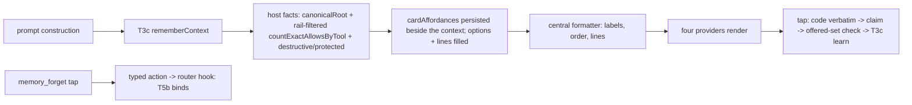

# ASKFLOOR-1-T5a — Card UX + provider surfaces (remember buttons, lines, Forget affordance transport)

## Context
T3a–T3c and T4 built the whole decision-memory engine (#484, #486, #488, #489), but no card renders a remembering button yet: every provider still shows the scalar `Allow once` / `Cancel` / `Allow for future` set (`channels/permission-interaction.ts:74-88`), so nothing a person taps can be learned. T5a makes the eligible DM card render the story's four buttons and lines, makes every provider carry the T3c remember codes end to end, and adds the provider-neutral `memory_forget` affordance TRANSPORT (union entry, rendering, tap decode, router hook) so T5b's `/permissions` list can bind the host handler without touching provider files. Seam map: `plans/exploration/askfloor-1-t5a-seam-map.md`; grill r1: `askfloor-1-t5a-task-grill-r1.md`.

## Owner rulings (Ravi)
- 2026-09-08 (bundled round 1, ledgered): scope nouns are plain — "this exact action", "this kind of action, anywhere", "only in <folder>"; the trust-growth button names the tool by its human label ("Allow all <label> actions"), never the canonical id; Forget buttons read "Forget <shortId>" (the first 6 hex of the record uuid, matching `/permissions all`).
- 2026-09-08 (bundled round 2, ledgered): the rails-bump re-ask line ("Asking again — the safety rules were updated…") is DROPPED and decision 0154 is amended accordingly (old-version rows are inert per the T3b ruling; T5b marks them outdated in `/permissions`); when a tool has no human label, the trust-growth button uses the name the card already shows for the tool, and if there is none the trust-growth alternative is not offered — the canonical id never appears in card copy.
- 2026-09-02/04 (story plan): ONE remembering alternative per card; batch cards never remember and carry the once-only line; destructive asks remember an exact Allow with no broader alternative; protected asks offer No (remembered) and Allow once only; trust growth after three remembered exact Allows for the same high-risk gantry tool.

## Orchestrator rulings (seam map + grill r1)
1. **Render authority is host-derived and persisted (r1 #2, #6).** At prompt construction on BOTH paths the host derives `PermissionCardAffordances { eligible, offered: PermissionRememberCode[], alternative?: { code, label, line }, destructive, protected, preTapLines, postTapLines }` from the T3c `PermissionRememberContext` plus two host facts (rulings 3, 4), and persists it as a typed `cardAffordances` field BESIDE `rememberContext` on the durable member payload through the SAME IPC persistence seam T3c uses — `rememberingPermissionApprovalRequester` (`runtime/permission-remember-settlement.ts:31-57,77-108`) — and inline at creation; the durable envelope's closed field list (`application/interactions/pending-interaction-permission-envelope.ts:10-56`) and its parser gain the field; recovery replays it. Providers render from the request's existing option list and context lines (`permission-decision-options.ts`, `contextLines`), which the host fills FROM the model; `PermissionApprovalRequest` (`domain/types.ts:179-241`) gains no new field. At settlement ONE central check in the T3c accessor (`pending-interaction-permission-callback.ts:448-469`, and the recovery path) converts a remember code NOT in the persisted `offered` set to its scalar base BEFORE application and learning (providers keep rejecting options they never rendered, e.g. `telegram/callback-handlers.ts:729-743`, `teams/interaction-handlers.ts:350-363`); this is the forgery guarantee and it is T5a's, not T3c's.
2. **Batch finalisation (r1 #3).** The Postgres bind transaction that sets `rememberContext.eligible=false` on batch members (`worker-coordination-permission-prompt.postgres.ts:306-347`) also resets `cardAffordances` to the scalar batch shape in the SAME statement; the repository and its Postgres suite are in scope.
3. **Validated place root (r1 #4).** `PermissionDecisionTailContext` (`permission-decision-coordinator.ts:63-67`) gains `canonicalRoot?` set by the trusted-root stage (`:217-224,277-284`); IPC (`ipc-permission-classifier-decision.ts:591-595,633-637`) and inline (`inline-agent-loop-tools.ts:390-401`, which today discards the tail context) thread it into prompt construction. Folder eligibility = the default kind candidate is valid AND the place candidate derived from `canonicalRoot` is valid; place candidates never derive from `workspaceRoot`.
4. **Trust growth (r1 #5).** High-risk = `gantryToolRisk({ toolName, toolInput }).level === 'high'` (`gantry-tool-risk.ts:59-85`, argument-aware) after the destructive/protected exclusion; the count is `countExactAllowsByTool` filtered to the CURRENT `railVersion` (port `permission-decision-memory.ts:197-209`, service `human-decision-memory-service.ts:208-214`, repository `:315-335` gain the filter, Postgres test); ≥ 3 offers the alternative; a repository failure suppresses the alternative with one `warn`. `kindVariant: 'tool'` is set only when the alternative is offered.
5. **Alternative slot precedence** (story plan): family rule ("Allow all `<family>` commands", the existing CARDSIMPLE-1 button and its existing line, unchanged — a durable-policy row, not memory; promotion hint suppressed) → else trust growth (button "Allow all <label> actions", line "Allow all <label> actions will remember: every <label> action, anywhere.") → else folder (button "Allow only in this folder", line "Allow only in this folder will remember: only in <folder>.") when ruling 3 holds → else none. Exactly one.
6. **`memory_forget` ownership (r1 #8, story plan line 195).** T5a owns the provider-neutral TRANSPORT: the union entry `memory_forget { recordId }` in `domain/message-actions.ts:3-64` (no label field — the scope label is never trusted from a callback), rendering ("Forget <shortId>") on all four providers through the existing message-action affordance encoders (`telegram/message-action-affordances.ts:25-40,69-118` with a bounded ≤ 64-byte codec, `slack/message-action-affordances.ts:69-120`, Discord `components.ts:31-83`, Teams per-row `ActionSet`s `cards.ts:629-651`), tap decode on each provider (`slack/channel-message-action-handler.ts:50-105`, Telegram/Discord/Teams handlers) into the typed action delivered to `channel-message-action-router.ts:62-118` with the authenticated conversation context, and a typed router HOOK `onMemoryForget?` that T5b binds. Unbound hook ⇒ the router answers "Not available yet." T5b owns the host handler: canonical person/app/agent resolution, loading the person-scoped row for the "Forgot: <scope>" reply, `revokeById`, the three replies and the in-place list edit.
7. **Where the copy lives.** NEW `channels/permission-card-affordances.ts` (labels, order, scope nouns, pre/post-tap lines, destructive/protected shapes, alternative templates); `permission-interaction.ts` (693/700) consumes it: `permissionButtonLabel` (`:74-88`), `formatPermissionContextLines` (`:350-383`), `formatPermissionReceiptText` (`:133-163`) become thin.

## Scope / Non-goals
In: the affordance module; the three central functions; the batch line in both renderers; the persisted `cardAffordances` carrier (request options/lines filled from it, envelope, parser, recovery, batch finalisation); the settlement offered-set check; `canonicalRoot` on the tail context and both prompt paths; rail-version-filtered trust-growth count; four providers' render + decode for remember codes and the `memory_forget` transport + router hook; snapshot/parity suites per lane; S4 fixture; the 0154 amendment. Out: `/permissions` listing, `all`, `forget <id>`, the Forget HOST handler, replies and list edit, the operating-guidance line, outdated-row marking (T5b); outage copy (T6); job lanes (T4).

## Acceptance Criteria
- T5a-AC1: CENTRAL COPY. NEW `channels/permission-card-affordances.ts` exports `buildPermissionCardAffordances(input) → PermissionCardAffordances` and the label/line formatters; eligible single-ask cards render, in order, **Allow** (remembered, default) / the one alternative (ruling 5) / **Just this once** / **No**; pre-tap block: "Allow will remember: <scope noun>" (writes: "writing to <path> — any future content, no more asking for this file"), then the alternative's line (ruling 5 templates) when present, ending with "No will remember: this exact action."; post-tap: "Remembered: <scope>. Change it any time with /permissions." (writes: "Remembered: writes to <path> (any content). …"; No: "I'll keep saying no to this exact action. Change it with /permissions."; Just this once: today's receipt). Destructive: normal three buttons, no alternative, pre-tap "Allow will remember: this exact command only — nothing broader. No will remember: this exact command." Protected: reason line "<path> is protected, so I always ask.", buttons **Allow once** / **No** (remembered) only. Scope nouns: "this exact action" / "this kind of action, anywhere" / "only in <folder>"; trust-growth label per the owner ruling (human label → card's tool name → no button). No rails-bump line. `permission-interaction.ts` ≤ 700. Unit tests: every shape, order, every literal line, family > trust > folder precedence, destructive/protected exclusions, the missing-label fallback chain.
- T5a-AC2: PERSISTED RENDER MODEL + OFFERED-SET CHECK. `cardAffordances` is derived host-side on both prompt paths (ruling 1) from the T3c context + `canonicalRoot` (ruling 3) + the rail-version-filtered trust-growth count (ruling 4), persisted beside `rememberContext` through `rememberingPermissionApprovalRequester` / inline creation, carried by the envelope and parser, replayed by recovery, and reset to the scalar batch shape inside the Postgres bind transaction (ruling 2); the request's option list and context lines are filled from it. At settlement (claim and recovery) a remember code not in `offered` becomes its scalar base before application and learning. Tests: `ipc-interaction-handler.test.ts` — model persisted on the IPC path, forged unoffered code → scalar base + nothing learned; inline suite — model at creation; `pending-interaction-permission-recovery-orchestrator.test.ts` — recovery replays the model and applies the check; `worker-coordination.postgres.integration.test.ts` — batch bind resets the model atomically; `pending-interaction-durability.test.ts` — envelope round-trip.
- T5a-AC3: PLACE ROOT + TRUST COUNT. `PermissionDecisionTailContext.canonicalRoot` set by the trusted-root stage and threaded on both paths; `countExactAllowsByTool(…, railVersion)` filters to the current rail version at port, service and repository; high-risk via `gantryToolRisk`. Tests: coordinator suite (root exposed only after the same-rails check), IPC and inline suites (root reaches the prompt), `human-decision-memory-service.test.ts` + Postgres suite (other-version rows not counted; ≥3 vs 2), affordance suite (folder eligibility rule; failure → no alternative + one warn).
- T5a-AC4: PROVIDERS — REMEMBER. Telegram (`channel-prompts.ts:218-225`, `prepared-permission-card.ts:47-56`, `callback-handlers.ts:696-743`), Slack (`permission-approval-delivery.ts:64-75,183-200`, `channel-interactions.ts:333-360`), Discord (`interactions.ts:161-182`, `prepared-permission-card.ts:45-51`, `components.ts:129-149`, `permission-callback.ts:44-95`), Teams (`cards.ts:168-213`, `permission-submit.ts:4-34`, `interaction-handlers.ts:230-372`) render the host-filled options and lines and pass a tapped remember code verbatim into the durable claim (no scalar-only normalisation before the claim); Discord and Teams codecs accept the four codes; Telegram's 64-byte budget holds. Tests: four-provider parity for eligible / destructive / protected / batch cards (`provider-affordance-parity.test.ts:118-205` extended) and one settlement test per provider proving a remember code reaches the claim as a code.
- T5a-AC5: PROVIDERS — FORGET TRANSPORT. `memory_forget { recordId }` in the union; each provider encodes/renders "Forget <shortId>" through its message-action affordance encoder and decodes a tap into the typed action delivered to the router with the authenticated conversation context; the router exposes `onMemoryForget?` and answers "Not available yet." when unbound; Teams renders per-row `ActionSet`s (ten-record test). Tests: router unit (typed action reaches a bound hook with the conversation identity; unbound reply), four provider render + decode tests, Telegram codec bound, Teams ten-button test.
- T5a-AC6: BATCH. `permission-batch-coalescer.ts` text formatter (`:121-139`) and native `contextLines` (`:142-161`) both carry "Allow all and Deny all are once-only. Tap Review each to decide one at a time — those cards can remember." after the rows and before the wait line; batch settlement (`:66-82`) writes no memory. Tests: both renderers, four-provider parity.
- T5a-AC7: INELIGIBLE LANES BYTE-FOR-BYTE. ask, auto_strict, job-prompt and group cards keep today's labels (incl. `Cancel`), copy and durable-rule controls with no memory control or line; the scalar fallback (`permission-decision-options.ts:12-32`) is unchanged. Tests: four-provider golden snapshots per lane CAPTURED FROM THE PRE-CHANGE RENDERERS with fixed callback ids as the first commit of the task, then pinned.
- T5a-AC8: S4 + GATES + DECISION. `askfloor-tap-budget.test.ts` adds S4 (`rm -rf build` asks once; Allow remembers exact command + target; identical command → zero taps; `rm -rf dist` asks; No is remembered exactly). `docs/decisions/0154` carries the owner-confirmed amendment (no rails-bump re-ask line; old-version rows inert, marked outdated by T5b). Existing unit and Postgres suites pass; tsc and check:architecture green; ceilings: 700 default (permission-interaction 693, Discord interactions 699, Teams cards 688 today — extract), Slack `channel-interactions.ts` ≤ 712, Telegram `callback-handlers.ts` ≤ 900; no wrapper, shim, alias, dead branch or compatibility naming.

## Technical Approach
1. One formatter module owns every label and line; providers and the three central functions are consumers.
2. Host-derived, persisted render model with a settlement offered-set check, so replay, recovery and forged callbacks read one authority (rejected: deriving at render from provider state; rejected: trusting T3c's context alone — it keeps every candidate).
3. Forget rides the existing message-action affordance encoders and router; T5a ships the transport and a hook, T5b the handler (story plan ownership).
4. Trust growth and place root are host facts computed once at prompt time.

## Decisions
0154 (amended: no rails-bump re-ask line), 0155, 0122, 0124, 0138, 0118, 0156.

## Surface Impact
User-visible: eligible DM cards gain Allow (remembered) / one alternative / Just this once / No with the remember lines; destructive and protected cards as ruled; batch cards gain the once-only line; ineligible cards unchanged; Forget buttons render only where T5b lists records and reply "Not available yet." until T5b binds the handler (no such list ships before T5b). No schema change.

## Task Decomposition
Single task; depends on T3c (T4 merged). Exact write scope — source: NEW `channels/permission-card-affordances.ts`, `channels/permission-interaction.ts`, `channels/permission-batch-coalescer.ts`, `channels/permission-decision-options.ts`, `domain/message-actions.ts`, `app/bootstrap/channel-message-action-router.ts`, `application/permissions/human-decision-learning.ts`, `application/permissions/human-decision-memory-service.ts`, `domain/ports/permission-decision-memory.ts`, `adapters/storage/postgres/repositories/permission-decision-memory-repository.postgres.ts`, `adapters/storage/postgres/repositories/worker-coordination-permission-prompt.postgres.ts`, `application/interactions/pending-interaction-permission-envelope.ts`, `application/interactions/pending-interaction-permission-callback.ts`, `application/interactions/pending-interaction-permission-recovery-orchestrator.ts`, `runtime/permission-remember-settlement.ts`, `runtime/permission-decision-coordinator.ts`, `runtime/ipc-permission-classifier-decision.ts`, `runtime/ipc-interaction-processing.ts`, `app/bootstrap/inline-permission-memory.ts`, `app/bootstrap/inline-agent-loop-tools.ts`, `channels/telegram/channel-prompts.ts`, `channels/telegram/prepared-permission-card.ts`, `channels/telegram/callback-handlers.ts`, `channels/telegram/channel-shared.ts`, `channels/telegram/message-action-affordances.ts`, `channels/slack/permission-approval-delivery.ts`, `channels/slack/channel-interactions.ts`, `channels/slack/permission-action-id.ts`, `channels/slack/message-action-affordances.ts`, `channels/slack/channel-message-action-handler.ts`, `channels/discord/interactions.ts`, `channels/discord/prepared-permission-card.ts`, `channels/discord/components.ts`, `channels/discord/permission-callback.ts`, `channels/teams/cards.ts`, `channels/teams/permission-submit.ts`, `channels/teams/interaction-handlers.ts`, `docs/decisions/0154-human-decision-memory-generic-scope.md`; tests: NEW `test/unit/channels/permission-card-affordances.test.ts`, `test/unit/channels/permission-interaction.test.ts`, `test/unit/channels/permission-batch-coalescer.test.ts`, `test/unit/channels/provider-affordance-parity.test.ts`, `test/unit/bootstrap/channel-message-action-router.test.ts`, `test/unit/channels/telegram.test.ts`, `test/unit/channels/slack.test.ts`, `test/unit/channels/discord.test.ts`, `test/unit/channels/teams/teams.test.ts`, `test/unit/runtime/ipc-interaction-handler.test.ts`, `test/unit/runtime/permission-decision-coordinator.test.ts`, `test/unit/bootstrap/inline-agent-loop-tools.test.ts`, `test/unit/application/pending-interaction-permission-recovery-orchestrator.test.ts`, `test/unit/application/pending-interaction-durability.test.ts`, `test/unit/application/human-decision-memory-service.test.ts`, `test/integration/worker-coordination.postgres.integration.test.ts`, `test/integration/permission-decision-memory.postgres.integration.test.ts`, `test/unit/runtime/askfloor-tap-budget-harness.ts`, `test/unit/runtime/askfloor-tap-budget.test.ts` — 57 files. Budget 60 files / 6,000 lines. `user_facing: true` → functional check before pr-ready.

## Risks
Ceilings: three provider/central files within 12 lines of 700 — extraction into the formatter module and the affordance encoders. Provider drift: four codecs + four renderers — parity per lane. Forgery: the offered-set check is the guarantee (pinned on claim and recovery). Batch atomicity: the model reset must sit in the bind transaction (lesson 103 family). Copy drift vs T5b: `/permissions` rows reuse the scope-noun formatter.

## Manual Verification (functional check, user_facing)
1. DM, auto mode: `cat ~/Workdir/<repo>/README.md` → card shows Allow / (alternative) / Just this once / No with "Allow will remember: this exact action" and "No will remember: this exact action."; tap Allow → "Remembered: …"; repeat → no card.
2. `rm -rf build` → destructive copy, no alternative; Allow; repeat → no card; `rm -rf dist` → card.
3. A protected path → reason line, Allow once / No only.
4. A batch of three commands → once-only line under the rows.
5. Group chat / scheduled job card → identical to today's.
6. A Forget button rendered through the harness → "Not available yet." until T5b.

## Verify Plan
`python3 factory/scripts/verify.py` with `GANTRY_TEST_DATABASE_URL`; `npx tsc --noEmit`; `npm run check:architecture`; unit leaves through `vitest.unit.config.ts`; the two Postgres leaves through their configs.

## Workflow

