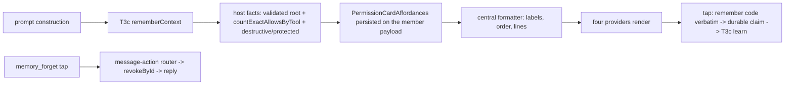

# ASKFLOOR-1-T5a — Card UX + provider surfaces (remember buttons, lines, Forget affordance)

## Context
T3a–T3c and T4 built the whole decision-memory engine (#484, #486, #488, #489), but no card renders a remembering button yet: every provider still shows the scalar `Allow once` / `Cancel` / `Allow for future` set (`channels/permission-interaction.ts:74-88`), so nothing a person taps can be learned. T5a makes the eligible DM card render the story's four buttons and lines, makes every provider carry the T3c remember codes end to end, and adds the provider-neutral `memory_forget` affordance (rendering, settlement, host handler) so T5b's `/permissions` list can ship without touching provider files. Seam map: `plans/exploration/askfloor-1-t5a-seam-map.md`.

## Owner rulings (Ravi)
- 2026-09-08 (bundled, ledgered): scope nouns are plain — "this exact action", "this kind of action, anywhere", "only in <folder>"; the trust-growth button names the tool by its human label ("Allow all <label> actions"), never the canonical id; Forget buttons read "Forget <shortId>" (the first 6 hex of the record uuid, matching `/permissions all`).
- 2026-09-02/04 (story plan): ONE remembering alternative per card; batch cards never remember and carry the once-only line; destructive asks remember an exact Allow with no broader alternative; protected asks offer No (remembered) and Allow once only; trust growth after three remembered exact Allows for the same high-risk gantry tool.
- 2026-09-07 (T3b): rows from another rails version are inert with no re-ask line — the story plan's "Asking again — the safety rules were updated…" line is NOT rendered by T5a (superseded ruling; T5b marks such rows outdated).

## Orchestrator rulings on the seam map
1. **Render authority is host-derived, never callback text.** T3c's `PermissionRememberContext` (`application/permissions/human-decision-learning.ts:24-44,97-119`) lives on the pending-interaction member payload and is read only at settlement (`pending-interaction-permission-callback.ts:448-469`). T5a adds a RENDER-TIME projection of that context — `PermissionCardAffordances { eligible, alternative?: { code, label, scope }, destructive, protected, preTapLines, postTapLine }` — derived host-side at prompt construction from the same context plus two new host facts: the validated place root (so `remember_allow_place` no longer resolves `no_root`) and the trust-growth count from `HumanDecisionMemoryService.countExactAllowsByTool` (`human-decision-memory-service.ts:208-214`, repository `:315-341` — no new read). Providers render from this model; a tapped code is decoded through the existing durable claim path; a code the model did not offer degrades to its scalar base exactly as T3c already guarantees.
2. **Where the model lives.** NEW `channels/permission-card-affordances.ts` (formatter: labels, order, scope nouns, pre/post-tap lines, destructive/protected shapes) so `permission-interaction.ts` (near its 700 ceiling) only calls it; `permissionButtonLabel` (`:74-88`), `formatPermissionContextLines` (`:350-383`) and `formatPermissionReceiptText` (`:133-163`) become thin consumers.
3. **Alternative slot precedence** (story plan): family rule ("Allow all `<family>` commands") when a CARDSIMPLE-1 family rule applies (promotion hint suppressed) → else trust growth ("Allow all <label> actions", `kindVariant: 'tool'`, high-risk gantry tool with ≥ 3 active exact Allows, never destructive) → else "Allow only in this folder" when a broader default applies and a validated root exists → else no alternative. Exactly one.
4. **`memory_forget` affordance.** `domain/message-actions.ts:3-64` gains `memory_forget { recordId, label }`; the host router (`app/bootstrap/channel-message-action-router.ts:62-118`) validates it and calls `HumanDecisionMemoryService.revoke` → `revokeById` (`permission-decision-memory.ts:197-209`) with the authenticated provider person; replies per the story plan: `applied` → "Forgot: <scope>. I'll ask next time." (edit the list message in place where the provider allows), `already_revoked` → "Already forgotten.", `not_found` → "Nothing to forget — that isn't one of your remembered decisions, or it's already gone. Send /permissions for the current list." Rendering on all four providers; Teams uses the existing per-row `ActionSet` pattern (`teams/cards.ts:629-651`), no chunking.

## Scope / Non-goals
In: the affordance module; the three central functions; the batch line in both renderers; the render-time affordance carrier on the prompt; place root + trust-growth facts host-side; four providers' render + decode for remember codes (Discord/Teams codecs widened; Telegram/Slack callback normalisation no longer scalar-only) and `memory_forget` render + settlement; the union entry + host handler; parity/snapshot suites per lane; S4 fixture. Out: `/permissions` listing, `all`, `forget <id>`, the operating-guidance line, outdated-row marking (T5b); outage copy (T6); any memory write path change (T3c); job lanes (T4).

## Acceptance Criteria
- T5a-AC1: CENTRAL COPY. NEW `channels/permission-card-affordances.ts` exports `buildPermissionCardAffordances(input) → PermissionCardAffordances` and the label/line formatters; eligible single-ask cards render, in order, **Allow** (remembered, default) / the one alternative (ruling 3) / **Just this once** / **No**; pre-tap block: "Allow will remember: <scope noun>" (writes: "writing to <path> — any future content, no more asking for this file"), then the alternative's own line when present, ending with "No will remember: this exact action."; post-tap: "Remembered: <scope>. Change it any time with /permissions." (writes: "Remembered: writes to <path> (any content). …"; No: "I'll keep saying no to this exact action. Change it with /permissions."; Just this once: today's receipt). Destructive: normal three buttons, no alternative, pre-tap "Allow will remember: this exact command only — nothing broader. No will remember: this exact command." Protected: reason line "<path> is protected, so I always ask.", buttons **Allow once** / **No** (remembered) only. Scope nouns: "this exact action" / "this kind of action, anywhere" / "only in <folder>"; trust growth: "Allow all <human label> actions". `permission-interaction.ts` consumes the module and stays ≤ 700. Unit tests: every card shape above, label order, each line, family-vs-trust-vs-folder precedence, destructive/protected exclusions.
- T5a-AC2: HOST-DERIVED RENDER MODEL. The affordances are derived host-side at prompt construction on both prompt paths (the IPC prompt closure in `ipc-interaction-processing.ts`; inline at creation) from the T3c remember context plus the validated place root and `countExactAllowsByTool` (high-risk gantry tools from the T2b table `gantry-tool-risk.ts:59-85,117-163`; destructive/protected from `permission-deterministic-rails.ts:205-274`), persisted beside the context on the member payload, and are the ONLY render input; `kindVariant: 'tool'` is set only when the trust-growth alternative is offered; place candidates derive only from the validated root. A tapped code not offered by the persisted model degrades to its scalar base (T3c guarantee, re-pinned). Tests: model derivation per lane (eligible DM, destructive, protected, trust-growth ≥3 vs 2, folder with/without root); forged code on a card that did not offer it → scalar base, nothing learned.
- T5a-AC3: PROVIDERS — REMEMBER. Telegram (`channel-prompts.ts:218-225`, `prepared-permission-card.ts:47-56`, `callback-handlers.ts:696-743`), Slack (`permission-approval-delivery.ts:64-75,183-200`, `channel-interactions.ts:333-360`), Discord (`interactions.ts:161-182`, `prepared-permission-card.ts:45-51`, `components.ts:129-149`, `permission-callback.ts:44-95`), Teams (`cards.ts:168-213`, `permission-submit.ts:4-34`, `interaction-handlers.ts:230-372`) render buttons from the central model and pass a tapped remember code verbatim into the durable claim (no scalar-only normalisation before the claim); Discord and Teams codecs accept the four codes; Telegram's 64-byte callback budget holds. Tests: four-provider parity for eligible / destructive / protected / batch cards (`provider-affordance-parity.test.ts:118-205` extended) and one settlement test per provider proving a remember code reaches the claim as a code.
- T5a-AC4: PROVIDERS — FORGET. `domain/message-actions.ts` gains `memory_forget { recordId, label }`; each provider renders it ("Forget <shortId>") and routes the tap to `channel-message-action-router.ts`, which validates and calls `HumanDecisionMemoryService.revoke` with the authenticated person and replies per ruling 4 (in-place list edit where supported); Teams renders per-row `ActionSet`s (ten-record test). Tests: router unit (applied / already_revoked / not_found incl. another person's id), four provider render + settlement tests, the Teams ten-button test.
- T5a-AC5: BATCH. `permission-batch-coalescer.ts` text formatter (`:121-139`) and native `contextLines` (`:142-161`) both carry "Allow all and Deny all are once-only. Tap Review each to decide one at a time — those cards can remember." after the rows and before the wait line; batch settlement (`:66-82`) writes no memory. Tests: both renderers, four-provider parity.
- T5a-AC6: INELIGIBLE LANES BYTE-FOR-BYTE. ask, auto_strict, job-prompt and group cards keep today's labels (incl. `Cancel`), copy and durable-rule controls with no memory control or line; the scalar fallback (`permission-decision-options.ts:12-32`) is unchanged. Tests: four-provider snapshot per lane pinned against today's output.
- T5a-AC7: S4 + GATES. `askfloor-tap-budget.test.ts` adds S4 (`rm -rf build` asks once; Allow remembers exact command + target; identical command → zero taps; `rm -rf dist` asks; No is remembered exactly). Existing unit and Postgres suites pass; tsc and check:architecture green; `permission-interaction.ts`, every provider file and `message-actions.ts` ≤ 700, Slack `channel-interactions.ts` ≤ 712, Telegram `callback-handlers.ts` ≤ 900; no wrapper, shim, alias, dead branch or "legacy" naming.

## Technical Approach
1. One formatter module owns every label and line; providers and the three central functions are consumers (rejected: per-provider copy — four drifting sources).
2. Host-derived, persisted render model (ruling 1) so replay, recovery and forged callbacks all read the same authority (rejected: deriving at render from provider state — untrusted).
3. Forget rides the existing message-actions router (rejected: a new command per provider).
4. Trust growth and place root are host facts computed once at prompt time (rejected: computing at tap time — a race with the count).

## Decisions
0154, 0155, 0122, 0124, 0138, 0118 (identity-scoped cards), 0156. No new decision.

## Surface Impact
User-visible: eligible DM cards gain Allow (remembered) / one alternative / Just this once / No with the remember lines; destructive and protected cards as ruled; batch cards gain the once-only line; ineligible cards unchanged. Forget buttons appear only where T5b lists records. No schema change.

## Task Decomposition
Single task; depends on T3c (T4 merged). Write scope — source: NEW `channels/permission-card-affordances.ts`, `channels/permission-interaction.ts`, `channels/permission-batch-coalescer.ts`, `channels/permission-decision-options.ts`, `domain/message-actions.ts`, `app/bootstrap/channel-message-action-router.ts`, `application/permissions/human-decision-learning.ts` (render model beside the context), `runtime/ipc-interaction-processing.ts` (prompt closure carries the model), `app/bootstrap/inline-permission-memory.ts`, `channels/telegram/channel-prompts.ts`, `channels/telegram/prepared-permission-card.ts`, `channels/telegram/callback-handlers.ts`, `channels/telegram/channel-shared.ts`, `channels/slack/permission-approval-delivery.ts`, `channels/slack/channel-interactions.ts`, `channels/slack/permission-action-id.ts`, `channels/discord/interactions.ts`, `channels/discord/prepared-permission-card.ts`, `channels/discord/components.ts`, `channels/discord/permission-callback.ts`, `channels/teams/cards.ts`, `channels/teams/permission-submit.ts`, `channels/teams/interaction-handlers.ts`; tests: NEW `test/unit/channels/permission-card-affordances.test.ts`, `test/unit/channels/permission-interaction.test.ts`, `test/unit/channels/permission-batch-coalescer.test.ts`, `test/unit/channels/provider-affordance-parity.test.ts`, `test/unit/bootstrap/channel-message-action-router.test.ts`, one settlement suite per provider (the existing telegram / slack / discord / teams suites), `test/unit/runtime/ipc-interaction-handler.test.ts`, `test/unit/runtime/askfloor-tap-budget-harness.ts`, `test/unit/runtime/askfloor-tap-budget.test.ts` — about 36 files. Budget 40 files / 4,000 lines. `user_facing: true` → functional check before pr-ready.

## Risks
Ceilings: `permission-interaction.ts` and `teams/cards.ts` sit near 700 — the formatter module absorbs copy. Provider drift: four codecs + four renderers — parity tests per lane. Forged callbacks: a remember code not offered by the persisted model must degrade (re-pinned). Copy drift vs T5b: `/permissions` rows must reuse the same scope-noun formatter (T5b imports it).

## Manual Verification (functional check, user_facing)
1. DM, auto mode: `cat ~/Workdir/<repo>/README.md` → card shows Allow / (alternative) / Just this once / No with "Allow will remember: this exact action" and "No will remember: this exact action."; tap Allow → "Remembered: …"; repeat → no card.
2. `rm -rf build` → destructive copy, no alternative; Allow; repeat → no card; `rm -rf dist` → card.
3. A protected path → reason line, Allow once / No only.
4. A batch of three commands → once-only line under the rows.
5. Group chat / scheduled job card → identical to today's.
6. From a T5b-style list (or the harness), tap Forget <id> → "Forgot: …"; tap again → "Already forgotten."

## Verify Plan
`python3 factory/scripts/verify.py` with `GANTRY_TEST_DATABASE_URL`; `npx tsc --noEmit`; `npm run check:architecture`; unit leaves through `vitest.unit.config.ts`.

## Workflow

