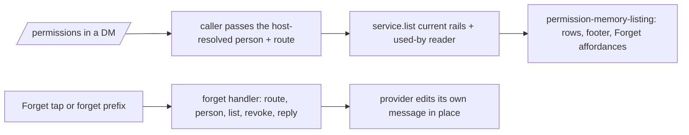

# ASKFLOOR-1-T5b — `/permissions`: remembered list, `all`, `forget <id>`, the Forget host handler

## Context
T3a–T5a made remembered decisions real: the card can learn (T3c), jobs project them (T4), and every provider renders the Forget button and delivers a typed `memory_forget` action to a router hook that still answers "Not available yet." (T5a). Nobody can SEE or UNDO what was remembered yet. T5b makes the existing `/permissions` session command (`session-command-parse.ts:25-39`, `session-commands.ts:580-585`) list the person's remembered decisions with Forget buttons, adds `/permissions all` and `/permissions forget <id>`, binds the Forget host handler, adds the "used by job" read over T4's audit stamp, and the one operating-guidance line. Seam map: `plans/exploration/askfloor-1-t5b-seam-map.md`. Grill r1 (`askfloor-1-t5b-task-grill-r1.md`) folded below (v2).

## Owner rulings (Ravi)
- 2026-09-08 (bundled, ledgered): a job that no longer exists is OMITTED from the "used by" suffix; when more than two jobs used a record the two MOST RECENT uses are named, then "+N jobs"; dates render in the runtime's configured timezone as day + month ("2 Sep"); Forget edits the list message IN PLACE where the provider allows, so T5b MAY touch the four provider action handlers for that edit (the story's "T5b touches no provider file" yields to this ruling for the in-place edit only).
- 2026-09-02/03 (story plan line 162): row format "Allow · read-only reads · anywhere · 2 Sep · Ravi" (outcome first, the approver's snapshotted display name, never "you"; 0154's fallback "someone" when no label); "· used by job <name>" from ACTUAL consumption only; the ten newest with buttons, then "Showing the 10 newest with buttons. <N> older." and "Send /permissions all for the full list, or /permissions forget <id>."; `/permissions all` = every ACTIVE current-rails record as plain text, short id FIRST ("a3f9c2 · Allow · read-only reads · anywhere · 2 Sep · Ravi"), no pagination; `forget <id>` resolves a prefix of ≥ 4 characters (case-insensitive) against THIS person's ACTIVE current-rails records — one match → revoke, more than one → "That id matches more than one — send /permissions all and use the longer id." with nothing mutated, none → the not_found reply; replies identical to the button: "Forgot: <scope>. I'll ask next time." / "Already forgotten." / "Nothing to forget — that isn't one of your remembered decisions, or it's already gone. Send /permissions for the current list."; empty state "Nothing remembered yet. Tap Allow on a card and it shows up here."; groups: every variant is non-mutating and replies with the mode line plus "Remembered decisions are a DM feature — nothing is remembered in groups. Send /permissions to me directly to see yours."; the operating-guidance line "I don't keep that list myself — send /permissions to see everything you've allowed or refused, each with a Forget button."; family rules are not listed (durable-policy rows).
- 2026-09-08 (0154 amendment): old-version rows are simply not listed. Orchestrator default (grill r1 gap 5, recommended option taken, no owner round): a Forget button or prefix that names an old-version row answers not_found and mutates nothing — the visible set and the revocable set are the same set.
- Copy literal (grill r1 gap 9): the suffix is exactly "· used by job <name>" (story plan line 162); decision 0153's consequence line "also used by job" is amended to the same literal in this task.

## Orchestrator rulings (seam map + grill r1)
1. **One service, one injection.** `SessionCommandDeps` (`session-commands.ts:89-135`) gains one optional `remembered` member `{ service: HumanDecisionMemoryService; usedBy: UsedByJobReader; timezone: string }`. The caller `group-processing-session-command-handlers.ts:33-67,146-153` supplies the person as `await resolveMemoryUserId()` — the value the host already resolved through `resolveCanonicalMemoryPersonId` at turn start (DM-only; `group-session-command-state.ts:69-124` carries it) — plus app id and agent folder from the route; it does NOT rerun identity. The service and the used-by reader are built once in `runtime-services.ts` (which already holds the decision-memory repository, `ops-repo` and the timezone) and travel through `MessageLoopDeps` (`runtime-services.ts:1121`) → group processing → the session-command deps. On a group route `remembered` is present but every variant returns the guidance without calling `list`, the used-by read or `revoke` (tests assert all three counts are zero).
2. **Rendering lives in the application layer.** `session-commands.ts` is at 740 and `channels/` may not be imported by `session/` or `application/`; NEW `application/permissions/permission-memory-listing.ts` owns the row formatter, the ten-newest footer, the empty state, the `all` listing, the three forget replies, the ambiguity reply and the prefix resolver. The T5a scope-noun helper MOVES from `channels/permission-card-affordances.ts` into that module (the channel file and `session-commands.ts` import it from `application/`; no re-export left behind). Rows: `{ shortId, recordId, outcome, scopeNoun, place, decidedAt, label?, usedBy: { jobs: string[]; more: number } }`; dates via `Intl.DateTimeFormat(undefined, { day: 'numeric', month: 'short', timeZone })`.
3. **Forget host handler — its own module.** NEW `app/bootstrap/permission-memory-forget-handler.ts` exports `createMemoryForgetHandler({ conversationRoutes, resolvePerson, service, usedBy, timezone })` and returns the `OnMemoryForgetMessageAction` bound through the existing setter seam (`channel-wiring-types.ts:238-249`, `channel-wiring.ts:726-730` — no channel import). Per tap: the route for `(conversationJid, providerAccountId)` gives `appId` + `agentFolder` (unknown route → not_found); `resolvePerson` is the DM-gated canonical identity for the tapping user (a group route or an unresolved person → not_found, nothing mutated); the row is loaded through the person-scoped `service.list` (current rails) BEFORE `service.revoke` so "Forgot: <scope>" names it and a foreign or stale id never reaches the repository; `applied | already_revoked | not_found` map to the three replies. The result is provider-neutral: `{ reply, listing?: { rows, footer } }` — the remaining rows re-rendered by the listing module (present only on `applied`). `MemoryForgetMessageActionInput` (`message-actions.ts:112-118`) is unchanged: each provider keeps its native message id / token locally and, when `listing` is present, edits the tapped message (Telegram `callback-handlers.ts:492-512` `editMessageText`; Slack `channel-message-action-handler.ts:108-127` `chat.update`; Discord `interactions.ts:281-305` edit AFTER the deferred acknowledgement; Teams `message-actions.ts:286-303` `updateAdaptiveCard`) and always sends `reply`. `runtime-services.ts` binds the handler in ≤ 6 lines; to stay under its 1,186 cap the `schedulerMessageOptions` + `startScheduler` block (`runtime-services.ts:372-434`) MOVES to NEW `app/bootstrap/runtime-scheduler-start.ts` (pure move, same names).
4. **"Used by job".** `PermissionRepository` (`domain/ports/repositories.ts:619-625`) gains ONE read `listDecisionsByHumanDecisionRecordId(input: { appId; recordIds: string[] }) → Array<{ recordId; jobId; lastUsedAt: string }>` — ONE row per `(recordId, jobId)` with the latest `created_at` as `lastUsedAt`, ordered `lastUsedAt DESC, jobId ASC`; Postgres (`domain-repositories.postgres.ts:1807-1867`, `permission_decisions.actor_context_json` is `text`, `schema/permissions.ts:53`) extracts `(actor_context_json::jsonb)->>'humanDecisionRecordId'` and `->>'jobId'` with `GROUP BY`. No index and no migration: the read runs once per DM `/permissions`, filtered by app and by the ≤ N listed record ids, over an audit table that is already bounded by retention — a scan is accepted and stated. The used-by reader (application) hydrates names through `ops-repo.ts:221` `getJobById`, DROPS missing jobs BEFORE counting, names the two most recent, then "+N jobs".
5. **Approver label — host-stamped carrier.** The IPC prompt path already refuses the worker's `personId` and takes `runRestriction.memoryUserId` from the host run registry (`ipc-interaction-processing.ts:134-158,214`); the label rides the same registry. Carrier: `memoryUserLabel` beside `memoryUserId` — stamped at host turn start from `message.sender_name` (`runtime-services-active-new.ts:32,77-118`), stored in the run metadata (`runtime-app.ts:115,549-570`), on `AgentInput` (`agent-spawn-types.ts:69`) for the inline runner; consumers: `permission-remember-settlement.ts:86-112` gains `personLabel?` and passes it to `derivePermissionRememberContext` → `personLabel`; `ipc-interaction-processing.ts:214` supplies `personLabel: runRestriction?.memoryUserLabel` (a worker-supplied label, like the worker personId, is discarded); `inline-permission-memory.ts:44-60,117-135` supplies `run.memoryUserLabel`. Rows render the stored label, "someone" when absent.
6. **Current rails.** `service.list` (`human-decision-memory-service.ts:181`) passes `railVersion: RAIL_CATALOG_VERSION` to `repository.listHumanDecisions`, which filters it in SQL; bare, `all`, prefix resolution and the button all go through `list`, so an old-version row is invisible AND unrevocable (not_found). Test: a stored row at `railVersion - 1` is absent from every listing and its prefix / id answers not_found with zero revoke calls.
7. **Guidance line.** `FULL_TOOL_ACCESS_GUIDANCE` (`prompt-profile-service.ts:199-220`, at 783) gains the one physical line; the truncation guard (`prompt-profile.test.ts:301-307`) is updated.
8. **Groups.** Every `/permissions` variant on a group route renders the mode line + the DM-guidance line and mutates nothing; parsing of `all`/`forget` still succeeds so the reply is the guidance, not a syntax error.

## Scope / Non-goals
In: parser (`all`, `forget <prefix>`), the listing module (+ scope-noun move), the deps injection and caller identity, the Forget handler module + wiring setter + in-place edit on four providers, the scheduler-start move, the audit read + used-by reader, the label carrier on both prompt paths, current-rails filtering, the guidance line, 0153 wording, listing fixture + S5. Out: any change to what is learned or projected (T3c/T4), card rendering (T5a), outage copy (T6), pagination of `all`, any new memory store, an audit index.

## Acceptance Criteria
- T5b-AC1: PARSER. `parsePermissionsCommand` accepts `permissions_all` and `permissions_forget { prefix }` (prefix ≥ 4 chars, lower-cased; anything else is today's usage reply); show/set/default unchanged. Tests: parser suite (`session-commands.test.ts:186-210`) — both new forms, a 3-char prefix rejected, mixed-case prefix lower-cased, every existing form unchanged.
- T5b-AC2: LISTING. Bare `/permissions` in a DM renders today's mode line, then the ten newest ACTIVE current-rails records as "<Outcome> · <scope noun> · <place> · <d Mon> · <label>" (+ " · used by job <a>, <b>" or "+N jobs" per ruling 4) each with a `memory_forget { recordId, label: 'Forget <shortId>' }` affordance, then the footer lines when more exist; the empty state when none; `/permissions all` renders every active record as plain text with the short id first; dates use the configured timezone, day + month. NEW `application/permissions/permission-memory-listing.ts` owns every row and reply string; the scope-noun helper lives there (moved from `channels/`). Tests: NEW listing suite — row format incl. "someone" fallback, timezone day-crossing date, ten-newest cut + footer, empty state, `all` ordering (newest first) and short-id-first, used-by suffix with 1, 2, 3+ jobs, a deleted job omitted before the +N count, one job used twice rendered once.
- T5b-AC3: FORGET BY ID AND BY BUTTON. `/permissions forget <prefix>` resolves (case-insensitive) against this person's ACTIVE current-rails records only: one match → `service.revoke` → "Forgot: <scope>. I'll ask next time."; several → the ambiguity reply, nothing mutated; none → the not_found reply. `createMemoryForgetHandler` does the same for a tap: route lookup, DM-gated person, row loaded through person-scoped `list` BEFORE `revoke`, `already_revoked` → "Already forgotten.", another person's id / a stale-rails id / an unknown route / a group route → not_found with zero revoke calls, and on `applied` returns the re-rendered remaining rows. Tests: listing suite (three outcomes, revoked-row prefix → not_found, cross-person → not_found, ambiguity → zero revoke calls); NEW `test/unit/bootstrap/permission-memory-forget-handler.test.ts` (the real factory: applied with listing, already_revoked, cross-person, stale rails, unknown route, group route, list-before-revoke ordering, a revoke racing to already_revoked); router suite (`channel-message-action-router.test.ts:170-196`) — the bound handler's result reaches the provider unchanged; `runtime-services.test.ts` — the handler is bound at startup through the setter.
- T5b-AC4: IN-PLACE EDIT. Each provider's Forget branch, when the result carries `listing`, edits the tapped message with the re-rendered rows (Telegram, Slack, Discord after the deferred acknowledgement, Teams per-row ActionSets) using its locally held message id / token — the host action input is unchanged — and sends `reply` in every case (no `listing` → reply only). Tests: one per provider suite (edit called with the re-rendered rows; reply text; no edit when `listing` is absent), Discord acknowledgement-before-edit order.
- T5b-AC5: USED-BY READ. `listDecisionsByHumanDecisionRecordId` on the port + Postgres adapter: one row per `(recordId, jobId)`, latest use, ordered `lastUsedAt DESC, jobId`, filtered by app and record ids, extracted from `actor_context_json`; no index (accepted scan, stated in the PR body). The used-by reader hydrates names via `getJobById`, drops deleted jobs first, names two, then "+N jobs". Tests: Postgres integration (rows written through `recordDecision` with `humanDecisionRecordId` on both job lanes are returned once per job with the latest timestamp; unrelated rows and other apps are not), reader unit (1, 2, 3+ jobs; deleted job dropped before the count; ordering).
- T5b-AC6: IDENTITY + GROUPS + LABEL. The caller passes the host-resolved DM person (`resolveMemoryUserId`), app and agent folder; on a group route every variant replies mode line + DM guidance with zero `list`, used-by and `revoke` calls (one test per variant); `memoryUserLabel` is stamped from the inbound sender name at turn start, persisted as `personLabel` on both prompt paths, and rendered from the stored row. Tests: group-processing suite (DM lists; group bare/all/forget → guidance, three zero-call assertions); `ipc-interaction-handler.test.ts` (label from the host registry persisted; a worker-supplied label ignored); `inline-agent-loop-tools.test.ts` (label from the run persisted); `runtime-services.test.ts` or the active-new suite (turn start stamps the label from `sender_name`).
- T5b-AC7: GUIDANCE + S5 + GATES. The guidance line is in `FULL_TOOL_ACCESS_GUIDANCE` (guard updated); S5 in `askfloor-tap-budget.test.ts` (remember in chat → the projected job runs with zero cards → a NEAR-MISS call in the same job still cards → Forget → the same job asks again) with the harness's `revokeById` made real (`askfloor-tap-budget-harness.ts:332-397`); decision 0153's consequence line reads "used by job". Existing unit and Postgres suites pass; tsc and check:architecture green; `session-commands.ts` ≤ 740, `prompt-profile-service.ts` ≤ 783, `runtime-services.ts` ≤ 1186 after the scheduler-start move, `channel-wiring.ts` ≤ 790 with no new channel import, 700 elsewhere; no wrapper, shim, alias, re-export, dead branch or compatibility naming.

## Technical Approach
1. One application module owns every row and reply string; the command, the handler and the four providers are consumers (rejected: a `session/` formatter — `channels/` cannot import it lawfully; per-provider copy).
2. The Forget handler is its own bootstrap module bound through the existing setter; it holds route lookup, identity and the pre-revoke load; providers only render and edit with their own message handle (rejected: identity inside the router; a message id on the host action; trusting the callback label).
3. The used-by suffix reads the durable audit rows T4 wrote, grouped per job, not runtime events (0153: actual consumption); a scan is accepted over an index.
4. The approver label rides the host run registry the IPC path already trusts for the person id (rejected: a worker-supplied label).
5. Current rails are filtered where rows are read, so listing and revocation share one visible set (0154 amendment).

## Decisions
0154 (amended), 0118, 0153 (wording amended), 0124. No new decision.

## Surface Impact
`/permissions` in a DM shows the remembered list with Forget buttons; `/permissions all` and `/permissions forget <id>` exist; groups get one guidance line; a Forget tap removes the row in place and confirms; the agent's guidance points people at `/permissions`.

## Task Decomposition
Single task; depends on T5a and T4. Write scope — source: `session/session-command-parse.ts`, `session/session-commands.ts`, NEW `application/permissions/permission-memory-listing.ts`, `application/permissions/human-decision-memory-service.ts`, `channels/permission-card-affordances.ts` (scope-noun move), `runtime/group-processing-session-command-handlers.ts`, `app/bootstrap/channel-wiring-types.ts`, `app/bootstrap/channel-wiring.ts`, `app/bootstrap/runtime-services.ts`, NEW `app/bootstrap/runtime-scheduler-start.ts`, NEW `app/bootstrap/permission-memory-forget-handler.ts`, `app/bootstrap/channel-message-action-router.ts`, `domain/ports/repositories.ts`, `domain/ports/permission-decision-memory.ts` (railVersion on list), `adapters/storage/postgres/repositories/domain-repositories.postgres.ts`, `adapters/storage/postgres/repositories/permission-decision-memory.postgres.ts` (rails filter), `runtime/permission-remember-settlement.ts`, `runtime/ipc-interaction-processing.ts`, `app/bootstrap/inline-permission-memory.ts`, `app/bootstrap/runtime-services-active-new.ts`, `app/bootstrap/runtime-app.ts`, `runtime/agent-spawn-types.ts`, `application/agents/prompt-profile-service.ts`, `channels/telegram/callback-handlers.ts`, `channels/slack/channel-message-action-handler.ts`, `channels/discord/interactions.ts`, `channels/teams/message-actions.ts`, `docs/decisions/0153-learned-decisions-project-into-job-grants.md`; tests: `test/unit/session/session-commands.test.ts`, NEW `test/unit/application/permission-memory-listing.test.ts`, NEW `test/unit/bootstrap/permission-memory-forget-handler.test.ts`, `test/unit/runtime/group-processing.test.ts`, `test/unit/bootstrap/channel-message-action-router.test.ts`, `test/unit/bootstrap/runtime-services.test.ts`, `test/unit/application/human-decision-memory-service.test.ts`, `test/unit/runtime/ipc-interaction-handler.test.ts`, `test/unit/bootstrap/inline-agent-loop-tools.test.ts`, `test/unit/runtime/prompt-profile.test.ts`, `test/unit/channels/telegram.test.ts`, `test/unit/channels/slack.test.ts`, `test/unit/channels/discord/discord.test.ts`, `test/unit/channels/teams/teams.test.ts`, `test/integration/permission-decision-memory.postgres.integration.test.ts`, `test/unit/runtime/askfloor-tap-budget-harness.ts`, `test/unit/runtime/askfloor-tap-budget.test.ts` — 46 files. Budget 50 files / 4,500 lines (the scheduler-start move is ~65 lines of pure relocation). `user_facing: true` → functional check before pr-ready.

## Risks
Ceilings: `runtime-services.ts` is AT its cap — the scheduler-start move lands first; the wiring setter adds no channel import. Identity: one visible set for listing and revocation (pinned by cross-person, stale-rails and group zero-call tests). Provider edits: four handlers — one edit test each, Discord's acknowledgement order pinned. Postgres JSON extraction on a `text` column: cast in SQL, covered by the integration leaf.

## Manual Verification (functional check, user_facing)
1. DM: remember an Allow on a card, send `/permissions` → the mode line and one row with a Forget button; `/permissions all` → the same row with its short id first.
2. Tap Forget → "Forgot: …" and the row disappears from the message; tap again (stale message) → "Already forgotten."
3. `/permissions forget <first 4 chars>` on a fresh record → "Forgot: …"; an ambiguous prefix → the ambiguity reply and both rows still listed.
4. Schedule a job that uses the remembered call → row gains "· used by job <name>".
5. In a group: `/permissions`, `/permissions all`, `/permissions forget abcd` → the mode line + the DM guidance, nothing changes.

## Verify Plan
`python3 factory/scripts/verify.py` with `GANTRY_TEST_DATABASE_URL`; `npx tsc --noEmit`; `npm run check:architecture`; unit leaves through `vitest.unit.config.ts`; the Postgres leaf through its config.

## Workflow

