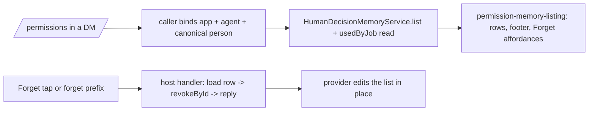

# ASKFLOOR-1-T5b — `/permissions`: remembered list, `all`, `forget <id>`, the Forget host handler

## Context
T3a–T5a made remembered decisions real: the card can learn (T3c), jobs project them (T4), and every provider renders the Forget button and delivers a typed `memory_forget` action to a router hook that still answers "Not available yet." (T5a). Nobody can SEE or UNDO what was remembered yet. T5b makes the existing `/permissions` session command (`session-command-parse.ts:25-39`, `session-commands.ts:580-585`) list the person's remembered decisions with Forget buttons, adds `/permissions all` and `/permissions forget <id>`, binds the Forget host handler, adds the "used by job" read over T4's audit stamp, and the one operating-guidance line. Seam map: `plans/exploration/askfloor-1-t5b-seam-map.md`.

## Owner rulings (Ravi)
- 2026-09-08 (bundled, ledgered): a job that no longer exists is OMITTED from the "used by" suffix; when more than two jobs used a record the two MOST RECENT uses are named, then "+N jobs"; dates render in the runtime's configured timezone as day + month ("2 Sep"); Forget edits the list message IN PLACE where the provider allows, so T5b MAY touch the four provider action handlers for that edit (the story's "T5b touches no provider file" yields to this ruling for the in-place edit only).
- 2026-09-02/03 (story plan line 162): row format "Allow · read-only reads · anywhere · 2 Sep · Ravi" (outcome first, the approver's snapshotted display name, never "you"; 0154's fallback "someone" when no label); "· used by job <name>" from ACTUAL consumption only; the ten newest with buttons, then "Showing the 10 newest with buttons. <N> older." and "Send /permissions all for the full list, or /permissions forget <id>."; `/permissions all` = every ACTIVE current-rails record as plain text, short id FIRST ("a3f9c2 · Allow · read-only reads · anywhere · 2 Sep · Ravi"), no pagination; `forget <id>` resolves a prefix of ≥ 4 characters against THIS person's ACTIVE records — one match → revoke, more than one → "That id matches more than one — send /permissions all and use the longer id." with nothing mutated, none → the not_found reply; replies identical to the button: "Forgot: <scope>. I'll ask next time." / "Already forgotten." / "Nothing to forget — that isn't one of your remembered decisions, or it's already gone. Send /permissions for the current list."; empty state "Nothing remembered yet. Tap Allow on a card and it shows up here."; groups: every variant is non-mutating and replies with the mode line plus "Remembered decisions are a DM feature — nothing is remembered in groups. Send /permissions to me directly to see yours."; the operating-guidance line "I don't keep that list myself — send /permissions to see everything you've allowed or refused, each with a Forget button."; family rules are not listed (durable-policy rows).
- 2026-09-08 (0154 amendment): old-version rows are simply not listed.

## Orchestrator rulings (seam map)
1. **One service, one injection.** `SessionCommandDeps` (`session-commands.ts:89-135`) gains ONE host-owned `HumanDecisionMemoryService` (T3a: `list`, `revoke`/`revokeById`, `countExactAllowsByTool`) plus a `usedByJob` read (ruling 4) and the identity triple; the caller `group-processing-session-command-handlers.ts:33-67,146-153` binds app id, agent folder, the canonical person from `resolveCanonicalMemoryPersonId` (`group-person-identity.ts:136-192`, DM-only) and the DM/group state. No second store, no bypass of the service.
2. **Rendering lives in a new session module.** `session-commands.ts` is at 740; NEW `session/permission-memory-listing.ts` owns the row formatter (reusing the T5a scope-noun formatter from `channels/permission-card-affordances.ts` for the scope word and the short-id derivation from the service), the ten-newest footer, the empty state, the `all` listing and the prefix resolver; `session-commands.ts` calls it.
3. **Forget host handler.** `ChannelWiring` gains a `setMemoryForgetHandler` setter beside the review/observer/brain setters (`channel-wiring-types.ts:238-249`, `channel-wiring.ts:741-747` — the lawful action-setter seam) and `runtime-services.ts` binds ONE host handler (it already holds the decision-memory repository) that resolves the callback user to the canonical person through the same identity path, loads the person-scoped row BEFORE revoking (for "Forgot: <scope>"), calls `revokeById(appId, agentFolder, actingPersonId, recordId)`, maps `applied | already_revoked | not_found` to the three replies, and asks the provider to drop the row in place. In-place edit: `MemoryForgetMessageActionInput` (`message-actions.ts:112-118`) gains the source message id, and each provider's Forget branch (Telegram `callback-handlers.ts:492-512` via `editMessageText`, Slack `channel-message-action-handler.ts:108-127` via `chat.update`, Discord `interactions.ts:281-305` via message edit AFTER the deferred acknowledgement T5a's fix introduced, Teams `message-actions.ts:286-303` via `updateAdaptiveCard`) removes the tapped row and re-renders the remaining rows through the same listing formatter; a provider that cannot edit replies only.
4. **"Used by job".** `PermissionRepository` (`domain/ports/repositories.ts:613-618`) gains ONE typed read `listDecisionsByHumanDecisionRecordId(recordIds) → { recordId, jobId, decidedAt }[]` over the durable audit rows (`actorContext.humanDecisionRecordId` beside `jobId`, written by T4 on both lanes), implemented in `domain-repositories.postgres.ts:1807-1867`; job names hydrate through `ops-repo.ts:221-225`; missing jobs are omitted; the two most recent uses are named, then "+N jobs".
5. **Approver label gap (seam map §7).** T3c persists `personLabel` but neither prompt path supplies it. T5b fills it host-side from the inbound sender display name that `resolveCanonicalMemoryPersonId` already receives (`group-person-identity.ts:136-147`): the IPC prompt closure (`permission-remember-settlement.ts:86-112`) and inline creation (`inline-permission-memory.ts:117-135`) pass `personLabel` from the host identity — never from a worker value; rows render the stored label, "someone" when absent.
6. **Guidance line.** `FULL_TOOL_ACCESS_GUIDANCE` (`prompt-profile-service.ts:199-220`, at 783) gains the one line; the truncation guard (`prompt-profile.test.ts:301-307`) is updated.
7. **Groups.** Every `/permissions` variant on a group route renders the mode line + the DM-guidance line and mutates nothing; parsing of `all`/`forget` still succeeds so the reply is the guidance, not a syntax error.

## Scope / Non-goals
In: parser (`all`, `forget <prefix>`), the listing module, the deps injection and caller identity, the Forget host handler + wiring setter + in-place edit on four providers, the audit read + job-name hydration, the approver label on both prompt paths, the guidance line, listing fixture + S5. Out: any change to what is learned or projected (T3c/T4), card rendering (T5a), outage copy (T6), pagination of `all`, any new memory store.

## Acceptance Criteria
- T5b-AC1: PARSER. `parsePermissionsCommand` accepts `permissions_all` and `permissions_forget { prefix }` (prefix ≥ 4 chars; anything else is today's usage reply); show/set/default unchanged. Tests: parser suite (`session-commands.test.ts:186-210`) — both new forms, a 3-char prefix rejected, every existing form unchanged.
- T5b-AC2: LISTING. Bare `/permissions` in a DM renders today's mode line, then the ten newest ACTIVE current-rails records as "<Outcome> · <scope noun> · <place> · <d Mon> · <label>" (+ " · used by job <a>, <b>" or "+N jobs" per ruling 4) each with a `memory_forget { recordId, label: 'Forget <shortId>' }` affordance, then the footer lines when more exist; the empty state when none; `/permissions all` renders every active record as plain text with the short id first; dates use the configured timezone, day + month. NEW `session/permission-memory-listing.ts` owns the formatting and reuses the T5a scope-noun formatter. Tests: NEW listing suite — row format incl. "someone" fallback, ten-newest cut + footer, empty state, `all` ordering (newest first) and short-id-first, used-by suffix with 1, 2, 3+ jobs and a deleted job omitted.
- T5b-AC3: FORGET BY ID AND BY BUTTON. `/permissions forget <prefix>` resolves against this person's ACTIVE records only: one match → `revokeById` → "Forgot: <scope>. I'll ask next time."; several → the ambiguity reply, nothing mutated; none → the not_found reply. The bound host handler does the same for a button tap (row loaded before revoke; `already_revoked` → "Already forgotten."; another person's id → not_found) and requests the in-place row removal. Tests: listing/prefix suite (all three outcomes, prefix of a revoked row → not_found, cross-person → not_found, nothing mutated on ambiguity — pinned by call counts); router suite (`channel-message-action-router.test.ts:170-196`) — the bound handler's three outcomes; `runtime-services.test.ts` — the handler is bound at startup.
- T5b-AC4: IN-PLACE EDIT. Each provider's Forget branch removes the tapped row from the list message where the provider can edit (Telegram, Slack, Discord after the deferred acknowledgement, Teams per-row ActionSets) using the listing formatter for the remaining rows; the confirmation reply is sent in every case. Tests: one per provider suite (edit called with the re-rendered rows; reply text), Discord acknowledgement-before-edit order.
- T5b-AC5: USED-BY READ. `listDecisionsByHumanDecisionRecordId` on the port + Postgres adapter; job names hydrated; ordering by most recent use; deleted jobs omitted. Tests: Postgres integration (rows written through `recordDecision` with `humanDecisionRecordId` on both lanes are returned; unrelated rows are not), hydration unit (2 vs 3 jobs, deleted job).
- T5b-AC6: IDENTITY + GROUPS + LABEL. The caller binds app, agent folder and the canonical DM person; on a group route every variant is non-mutating and replies mode line + DM guidance (one test per variant); the approver label is supplied host-side on both prompt paths and rendered from the stored row. Tests: group-processing suite (DM lists; group bare/all/forget → guidance, zero service writes), IPC + inline prompt tests (label persisted from the host identity, a worker-supplied label ignored).
- T5b-AC7: GUIDANCE + S5 + GATES. The guidance line is in `FULL_TOOL_ACCESS_GUIDANCE` (guard updated); S5 in `askfloor-tap-budget.test.ts` (remember in chat → the projected job runs with zero cards → Forget → the same job asks again) with the harness's `revokeById` made real (`askfloor-tap-budget-harness.ts:332-397`). Existing unit and Postgres suites pass; tsc and check:architecture green; `session-commands.ts` ≤ 740, `prompt-profile-service.ts` ≤ 783, `runtime-services.ts` ≤ 1186, `channel-wiring.ts` ≤ 790 (its channel-import cap of 7 is exhausted — the setter must not add a channel import), 700 elsewhere; no wrapper, shim, alias, dead branch or compatibility naming.

## Technical Approach
1. One listing module owns every row and reply string; the command and the four providers are consumers (rejected: formatting in `session-commands.ts` — at its ceiling — or per provider).
2. The Forget host handler is bound through the existing action-setter seam and holds the identity resolution and the pre-revoke row load; providers only render and edit (rejected: identity inside the router, or trusting the callback label).
3. The used-by suffix reads the durable audit rows T4 wrote, not runtime events (0153: actual consumption).
4. The approver label rides the host identity path that already carries the display name (rejected: a worker-supplied label).

## Decisions
0154 (amended), 0118, 0153, 0132, 0124. No new decision.

## Surface Impact
`/permissions` in a DM shows the remembered list with Forget buttons; `/permissions all` and `/permissions forget <id>` exist; groups get one guidance line; a Forget tap removes the row in place and confirms; the agent's guidance points people at `/permissions`.

## Task Decomposition
Single task; depends on T5a and T4. Write scope — source: `session/session-command-parse.ts`, `session/session-commands.ts`, NEW `session/permission-memory-listing.ts`, `runtime/group-processing-session-command-handlers.ts`, `app/bootstrap/channel-wiring-types.ts`, `app/bootstrap/channel-wiring.ts`, `app/bootstrap/runtime-services.ts`, `app/bootstrap/channel-message-action-router.ts`, `domain/message-actions.ts`, `domain/ports/repositories.ts`, `adapters/storage/postgres/repositories/domain-repositories.postgres.ts`, `application/permissions/human-decision-memory-service.ts` (prefix resolver if it belongs there), `runtime/permission-remember-settlement.ts`, `app/bootstrap/inline-permission-memory.ts`, `application/agents/prompt-profile-service.ts`, `channels/telegram/callback-handlers.ts`, `channels/slack/channel-message-action-handler.ts`, `channels/discord/interactions.ts`, `channels/teams/message-actions.ts`; tests: `test/unit/session/session-commands.test.ts`, NEW `test/unit/session/permission-memory-listing.test.ts`, `test/unit/runtime/group-processing.test.ts`, `test/unit/bootstrap/channel-message-action-router.test.ts`, `test/unit/bootstrap/runtime-services.test.ts`, `test/unit/application/human-decision-memory-service.test.ts`, `test/unit/runtime/ipc-interaction-handler.test.ts`, `test/unit/bootstrap/inline-agent-loop-tools.test.ts`, `test/unit/runtime/prompt-profile.test.ts`, `test/unit/channels/telegram.test.ts`, `test/unit/channels/slack.test.ts`, `test/unit/channels/discord/discord.test.ts`, `test/unit/channels/teams/teams.test.ts`, `test/integration/permission-decision-memory.postgres.integration.test.ts` (or the domain-repositories Postgres suite that owns permission decisions), `test/unit/runtime/askfloor-tap-budget-harness.ts`, `test/unit/runtime/askfloor-tap-budget.test.ts` — 35 files. Budget 40 files / 4,000 lines. `user_facing: true` → functional check before pr-ready.

## Risks
Ceilings: four files at or near cap — the listing module absorbs the copy; the wiring setter adds no channel import. Identity: the person axis must be the canonical DM person on every path (pinned by cross-person not_found and group zero-write tests). Provider edits: four handlers — one edit test each, Discord's acknowledgement order pinned.

## Manual Verification (functional check, user_facing)
1. DM: remember an Allow on a card, send `/permissions` → the mode line and one row with a Forget button; `/permissions all` → the same row with its short id first.
2. Tap Forget → "Forgot: …" and the row disappears from the message; tap again (stale message) → "Already forgotten."
3. `/permissions forget <first 4 chars>` on a fresh record → "Forgot: …"; an ambiguous prefix → the ambiguity reply and both rows still listed.
4. Schedule a job that uses the remembered call → row gains "· used by job <name>".
5. In a group: `/permissions`, `/permissions all`, `/permissions forget abcd` → the mode line + the DM guidance, nothing changes.

## Verify Plan
`python3 factory/scripts/verify.py` with `GANTRY_TEST_DATABASE_URL`; `npx tsc --noEmit`; `npm run check:architecture`; unit leaves through `vitest.unit.config.ts`; the Postgres leaf through its config.

## Workflow

